# Advanced Clustering Topics 🌳
## Building on K-Means: New Ways to Group Things!

---

## 🎯 What You'll Learn Today

Remember K-Means clustering from last week? It's awesome, but it has some limitations:
- We had to choose K (number of clusters) ahead of time
- It only finds circular/spherical shaped groups
- It struggles with weird-shaped clusters or noise

Today we'll explore **two powerful new clustering families** that solve these problems:

1. **Hierarchical Clustering** 🌳 - Build family trees of data!
2. **Density-Based Clustering** 🎨 - Find clusters by looking for crowded areas!

---

# Part 1: Hierarchical Clustering 🌳

## 🤔 What is Hierarchical Clustering?

Imagine organizing all living things on Earth. Do you start with individual animals and group them, or start with "all animals" and split them up?

**Both approaches work!**

- **Bottom-Up (Agglomerative):** Start with individuals → merge into groups → keep merging
- **Top-Down (Divisive):** Start with everyone together → split into groups → keep splitting

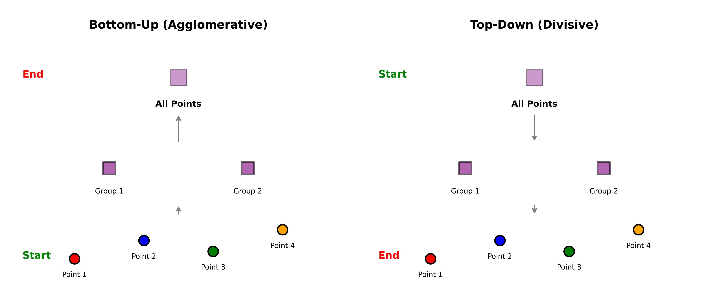

That's exactly what Hierarchical Clustering does! It creates a **family tree** (called a dendrogram) showing how data points are related.

---

## 🌱 Bottom-Up Clustering (Agglomerative)

Think about organizing your music playlist:

**Start:** Every song is its own "cluster"
- 🎵 Song 1
- 🎵 Song 2  
- 🎵 Song 3
- 🎵 Song 4

**Step 1:** Find the 2 most similar songs and group them
- 🎵🎵 (Song 1 + Song 2) - both pop songs
- 🎵 Song 3
- 🎵 Song 4

**Step 2:** Find next 2 most similar and group them
- 🎵🎵 (Song 1 + Song 2) - pop group
- 🎵🎵 (Song 3 + Song 4) - both rock songs

**Step 3:** Merge these two groups
- 🎵🎵🎵🎵 (All songs together)

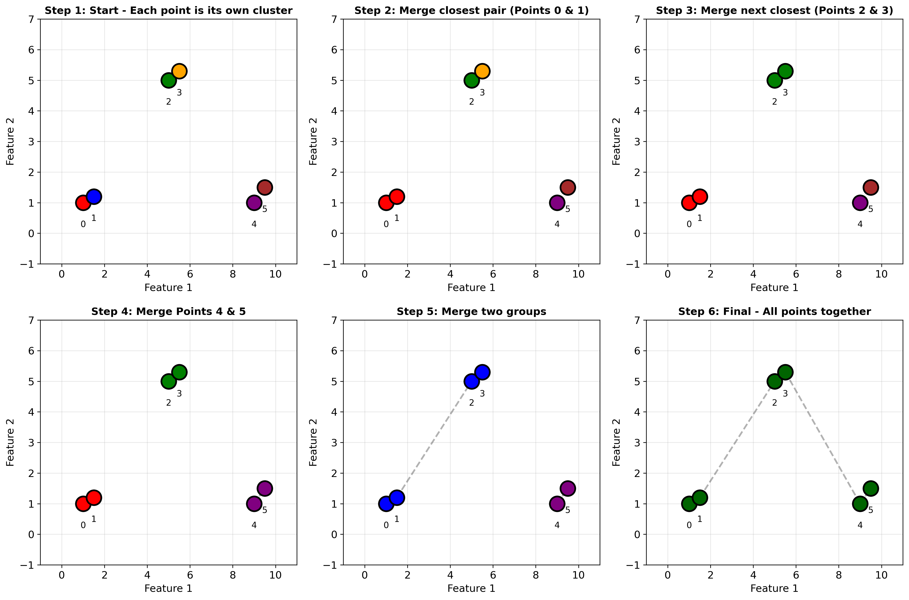

**Key Idea:** Start small, build up! Like building with LEGO blocks - start with individual pieces, snap them together until you have the whole set!

---

## 🌳 Top-Down Clustering (Divisive)

Now think about organizing students in your school:

**Start:** Everyone in one big group
- 🏫 ALL STUDENTS

**Step 1:** Split into the two most different groups
- 🏫 Middle School Students
- 🏫 High School Students

**Step 2:** Split middle school into smaller groups
- 📚 6th graders
- 📚 7th graders  
- 📚 8th graders

**Step 3:** Keep splitting until each person is alone (or stop when groups make sense!)

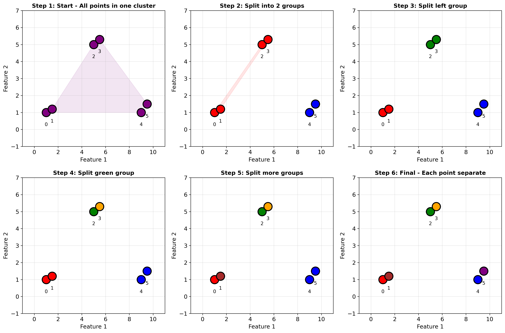

**Key Idea:** Start big, break down! Like organizing files on your computer - start with main folder, create subfolders, then sub-subfolders!

---

## 🔗 Linkage Methods: How Do We Measure "Closeness"?

When merging clusters, how do we know which ones are most similar? We use **linkage methods**:

### 1. Single Linkage (Nearest Point)
"Two clusters are close if their NEAREST points are close"

**Example:** Your friend group and another group
- Distance = closest person in your group to closest person in their group

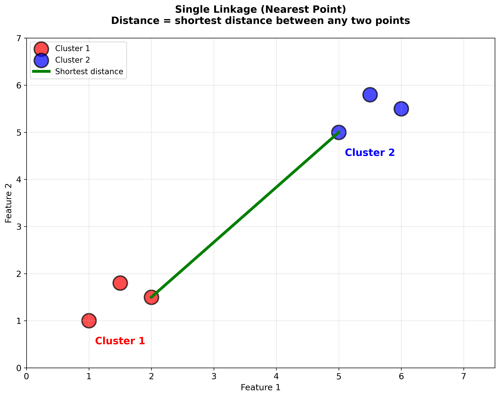

**Pros:** Can find chains of connected points  
**Cons:** Can create long, snake-like clusters

---

### 2. Complete Linkage (Farthest Point)
"Two clusters are close if their FARTHEST points aren't too far"

**Example:** Checking if two cities can be sister cities
- Distance = farthest person in one city to farthest in other city

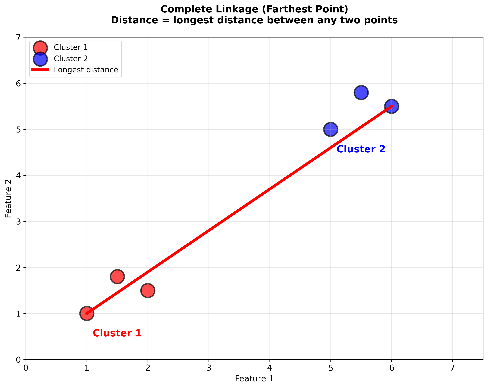

**Pros:** Creates compact, tight clusters  
**Cons:** Sensitive to outliers

---

### 3. Average Linkage (Average Distance)
"Two clusters are close if their AVERAGE distance is small"

**Example:** Comparing two class averages
- Distance = average distance between all students in both classes


**Pros:** Balanced approach, usually works well  
**Cons:** Moderate computational cost

---

### 4. Ward's Method (Minimize Variance)
"Merge clusters that increase total variance the LEAST"

**Think of it like:** Keeping study groups balanced
- Merge groups that stay most evenly skilled after combining


**Pros:** Creates very balanced, similar-sized clusters  
**Cons:** Assumes spherical clusters (like K-Means)

---

## 🎄 Dendrograms: The Family Tree of Data

A **dendrogram** is a tree diagram that shows how clusters were formed!

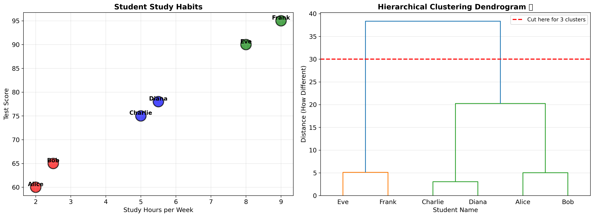

**How to Read a Dendrogram:**

```
Height = Distance at which clusters merged

    |
    |                    ← If you cut here, you get 2 clusters
----+----
    |    |              ← If you cut here, you get 3 clusters  
    |  ----+----
    |  |   |   |        ← If you cut here, you get 4 clusters
   [A] [B][C] [D]       ← Bottom = individual data points
```

**Real Example: Student Study Groups**

```
                 ALL STUDENTS
                      |
        ______________|______________
       |                             |
    HARD WORKERS              BALANCED STUDENTS
       |                             |
   ____|____                    _____|_____
  |         |                  |           |
EARLY    NIGHT           EFFICIENT    SOCIAL
BIRDS    OWLS            STUDIERS    LEARNERS
```

**The height where branches connect = how different the groups are!**
- High connection = very different groups
- Low connection = very similar groups

---

## 📏 Measuring Distance Between Clusters

Remember, in K-Means we measured distance between **points**. In hierarchical clustering, we measure distance between **clusters**!

**Distance between two points (same as K-Means):**
```python
import math

def point_distance(p1, p2):
    return math.sqrt((p1[0] - p2[0])**2 + (p1[1] - p2[1])**2)
```

**Distance between two clusters (Single Linkage Example):**
```python
def cluster_distance_single(cluster1, cluster2):
    """Find minimum distance between any two points"""
    min_dist = float('inf')
    
    for point1 in cluster1:
        for point2 in cluster2:
            dist = point_distance(point1, point2)
            min_dist = min(min_dist, dist)
    
    return min_dist
```

**Distance between two clusters (Complete Linkage Example):**
```python
def cluster_distance_complete(cluster1, cluster2):
    """Find maximum distance between any two points"""
    max_dist = 0
    
    for point1 in cluster1:
        for point2 in cluster2:
            dist = point_distance(point1, point2)
            max_dist = max(max_dist, dist)
    
    return max_dist
```

---

## 💻 Let's Code It! Agglomerative Clustering

Here's a simple implementation to understand the concept:

```python
import math

# Student data: [study_hours, test_score]
students = [
    [2, 60],    # Student A
    [2.5, 65],  # Student B
    [8, 90],    # Student C
    [8.5, 92],  # Student D
    [5, 75],    # Student E
]

# Calculate distance between two points
def distance(p1, p2):
    return math.sqrt((p1[0] - p2[0])**2 + (p1[1] - p2[1])**2)

# Find distance between two clusters (Single Linkage)
def cluster_distance(c1, c2):
    min_dist = float('inf')
    for p1 in c1:
        for p2 in c2:
            d = distance(p1, p2)
            if d < min_dist:
                min_dist = d
    return min_dist

# Start: Each student is their own cluster
clusters = [[student] for student in students]
step = 0

print("🌱 Agglomerative Clustering - Building from Bottom Up!")
print("="*60)
print(f"\nStep {step}: Start with {len(clusters)} individual students")
for i, cluster in enumerate(clusters):
    print(f"  Cluster {i}: {cluster}")

# Keep merging until we have just one cluster
while len(clusters) > 1:
    step += 1
    
    # Find two closest clusters
    min_dist = float('inf')
    merge_i, merge_j = 0, 1
    
    for i in range(len(clusters)):
        for j in range(i + 1, len(clusters)):
            d = cluster_distance(clusters[i], clusters[j])
            if d < min_dist:
                min_dist = d
                merge_i, merge_j = i, j
    
    # Merge the two closest clusters
    print(f"\nStep {step}: Merge clusters {merge_i} and {merge_j}")
    print(f"  Distance: {min_dist:.2f}")
    
    merged = clusters[merge_i] + clusters[merge_j]
    
    # Remove old clusters and add merged one
    clusters = [c for idx, c in enumerate(clusters) if idx not in [merge_i, merge_j]]
    clusters.append(merged)
    
    # Show current state
    print(f"  Now we have {len(clusters)} cluster(s):")
    for i, cluster in enumerate(clusters):
        print(f"    Cluster {i}: {len(cluster)} students - {cluster}")

print("\n" + "="*60)
print("✅ Done! All students merged into one cluster!")
```

**Sample Output:**
```
🌱 Agglomerative Clustering - Building from Bottom Up!
============================================================

Step 0: Start with 5 individual students
  Cluster 0: [[2, 60]]
  Cluster 1: [[2.5, 65]]
  Cluster 2: [[8, 90]]
  Cluster 3: [[8.5, 92]]
  Cluster 4: [[5, 75]]

Step 1: Merge clusters 0 and 1
  Distance: 5.59
  Now we have 4 cluster(s):
    Cluster 0: 2 students - [[2, 60], [2.5, 65]]
    Cluster 1: 2 students - [[8, 90], [8.5, 92]]
    Cluster 2: 1 students - [[5, 75]]

Step 2: Merge clusters 1 and 2
  Distance: 2.55
  Now we have 3 cluster(s):
    Cluster 0: 2 students - [[2, 60], [2.5, 65]]
    Cluster 1: 2 students - [[8, 90], [8.5, 92]]
    Cluster 2: 1 students - [[5, 75]]

... (continues until all merged)
```

---

## 💻 Using scikit-learn for Hierarchical Clustering

The real power comes from using scikit-learn:

```python
from sklearn.cluster import AgglomerativeClustering
import numpy as np
import matplotlib.pyplot as plt

# Student data
X = np.array([
    [2, 60], [2.5, 65], [3, 70],      # Low study group
    [5, 75], [6, 80], [5.5, 78],      # Medium study group
    [8, 90], [9, 95], [8.5, 92]       # High study group
])

# Create hierarchical clustering model
# n_clusters: how many final groups we want
# linkage: 'single', 'complete', 'average', or 'ward'
model = AgglomerativeClustering(
    n_clusters=3,
    linkage='ward'
)

# Fit and predict
labels = model.fit_predict(X)

# Visualize results
plt.figure(figsize=(10, 6))
plt.scatter(X[:, 0], X[:, 1], c=labels, cmap='viridis', s=100)
plt.xlabel('Study Hours per Week')
plt.ylabel('Test Score')
plt.title('Hierarchical Clustering Results')
plt.colorbar(label='Cluster')
plt.grid(True, alpha=0.3)
plt.show()

# Show which student belongs to which cluster
for i, (point, label) in enumerate(zip(X, labels)):
    print(f"Student {i+1}: {point} → Cluster {label}")
```

---

## 📊 Creating a Dendrogram

The coolest part! Let's visualize the family tree:

```python
from scipy.cluster.hierarchy import dendrogram, linkage
import matplotlib.pyplot as plt
import numpy as np

# Student data with names
students = {
    'Alice': [2, 60],
    'Bob': [2.5, 65],
    'Charlie': [8, 90],
    'Diana': [8.5, 92],
    'Eve': [5, 75],
    'Frank': [5.5, 78]
}

X = np.array(list(students.values()))
names = list(students.keys())

# Calculate linkage matrix
# method can be: 'single', 'complete', 'average', 'ward'
Z = linkage(X, method='ward')

# Create dendrogram
plt.figure(figsize=(12, 6))
dendrogram(Z, labels=names, leaf_font_size=12)
plt.title('Student Study Habits Dendrogram 🌳')
plt.xlabel('Student Name')
plt.ylabel('Distance (How Different)')
plt.axhline(y=15, color='r', linestyle='--', label='Cut here for 3 clusters')
plt.legend()
plt.grid(True, alpha=0.3)
plt.show()

print("How to read this dendrogram:")
print("- Lower connections = more similar students")
print("- Higher connections = more different groups")
print("- Cut horizontally to choose number of clusters!")
```

---

## ✅ Hierarchical Clustering: Pros and Cons

**Advantages (Why It's Awesome!)** 👍
- **No need to pick K ahead of time** - see all possible groupings!
- **Creates a hierarchy** - shows relationships between clusters
- **Dendrogram is informative** - visual understanding of data structure
- **Deterministic** - same input = same output (unlike K-Means)
- **Works with any distance metric** - very flexible!

**Disadvantages (Things to Watch Out For)** 👎
- **Slow for large datasets** - O(n³) time complexity
- **Can't undo merges/splits** - decisions are permanent
- **Memory intensive** - needs to store distance matrix
- **Sensitive to noise** - outliers can mess up clusters
- **Different linkages = different results** - need to choose wisely

---

# Part 2: Density-Based Clustering 🎨

## 🌟 What is Density-Based Clustering?

Imagine a nighttime satellite photo of Earth showing city lights:

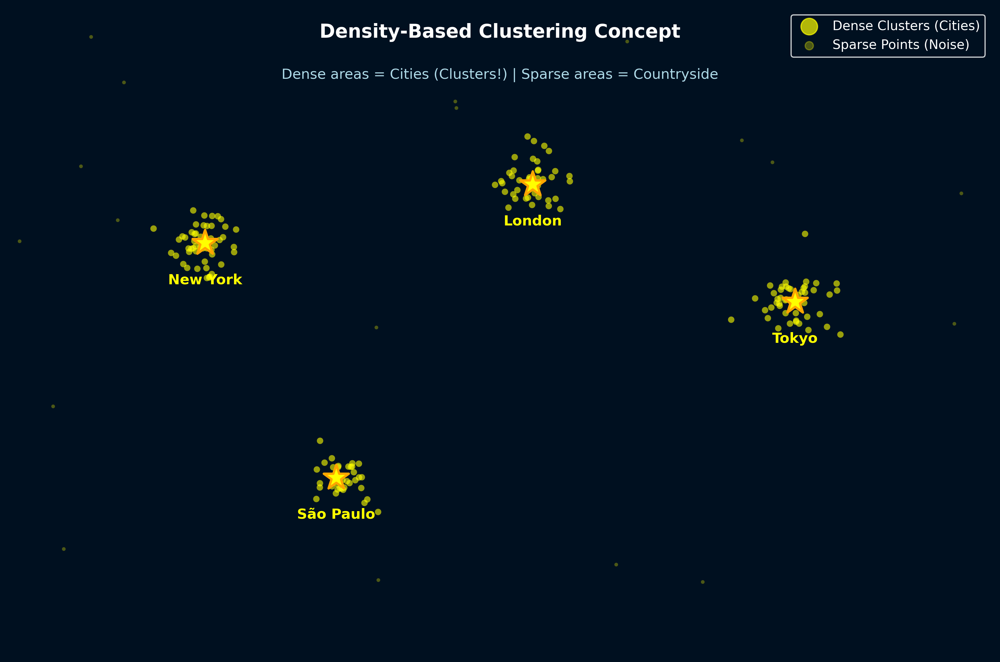

**You can see:**
- **Dense areas** = cities (clusters!)
- **Sparse areas** = countryside (not clusters)
- **Dark areas** = oceans (noise)

**Density-based clustering works the same way!**
- Find areas where data points are crowded together
- These crowded areas = clusters
- Isolated points = noise/outliers

Unlike K-Means and Hierarchical clustering, density-based methods:
- ✅ Find clusters of **any shape** (not just circles!)
- ✅ Automatically detect **outliers**
- ✅ Don't need to know **number of clusters** ahead of time!

---

## 🔍 DBSCAN: Density-Based Spatial Clustering

**DBSCAN** = **D**ensity-**B**ased **S**patial **C**lustering of **A**pplications with **N**oise

Think of DBSCAN like finding friend groups in a cafeteria:

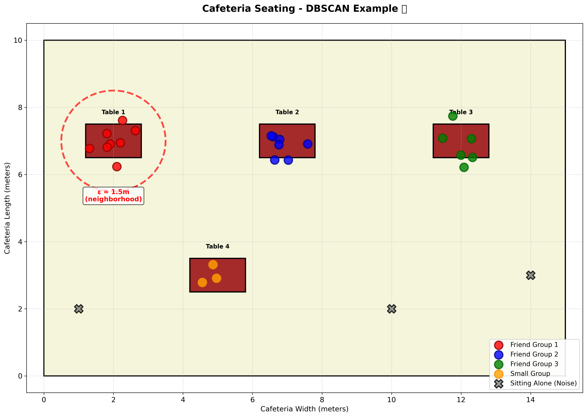

**Rules:**
1. If you're sitting close to lots of people → you're in a friend group (core point)
2. If you're near a friend group but alone → you're on the edge (border point)  
3. If you're sitting alone far from everyone → you're by yourself (noise)

---

## 🎯 DBSCAN Core Concepts

DBSCAN has just **2 parameters**:

### 1. Epsilon (ε) - "Neighborhood Radius"
**How close is close enough?**

```
    ε = 2 units
    
    •  •     ← These points are neighbors
     ╲╱         (within ε distance)
      •
      
    •        • ← These are NOT neighbors
               (more than ε apart)
```

### 2. MinPts - "Minimum Points"
**How many neighbors make a crowd?**

```
MinPts = 3

    • • •    ← This is a crowd (3 points)
      •         → Core point!
      
    •   •    ← This is NOT a crowd (only 2)
```

---

## 👥 Three Types of Points in DBSCAN

### 1. Core Points 🌟
**Popular students with lots of friends nearby**
- Has at least MinPts neighbors within ε distance
- Forms the center of clusters

### 2. Border Points 🌙
**Students hanging out near a friend group**  
- Has fewer than MinPts neighbors
- But is within ε of a core point
- Part of cluster but on the edge

### 3. Noise Points ❌
**Students sitting alone**
- Has fewer than MinPts neighbors
- NOT near any core points
- Considered outliers/noise

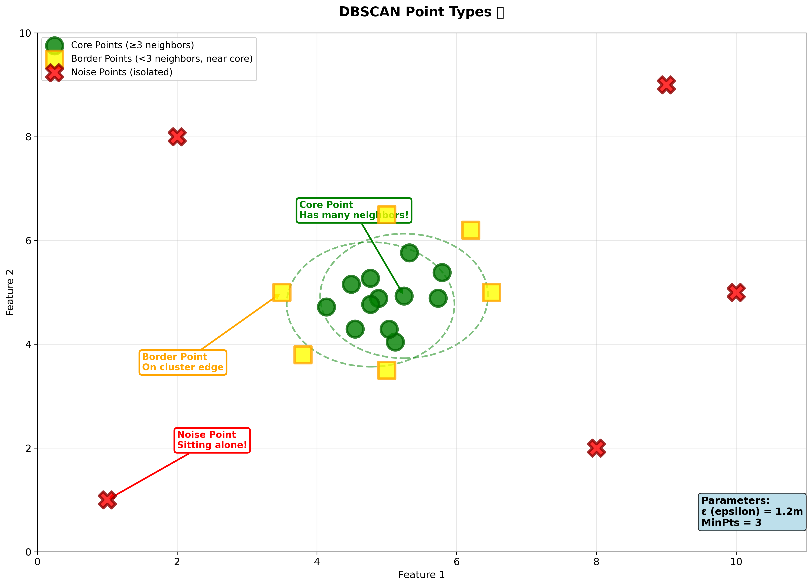

---

## 🔄 How DBSCAN Works: Step by Step

**Given:** ε = 2, MinPts = 3

**Step 1: Pick a random unvisited point**
- Check if it has enough neighbors (≥ MinPts within ε)
- If YES → It's a core point! Start a new cluster
- If NO → Mark as noise (for now)

**Step 2: Grow the cluster**
- Add all neighbors of the core point to the cluster
- For each neighbor:
  - If it's also a core point → add its neighbors too!
  - If it's a border point → add it but don't expand
  
**Step 3: Repeat**
- Pick another unvisited point
- Repeat until all points are visited

**Step 4: Final check**
- Points still marked as noise = true outliers

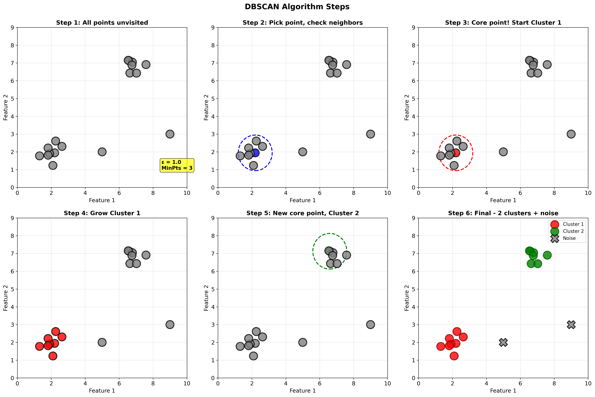

---

## 💻 Let's Code DBSCAN!

Simple implementation to understand the concept:

```python
import math

# Calculate distance between two points
def distance(p1, p2):
    return math.sqrt((p1[0] - p2[0])**2 + (p1[1] - p2[1])**2)

# Find all neighbors within epsilon
def find_neighbors(data, point_idx, epsilon):
    neighbors = []
    current_point = data[point_idx]
    
    for i, point in enumerate(data):
        if i != point_idx:
            if distance(current_point, point) <= epsilon:
                neighbors.append(i)
    
    return neighbors

# Simple DBSCAN implementation
def simple_dbscan(data, epsilon, min_pts):
    n_points = len(data)
    
    # Initially, all points are unvisited and unlabeled
    visited = [False] * n_points
    labels = [-1] * n_points  # -1 means noise
    cluster_id = 0
    
    for point_idx in range(n_points):
        if visited[point_idx]:
            continue
            
        visited[point_idx] = True
        neighbors = find_neighbors(data, point_idx, epsilon)
        
        # Check if core point
        if len(neighbors) < min_pts:
            # Mark as noise (for now)
            labels[point_idx] = -1
        else:
            # Start new cluster
            cluster_id += 1
            labels[point_idx] = cluster_id
            
            # Grow cluster by checking all neighbors
            i = 0
            while i < len(neighbors):
                neighbor_idx = neighbors[i]
                
                if not visited[neighbor_idx]:
                    visited[neighbor_idx] = True
                    neighbor_neighbors = find_neighbors(data, neighbor_idx, epsilon)
                    
                    # If neighbor is also core point, add its neighbors
                    if len(neighbor_neighbors) >= min_pts:
                        neighbors.extend(neighbor_neighbors)
                
                # Add to cluster if not already in one
                if labels[neighbor_idx] == -1:
                    labels[neighbor_idx] = cluster_id
                    
                i += 1
    
    return labels

# Example: Student locations in cafeteria [x, y]
cafeteria = [
    [1, 1], [1.5, 1.5], [1.3, 1.2],        # Group 1: table in corner
    [5, 5], [5.5, 5.2], [5.3, 5.5],        # Group 2: center table
    [9, 1], [9.2, 1.3],                     # Group 3: small group
    [10, 10],                               # Alone student (noise)
]

# Run DBSCAN
epsilon = 1.0  # Students within 1 meter
min_pts = 2    # Need at least 2 students to form group

labels = simple_dbscan(cafeteria, epsilon, min_pts)

# Display results
print("🔍 DBSCAN Clustering Results")
print("="*60)
print(f"Parameters: ε = {epsilon}, MinPts = {min_pts}")
print()

for i, (point, label) in enumerate(zip(cafeteria, labels)):
    if label == -1:
        print(f"Student {i+1} at {point}: NOISE (sitting alone)")
    else:
        print(f"Student {i+1} at {point}: Cluster {label}")

# Count clusters and noise
n_clusters = len(set(labels)) - (1 if -1 in labels else 0)
n_noise = list(labels).count(-1)

print()
print(f"Total clusters found: {n_clusters}")
print(f"Noise points: {n_noise}")
```

**Sample Output:**
```
🔍 DBSCAN Clustering Results
============================================================
Parameters: ε = 1.0, MinPts = 2

Student 1 at [1, 1]: Cluster 1
Student 2 at [1.5, 1.5]: Cluster 1
Student 3 at [1.3, 1.2]: Cluster 1
Student 4 at [5, 5]: Cluster 2
Student 5 at [5.5, 5.2]: Cluster 2
Student 6 at [5.3, 5.5]: Cluster 2
Student 7 at [9, 1]: Cluster 3
Student 8 at [9.2, 1.3]: Cluster 3
Student 9 at [10, 10]: NOISE (sitting alone)

Total clusters found: 3
Noise points: 1
```

---

## 💻 Using scikit-learn DBSCAN

The real implementation with visualization:

```python
from sklearn.cluster import DBSCAN
import numpy as np
import matplotlib.pyplot as plt

# Create sample data with different shaped clusters
from sklearn.datasets import make_moons, make_blobs

# Create two crescent-shaped clusters (K-Means would fail here!)
X_moons, _ = make_moons(n_samples=200, noise=0.05, random_state=42)

# Also add some outliers
outliers = np.random.uniform(low=-2, high=3, size=(20, 2))
X = np.vstack([X_moons, outliers])

# Apply DBSCAN
dbscan = DBSCAN(eps=0.3, min_samples=5)
labels = dbscan.fit_predict(X)

# Visualize
plt.figure(figsize=(12, 5))

# Plot DBSCAN results
plt.subplot(1, 2, 1)
plt.scatter(X[:, 0], X[:, 1], c=labels, cmap='viridis', s=50)
plt.title('DBSCAN Clustering Results')
plt.xlabel('Feature 1')
plt.ylabel('Feature 2')
plt.colorbar(label='Cluster (-1 = noise)')

# For comparison, show what K-Means would do
from sklearn.cluster import KMeans
kmeans = KMeans(n_clusters=2, random_state=42)
kmeans_labels = kmeans.fit_predict(X)

plt.subplot(1, 2, 2)
plt.scatter(X[:, 0], X[:, 1], c=kmeans_labels, cmap='viridis', s=50)
plt.title('K-Means Results (for comparison)')
plt.xlabel('Feature 1')
plt.ylabel('Feature 2')
plt.colorbar(label='Cluster')

plt.tight_layout()
plt.show()

# Print statistics
n_clusters = len(set(labels)) - (1 if -1 in labels else 0)
n_noise = list(labels).count(-1)

print(f"Estimated number of clusters: {n_clusters}")
print(f"Estimated number of noise points: {n_noise}")
print(f"Cluster sizes: {[list(labels).count(i) for i in range(n_clusters)]}")
```

---

## 🎨 DBSCAN vs K-Means: Visual Comparison

```
K-MEANS (Fails on complex shapes):
    ○○○●●●             K-Means tries to make
   ○○   ●●●            circular clusters even
  ○○     ●●            when data is crescent-shaped!
   ○○   ●●
    ○○●●

DBSCAN (Handles complex shapes):
    ●●●●●●             DBSCAN finds the
   ●●   ●●●            actual crescent shape
  ●●     ●●            because it looks at
   ●●   ●●             density, not distance
    ●●●●●              from centers!
    
    ○ ○ ○              Isolated points = noise!
```

---

## 🔧 Choosing DBSCAN Parameters

### How to Pick Epsilon (ε)?

**Method 1: K-Distance Graph**
```python
from sklearn.neighbors import NearestNeighbors
import matplotlib.pyplot as plt

# Calculate distances to k-nearest neighbors
k = 4  # Usually MinPts - 1
neighbors = NearestNeighbors(n_neighbors=k)
neighbors.fit(X)
distances, indices = neighbors.kneighbors(X)

# Sort and plot distances to 4th nearest neighbor
distances = np.sort(distances[:, k-1], axis=0)

plt.figure(figsize=(10, 6))
plt.plot(distances)
plt.xlabel('Points sorted by distance')
plt.ylabel('Distance to 4th nearest neighbor')
plt.title('K-Distance Graph (Elbow = good ε)')
plt.grid(True)
plt.show()

# Look for the "elbow" point!
```

**Method 2: Domain Knowledge**
- In cafeteria: ε = typical table radius
- In geography: ε = city/neighborhood size  
- In customer data: ε = what distance makes customers "similar"?

### How to Pick MinPts?

**Rule of thumb:**
- MinPts ≥ dimensions + 1
- For 2D data: MinPts ≥ 3
- For 3D data: MinPts ≥ 4
- Higher MinPts = fewer, denser clusters

**Common values:**
- MinPts = 4 or 5 for most 2D applications
- Increase for noisier data
- Decrease if clusters are sparse

---

## ✅ DBSCAN: Pros and Cons

**Advantages (Why DBSCAN Rocks!)** 👍
- **Finds any shape** - crescents, spirals, donuts!
- **No need to specify number of clusters** - finds them automatically
- **Detects outliers** - naturally handles noise
- **Fast for low-dimensional data** - efficient spatial indexing
- **Only 2 parameters** - ε and MinPts

**Disadvantages (Limitations)** 👎
- **Struggles with varying densities** - if clusters have different densities
- **Sensitive to parameters** - choosing ε and MinPts can be tricky
- **Not fully deterministic** - tie-breaking can vary
- **High-dimensional curse** - distance becomes less meaningful
- **Can't cluster data with different scales** - need to standardize first!

---

## 🌈 OPTICS: DBSCAN's Smarter Cousin

**OPTICS** = **O**rdering **P**oints **T**o **I**dentify the **C**lustering **S**tructure

Remember DBSCAN's biggest problem? **It can't handle varying densities!**

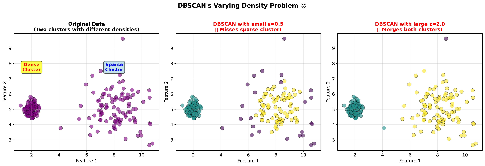

**OPTICS solves this!** Instead of using one fixed ε, it:
1. Explores multiple density levels
2. Creates an ordering of points
3. Shows clustering structure at ALL scales!

---

## 📊 The Reachability Plot

OPTICS's secret weapon is the **reachability plot**:

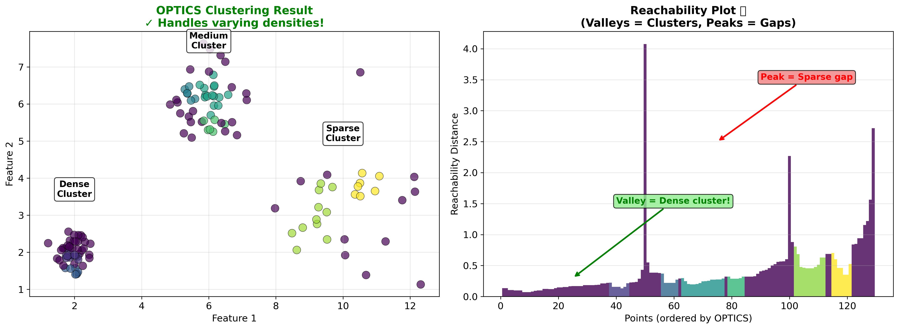

**How to Read It:**

```
Reachability
Distance
    ↑
    |     ___
    |    |   |___
    |____|       |___
    |                |___
    +-------------------→ Points (ordered)
    
    Valley = Dense cluster!
    Peak = Sparse area (noise)
```

**Visual analogy:** Like a side-view of mountains
- **Valleys** = clusters (low reachability = dense)
- **Peaks** = gaps between clusters (high reachability = sparse)

---

## 🎯 OPTICS Core Concepts

### 1. Core Distance
**Minimum ε needed for a point to be a core point**

If MinPts = 3:
```
    •
  •   •  •     Core distance = distance to 3rd nearest neighbor
    •
```

### 2. Reachability Distance
**How "reachable" is point B from point A?**

```
Reachability(B from A) = max(core_distance(A), distance(A,B))
```

**Think of it:** How hard is it to reach point B if you're starting from point A's neighborhood?

---

## 💻 Let's Code OPTICS!

```python
from sklearn.cluster import OPTICS
import numpy as np
import matplotlib.pyplot as plt

# Create data with varying densities
from sklearn.datasets import make_blobs

# Two clusters with different densities
X1, _ = make_blobs(n_samples=100, centers=[[0, 0]], cluster_std=0.5, random_state=42)
X2, _ = make_blobs(n_samples=100, centers=[[4, 4]], cluster_std=1.5, random_state=42)
X = np.vstack([X1, X2])

# Apply OPTICS
optics = OPTICS(min_samples=5, xi=0.05)
labels = optics.fit_predict(X)

# Create visualization
fig, axes = plt.subplots(1, 2, figsize=(15, 5))

# Plot 1: Clustering results
axes[0].scatter(X[:, 0], X[:, 1], c=labels, cmap='viridis', s=50)
axes[0].set_title('OPTICS Clustering Results')
axes[0].set_xlabel('Feature 1')
axes[0].set_ylabel('Feature 2')

# Plot 2: Reachability plot
space = np.arange(len(X))
reachability = optics.reachability_[optics.ordering_]
axes[1].plot(space, reachability, 'b-', alpha=0.7)
axes[1].fill_between(space, reachability, alpha=0.3)
axes[1].set_title('Reachability Plot')
axes[1].set_xlabel('Points (ordered)')
axes[1].set_ylabel('Reachability Distance')
axes[1].grid(True, alpha=0.3)

plt.tight_layout()
plt.show()

# Print results
n_clusters = len(set(labels)) - (1 if -1 in labels else 0)
n_noise = list(labels).count(-1)

print(f"Clusters found: {n_clusters}")
print(f"Noise points: {n_noise}")
print("\nOPTICS handles varying densities better than DBSCAN!")
```

---

## 🆚 DBSCAN vs OPTICS Comparison

| Feature | DBSCAN | OPTICS |
|---------|--------|--------|
| **Parameters** | ε, MinPts | MinPts, xi (optional) |
| **Varying Density** | Struggles ❌ | Handles well ✓ |
| **Speed** | Faster | Slower |
| **Output** | Cluster labels | Reachability plot + labels |
| **Interpretability** | Simple | More complex |
| **Best For** | Uniform density | Varying density |

**When to use DBSCAN:**
- Clusters have similar densities
- Speed is important
- Simple interpretation needed

**When to use OPTICS:**
- Clusters have varying densities
- Want to explore multiple density levels
- Need hierarchical structure information

---

## ✅ Density-Based Clustering: Pros and Cons

**Overall Advantages** 👍
- **Any shape clusters** - not limited to circles
- **Automatic outlier detection** - noise is identified
- **No need for K** - finds clusters automatically
- **Robust to noise** - doesn't force outliers into clusters

**Overall Disadvantages** 👎
- **Parameter tuning** - ε and MinPts need careful selection
- **High-dimensional struggles** - curse of dimensionality
- **Memory intensive** - needs distance matrix
- **Different scales** - requires standardization

---

## 🎓 Comparison: All Clustering Methods

Let's compare everything we've learned:

| Method | K-Means | Hierarchical | DBSCAN | OPTICS |
|--------|---------|--------------|--------|--------|
| **Need to specify K?** | Yes | Yes (or cut dendrogram) | No | No |
| **Cluster Shapes** | Spherical only | Depends on linkage | Any shape | Any shape |
| **Handles Noise** | No | No | Yes ✓ | Yes ✓ |
| **Varying Density** | No | No | No | Yes ✓ |
| **Speed** | ⚡ Very Fast | 🐌 Slow | ⚡ Fast | 🚗 Moderate |
| **Deterministic?** | No (random init) | Yes | Mostly | Mostly |
| **Good For** | Large datasets, simple clusters | Understanding hierarchy | Complex shapes | Varying densities |

---

## 🧪 Try It Yourself!

### Challenge 1: Hierarchical Clustering Experiment
Create a dataset of students with [study_hours, sleep_hours]:
- Use different linkage methods ('single', 'complete', 'average', 'ward')
- Create dendrograms for each
- Which method gives the best clusters?

```python
from scipy.cluster.hierarchy import dendrogram, linkage
import matplotlib.pyplot as plt

# Your code here!
```

### Challenge 2: DBSCAN Parameter Testing
Using the same student dataset:
- Try different ε values (0.5, 1.0, 2.0)
- Try different MinPts (2, 3, 5)
- How do results change?

```python
from sklearn.cluster import DBSCAN

# Your code here!
```

### Challenge 3: Shape Challenge
Create these datasets and cluster them:
1. Two circles (one inside the other)
2. Two crescent moons
3. Spiral shape

Which algorithm works best for each?

```python
from sklearn.datasets import make_circles, make_moons

# Your code here!
```

### Challenge 4: Compare All Methods
Create a comparison visualization:
- Same dataset
- Four subplots: K-Means, Hierarchical, DBSCAN, OPTICS
- Which performs best?

---

## 🎯 When to Use Each Method?

### Use K-Means when:
- ✓ You know how many clusters you want
- ✓ Clusters are roughly spherical
- ✓ You have a large dataset (millions of points)
- ✓ Speed is critical

### Use Hierarchical Clustering when:
- ✓ You want to understand data hierarchy
- ✓ Don't know exact number of clusters
- ✓ Dataset is small to medium (<10,000 points)
- ✓ Need to visualize relationships (dendrogram)

### Use DBSCAN when:
- ✓ Clusters have weird shapes
- ✓ Need to find outliers
- ✓ Don't know number of clusters
- ✓ All clusters have similar density

### Use OPTICS when:
- ✓ Clusters have varying densities
- ✓ Need hierarchical density-based structure
- ✓ Want to explore data at multiple scales
- ✓ DBSCAN isn't working well

---

## 📚 Vocabulary Check

**Hierarchical Clustering Terms:**
- **Agglomerative:** Bottom-up approach (merge small to large)
- **Divisive:** Top-down approach (split large to small)
- **Dendrogram:** Tree diagram showing cluster hierarchy
- **Linkage:** Method to measure distance between clusters
- **Single Linkage:** Nearest point distance
- **Complete Linkage:** Farthest point distance
- **Average Linkage:** Mean distance between all points
- **Ward's Method:** Minimize within-cluster variance

**Density-Based Terms:**
- **Density:** How crowded points are in a region
- **Core Point:** Point with enough neighbors (≥ MinPts)
- **Border Point:** Near a core point but not dense enough
- **Noise Point:** Isolated point, not in any cluster
- **Epsilon (ε):** Neighborhood radius
- **MinPts:** Minimum points to form dense region
- **Reachability Distance:** How accessible a point is from another
- **Reachability Plot:** Visualization of density structure

---

## 🏠 Homework Ideas

1. **Research Assignment:**
   - Find real-world applications of each clustering method
   - Why was that method chosen over others?

2. **Coding Challenge:**
   Create a "clustering detective" program that:
   - Takes a dataset
   - Tries all four methods
   - Recommends which works best and why

3. **Experiment:**
   - Create synthetic datasets with different shapes
   - Test all clustering methods
   - Document which method works best for each shape

4. **Dendrogram Analysis:**
   - Create a hierarchical clustering of your favorite songs
   - Use features like tempo, energy, danceability
   - Create a dendrogram showing song relationships

5. **Parameter Tuning:**
   - Use the K-distance graph to find optimal ε for DBSCAN
   - Test different MinPts values
   - Document how parameters affect results

---

## 🎉 Congratulations!

You've now mastered **advanced clustering techniques**!

**You learned:**
- ✅ **Hierarchical Clustering** - Building data family trees
- ✅ **Agglomerative vs Divisive** - Bottom-up and top-down approaches
- ✅ **Dendrograms** - Visualizing cluster hierarchies
- ✅ **Linkage Methods** - Different ways to measure cluster distance
- ✅ **DBSCAN** - Finding clusters based on density
- ✅ **OPTICS** - Handling varying density clusters
- ✅ **When to use each method** - Choosing the right tool

**Your Clustering Toolbox:**
1. **K-Means** → Fast, simple clusters
2. **Hierarchical** → Understanding structure
3. **DBSCAN** → Complex shapes, outlier detection
4. **OPTICS** → Varying densities

**Next Steps:**
- Practice with real datasets
- Experiment with parameter tuning
- Combine clustering with visualization
- Learn about cluster validation metrics
- Explore semi-supervised clustering

Remember: **There's no single "best" clustering algorithm!** The right choice depends on your data, goals, and constraints. Understanding multiple methods makes you a powerful data scientist! 🚀

---

## 🤔 Discussion Questions

1. Why might a dendrogram be more useful than just knowing the final clusters?

2. In what situations would DBSCAN be better than K-Means?

3. How would you explain "density-based clustering" to someone who's never heard of it?

4. What are the trade-offs between Agglomerative and Divisive clustering?

5. Why is OPTICS better than DBSCAN for datasets with varying densities?

6. Can you think of a real-world problem where you'd need hierarchical clustering?

---

*Keep exploring and happy clustering! The more you practice with different algorithms, the better you'll understand when to use each one! 🌟*
