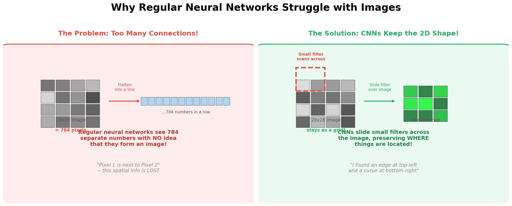
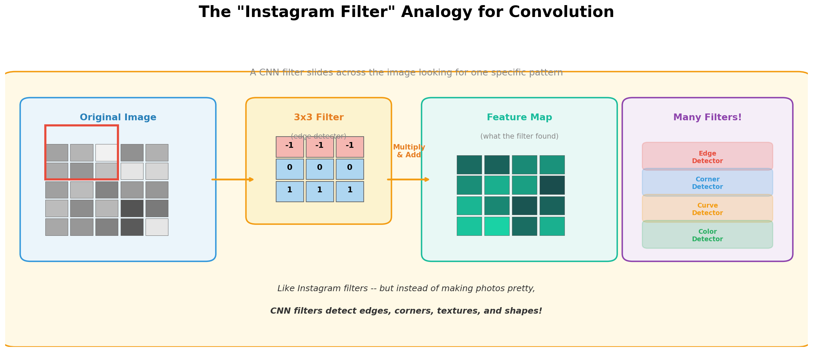
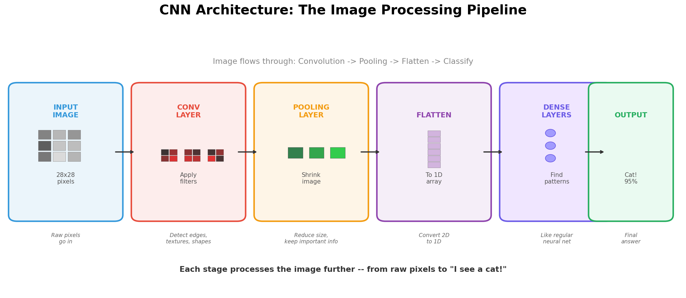
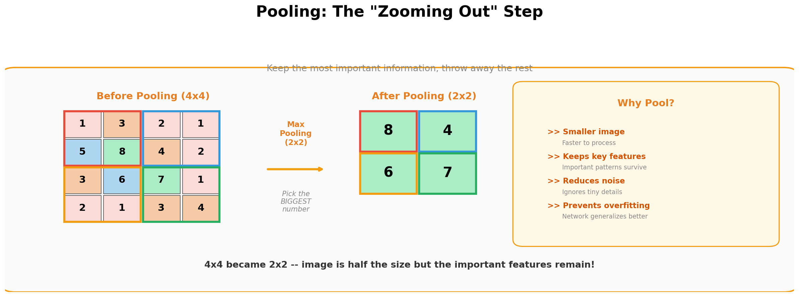
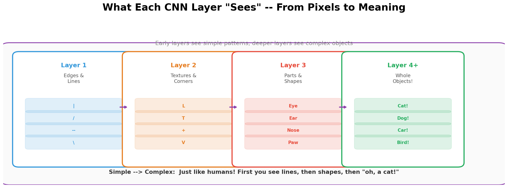
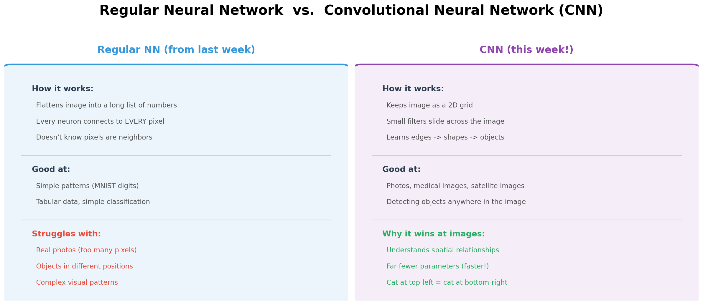

# 📸 Image Classification with CNNs

**Python Machine Learning Course — Week 24**  
**Learn and Help | Academic Year 2025–2026**

---

## 🎯 Learning Goals

By the end of this lesson, you will be able to:

1. Explain why regular neural networks struggle with images
2. Describe how a CNN processes an image using filters, pooling, and flattening
3. Use real analogies to explain convolution and pooling to a friend
4. Experiment with CNN playgrounds in the browser — no code needed
5. Build and train a CNN in Keras to classify images
6. Compare a CNN's accuracy to the regular neural network from Week 23

---

## 📖 Part 1: The Problem — Why Can't Regular Neural Networks Handle Images Well?

Last week you built a regular neural network (MLP) that classified MNIST handwritten digits with ~97% accuracy. That's great! But try giving that same network a **photo of a real cat** and it falls apart. Why?



The core problem is that a regular neural network **flattens** the image into a long line of numbers. A 28×28 image becomes a list of 784 numbers. A small phone photo (224×224×3 colors) becomes **150,528 numbers**. This creates two major issues:

**Issue 1: Spatial information is destroyed.** When you flatten an image, the network no longer knows that pixel (1,1) is *next to* pixel (1,2). It's as if someone cut a photo into confetti and dumped it in a pile — you lost all the structure.

**Issue 2: Way too many connections.** If your image has 150,528 pixels and your first hidden layer has 128 neurons, that's **19 million connections** in just the first layer! The network is huge, slow, and easy to overfit.

> 🎒 **School Analogy:** Imagine your teacher gives you a jigsaw puzzle but dumps all the pieces in a line instead of keeping the picture together. You'd have a much harder time figuring out what the picture is!

CNNs solve both problems. They keep the image as a **2D grid** and use small **sliding filters** to scan across it — like reading a page with a magnifying glass instead of scrambling all the letters.

---

## 📖 Part 2: The "Instagram Filter" Analogy — What Is Convolution?

The word "Convolutional" sounds scary, but the idea is simple: **slide a small filter across the image and see what it detects.**



### How It Works

Think about Instagram or Snapchat filters. When you apply a filter that sharpens the edges in your photo, here's what's really happening:

1. Take a tiny grid (usually 3×3 or 5×5) called a **filter** or **kernel**
2. Place it on the top-left corner of the image
3. **Multiply** each filter number by the pixel underneath it, then **add** them all up — this gives you one number
4. **Slide** the filter one pixel to the right and repeat
5. When you reach the end of a row, slide down and start the next row
6. The result is a new, smaller image called a **feature map** — it highlights where the filter found its pattern

### What Do Filters Actually Find?

Different filters detect different things:

| Filter Type | What It Finds | Analogy |
| --- | --- | --- |
| **Horizontal edge detector** | Horizontal lines and edges | Like finding the horizon in a landscape photo |
| **Vertical edge detector** | Vertical lines and edges | Like finding the edges of a door |
| **Corner detector** | Where two edges meet | Like finding the corners of a window |
| **Blur filter** | Smooths out noise | Like squinting at a picture |

The key insight: **you don't design these filters by hand.** The CNN *learns* which filters are most useful during training, just like how the weights in a regular neural network are learned!

> 💡 **Key Insight:** Each filter is like a specialist detective. One detective looks for horizontal lines, another looks for corners, another looks for curves. Together, they build up a complete description of what's in the image.

---

## 📖 Part 3: The CNN Pipeline — From Pixels to Prediction

A CNN processes an image through a series of stages, like an assembly line in a factory.



### Stage 1: Convolution Layer (Apply Filters)

Multiple filters slide across the image. Each filter produces a **feature map** — a highlighted version of where it found its pattern. If you have 32 filters, you get 32 feature maps.

### Stage 2: Activation (ReLU)

Same as last week! After each convolution, apply ReLU to keep only positive values. Negative values become 0. This helps the network focus on what matters.

### Stage 3: Pooling (Shrink It Down)

This is the "zooming out" step. Pooling reduces the size of each feature map while keeping the important information.



**Max Pooling** is the most common type. It slides a 2×2 window across the feature map and keeps only the **biggest number** in each window. This makes the image half the size in each dimension (a 4×4 becomes 2×2).

> 📱 **Phone Analogy:** Max pooling is like looking at a photo on your phone, then zooming out. You lose some tiny details, but you can still tell what the picture is. The important stuff survives the zoom.

### Stage 4: Repeat!

Most CNNs stack multiple rounds of Convolution → ReLU → Pooling. Each round finds increasingly complex patterns.

### Stage 5: Flatten

After several rounds, flatten the final feature maps into a 1D list (just like the regular neural network from Week 23).

### Stage 6: Dense Layers + Output

Pass the flattened features through regular dense layers (fully connected layers) and get a final prediction — e.g., "This is a cat with 95% confidence."

---

## 📖 Part 4: What Each Layer "Sees" — Simple to Complex

This is one of the most mind-blowing things about CNNs: each layer learns to recognize increasingly complex things.



This matches how our own brains process vision! Your visual cortex has layers that first detect edges, then combine them into shapes, then recognize whole objects. CNNs accidentally rediscovered the same architecture.

> 🎨 **Art Class Analogy:** Imagine drawing a cat. First you draw basic lines (Layer 1). Then you combine lines into shapes — circles for the head, triangles for ears (Layer 2). Then you add details like eyes and whiskers (Layer 3). Finally you step back and say "That's a cat!" (Layer 4). A CNN does the exact same thing, but in reverse — it *detects* those features instead of drawing them.

---

## 📖 Part 5: Regular Neural Network vs. CNN

Here's how the regular NN from Week 23 compares to a CNN:



### Side-by-Side Summary

| Feature | Regular NN (Week 23) | CNN (This Week) |
| --- | --- | --- |
| **Input format** | Flattened 1D array | 2D image grid |
| **How it processes** | Every neuron sees every pixel | Small filters slide across the image |
| **Understands position?** | No — "pixel 100" means nothing | Yes — knows neighbors and regions |
| **Number of parameters** | Very high | Much lower (parameter sharing!) |
| **Good at** | Tabular data, simple images | Photos, medical scans, satellite images |
| **MNIST accuracy** | ~97% | ~99% |
| **Real photo accuracy** | Poor | Excellent |

**Parameter sharing** is CNNs' secret weapon: the same 3×3 filter is reused across the entire image. A regular NN needs separate weights for every single pixel. This makes CNNs far more efficient.

> 💡 **Key Takeaway:** CNNs are regular neural networks with a special front end designed for images. The Conv + Pool layers are like an expert image preprocessor that feeds the best features into a regular dense network.

---

## 🎮 Part 6: Hands-On Playgrounds (No Code Needed!)

Before writing any code, explore these interactive tools in your browser.

### Playground 1: CNN Explainer — See Every Layer in Action 🌟

🔗 **[poloclub.github.io/cnn-explainer](https://poloclub.github.io/cnn-explainer/)**

This is the **must-try** playground for this week. It shows a real CNN classifying images (espresso, grocery store, etc.) and lets you click on **any neuron in any layer** to see exactly what it's detecting.

**What to explore:**

1. Click on different neurons in the first Conv layer — you'll see they detect different edges
2. Click on neurons in deeper layers — you'll see they detect more complex patterns
3. Hover over the connections to see filter values
4. Try the different input images and watch how activations change

### Playground 2: CNN Playground — Draw Digits & Detect Objects

🔗 **[cnn-playground.live](https://cnn-playground.live/)**

This site has multiple demos: draw a digit and watch a CNN classify it in real time, upload your own images for classification with a ResNet50 model, and even try object detection with YOLO.

### Playground 3: Google Quick, Draw! — Play a Game with a Neural Network

🔗 **[quickdraw.withgoogle.com](https://quickdraw.withgoogle.com/)**

A fun game where you draw objects in 20 seconds and a neural network tries to guess what you're drawing. Behind the scenes, it uses a model trained on over **one billion doodles** from players worldwide.

**Class activity idea:** Have a competition! Who can get the most correct guesses out of 6 rounds?

### Playground 4: Teachable Machine — Train Your Own Image Classifier

🔗 **[teachablemachine.withgoogle.com](https://teachablemachine.withgoogle.com/)**

Use your webcam to train a CNN to recognize anything you want — hand gestures, objects on your desk, facial expressions. No code needed, and you can export the model!

### Playground 5: ConvNet Playground — Semantic Image Search

🔗 **[convnetplayground.fastforwardlabs.com](https://convnetplayground.fastforwardlabs.com/)**

Upload an image and see how a CNN finds visually similar images. Great for understanding how CNNs turn images into "feature vectors" that capture what an image looks like.

---

## 🎮 Part 7: Hands-On Code Activities

### Activity 1: Build a CNN in Keras (MNIST Digits)

Let's classify the same MNIST digits from Week 23 — but this time with a CNN instead of a regular neural network.

```python
# ===========================================
# CNN for MNIST Digit Classification (Keras)
# ===========================================
# Compare this to Week 23's regular neural network!

import numpy as np
from tensorflow import keras
from tensorflow.keras import layers
import time

# Step 1: Load MNIST
(x_train, y_train), (x_test, y_test) = keras.datasets.mnist.load_data()

# Step 2: Prepare data — CNN needs 4D input: (samples, height, width, channels)
# Notice: we DON'T flatten to 784! We keep the 28x28 shape!
x_train = x_train.reshape(-1, 28, 28, 1).astype("float32") / 255.0
x_test = x_test.reshape(-1, 28, 28, 1).astype("float32") / 255.0

# Step 3: Build the CNN
model = keras.Sequential([
    # --- Convolution Block 1 ---
    layers.Conv2D(32, (3, 3), activation="relu", input_shape=(28, 28, 1)),
    #   32 filters, each 3x3 pixels, using ReLU activation
    layers.MaxPooling2D((2, 2)),
    #   Max pooling with 2x2 window — image shrinks from 26x26 to 13x13

    # --- Convolution Block 2 ---
    layers.Conv2D(64, (3, 3), activation="relu"),
    #   64 filters, each 3x3 — finds more complex patterns
    layers.MaxPooling2D((2, 2)),
    #   Shrinks again

    # --- Flatten + Dense Layers (same as Week 23 from here) ---
    layers.Flatten(),
    #   Convert 2D feature maps to 1D list
    layers.Dense(64, activation="relu"),
    #   Regular hidden layer
    layers.Dense(10, activation="softmax")
    #   Output: 10 neurons for digits 0-9
])

# Step 4: Show what we built
model.summary()

# Step 5: Compile and train
model.compile(optimizer="adam",
              loss="sparse_categorical_crossentropy",
              metrics=["accuracy"])

print("\n🧠 Training CNN...")
print("=" * 50)
start = time.time()
model.fit(x_train, y_train, epochs=5, batch_size=64, validation_split=0.1)
cnn_time = time.time() - start

# Step 6: Test
test_loss, test_accuracy = model.evaluate(x_test, y_test)
print(f"\n{'=' * 50}")
print(f"🎯 CNN Test Accuracy: {test_accuracy * 100:.2f}%")
print(f"⏱️  Training Time: {cnn_time:.1f}s")
print(f"\n📊 Compare to Week 23:")
print(f"   Regular NN (Keras):     ~97.5%")
print(f"   CNN (this week):        {test_accuracy * 100:.2f}%  {'🏆' if test_accuracy > 0.975 else ''}")
```

**Key differences from Week 23's code:**

* We use `Conv2D` and `MaxPooling2D` layers instead of only `Dense` layers
* We do NOT flatten the image at the start — we keep it as 28×28
* We reshape to `(28, 28, 1)` — the `1` means one color channel (grayscale)
* We still use `Flatten()` + `Dense()` at the end, just like a regular NN

---

### Activity 2: Fashion-MNIST — Classify Clothing Items

MNIST digits are "too easy" — let's try something harder! **Fashion-MNIST** has the same format (28×28 grayscale) but contains clothing items instead of digits.

```python
# ===========================================
# CNN for Fashion-MNIST (Clothing Classification)
# ===========================================
# Same format as MNIST, but much harder!

import numpy as np
from tensorflow import keras
from tensorflow.keras import layers

# Step 1: Load Fashion-MNIST (built into Keras!)
(x_train, y_train), (x_test, y_test) = keras.datasets.fashion_mnist.load_data()

# Class names (Fashion-MNIST uses numbers 0-9 for these categories)
class_names = ['T-shirt/top', 'Trouser', 'Pullover', 'Dress', 'Coat',
               'Sandal', 'Shirt', 'Sneaker', 'Bag', 'Ankle boot']

# Step 2: Prepare data
x_train = x_train.reshape(-1, 28, 28, 1).astype("float32") / 255.0
x_test = x_test.reshape(-1, 28, 28, 1).astype("float32") / 255.0

# Step 3: Build a slightly deeper CNN
model = keras.Sequential([
    layers.Conv2D(32, (3, 3), activation="relu", input_shape=(28, 28, 1)),
    layers.MaxPooling2D((2, 2)),
    layers.Conv2D(64, (3, 3), activation="relu"),
    layers.MaxPooling2D((2, 2)),
    layers.Conv2D(64, (3, 3), activation="relu"),  # Extra conv layer!
    layers.Flatten(),
    layers.Dense(64, activation="relu"),
    layers.Dense(10, activation="softmax")
])

# Step 4: Train
model.compile(optimizer="adam",
              loss="sparse_categorical_crossentropy",
              metrics=["accuracy"])

print("👗 Training CNN on Fashion-MNIST...")
model.fit(x_train, y_train, epochs=10, batch_size=64, validation_split=0.1, verbose=1)

# Step 5: Test
test_loss, test_acc = model.evaluate(x_test, y_test)
print(f"\n🎯 Fashion-MNIST Accuracy: {test_acc * 100:.2f}%")

# Step 6: Show predictions with class names
predictions = model.predict(x_test[:10])
print("\nFirst 10 predictions:")
for i in range(10):
    pred_class = np.argmax(predictions[i])
    confidence = predictions[i][pred_class] * 100
    actual = y_test[i]
    status = "✅" if pred_class == actual else "❌"
    print(f"  {status} Predicted: {class_names[pred_class]:12s} | Actual: {class_names[actual]:12s} | Confidence: {confidence:.1f}%")
```

---

### Activity 3: The Ultimate Week 23 vs Week 24 Showdown 🏁

Run this script to compare all approaches on the same dataset:

```python
# ===========================================
# SHOWDOWN: Regular NN vs CNN vs Random Forest
# ===========================================

import numpy as np
from sklearn.neural_network import MLPClassifier
from sklearn.ensemble import RandomForestClassifier
from sklearn.metrics import accuracy_score
from tensorflow import keras
from tensorflow.keras import layers
import time

# Load data
(x_train, y_train), (x_test, y_test) = keras.datasets.mnist.load_data()
x_train_flat = x_train.reshape(-1, 784).astype("float32") / 255.0
x_test_flat = x_test.reshape(-1, 784).astype("float32") / 255.0
x_train_cnn = x_train.reshape(-1, 28, 28, 1).astype("float32") / 255.0
x_test_cnn = x_test.reshape(-1, 28, 28, 1).astype("float32") / 255.0

results = {}

# 1. Random Forest
print("🌲 Training Random Forest...")
start = time.time()
rf = RandomForestClassifier(n_estimators=100, random_state=42)
rf.fit(x_train_flat[:10000], y_train[:10000])
results['Random Forest'] = (accuracy_score(y_test, rf.predict(x_test_flat)), time.time()-start, 'Classic ML')
print(f"   Done! {results['Random Forest'][0]*100:.2f}%")

# 2. Regular NN (scikit-learn)
print("\n🧠 Training Regular NN (scikit-learn)...")
start = time.time()
mlp = MLPClassifier(hidden_layer_sizes=(128, 64), max_iter=20, random_state=42, verbose=False)
mlp.fit(x_train_flat, y_train)
results['Regular NN (sklearn)'] = (accuracy_score(y_test, mlp.predict(x_test_flat)), time.time()-start, 'Neural Net')
print(f"   Done! {results['Regular NN (sklearn)'][0]*100:.2f}%")

# 3. Regular NN (Keras)
print("\n🧠 Training Regular NN (Keras)...")
nn = keras.Sequential([
    layers.Dense(128, activation="relu", input_shape=(784,)),
    layers.Dense(64, activation="relu"),
    layers.Dense(10, activation="softmax")
])
nn.compile(optimizer="adam", loss="sparse_categorical_crossentropy", metrics=["accuracy"])
start = time.time()
nn.fit(x_train_flat, y_train, epochs=5, batch_size=32, verbose=0)
_, nn_acc = nn.evaluate(x_test_flat, y_test, verbose=0)
results['Regular NN (Keras)'] = (nn_acc, time.time()-start, 'Neural Net')
print(f"   Done! {nn_acc*100:.2f}%")

# 4. CNN (Keras) - THE STAR OF THIS WEEK!
print("\n📸 Training CNN (Keras)...")
cnn = keras.Sequential([
    layers.Conv2D(32, (3,3), activation="relu", input_shape=(28,28,1)),
    layers.MaxPooling2D((2,2)),
    layers.Conv2D(64, (3,3), activation="relu"),
    layers.MaxPooling2D((2,2)),
    layers.Flatten(),
    layers.Dense(64, activation="relu"),
    layers.Dense(10, activation="softmax")
])
cnn.compile(optimizer="adam", loss="sparse_categorical_crossentropy", metrics=["accuracy"])
start = time.time()
cnn.fit(x_train_cnn, y_train, epochs=5, batch_size=64, verbose=0)
_, cnn_acc = cnn.evaluate(x_test_cnn, y_test, verbose=0)
results['CNN (Keras)'] = (cnn_acc, time.time()-start, 'CNN')
print(f"   Done! {cnn_acc*100:.2f}%")

# SCOREBOARD
print("\n" + "=" * 65)
print("🏆 FINAL SCOREBOARD — MNIST Digit Classification")
print("=" * 65)
print(f"{'Approach':<25} {'Accuracy':<12} {'Time':<10} {'Type'}")
print("-" * 65)
for name, (acc, t, tp) in sorted(results.items(), key=lambda x: -x[1][0]):
    medal = "🥇" if acc == max(v[0] for v in results.values()) else "  "
    print(f"{medal} {name:<23} {acc*100:.2f}%       {t:.1f}s       {tp}")
print("-" * 65)
print("\n💡 Notice how the CNN beats the regular NN — especially on images!")
```

**📝 Record your results:**

| Approach | Accuracy | Training Time | Type |
| --- | --- | --- | --- |
| Random Forest | ____% | ____s | Classic ML |
| Regular NN (scikit-learn) | ____% | ____s | Neural Net |
| Regular NN (Keras) | ____% | ____s | Neural Net |
| CNN (Keras) | ____% | ____s | CNN |


---

## 📺 Part 8: Recommended Videos and Resources

### Must-Watch Videos 🎬

| Video | Length | Why Watch It |
| --- | --- | --- |
| [Codebasics: Simple Explanation of CNN](https://www.youtube.com/watch?v=zfiSAzpy9NM) | 26 min | Beginner-friendly explanation using analogies — covers filters, convolution, ReLU, and pooling |
| [3Blue1Brown: But What Is a Convolution?](https://www.youtube.com/watch?v=KuXjwB4LzSA) | 23 min | Beautiful visual explanation of convolution — the math behind CNN filters |
| [Brandon Rohrer: How CNNs Work](https://www.youtube.com/watch?v=FmpDIaiMIeA) | 26 min | Excellent step-by-step walkthrough with clear diagrams |
| [Deeplizard: CNNs Explained](https://www.youtube.com/watch?v=YRhxdVk_sIs) | 15 min | Beginner-friendly with good examples and visualizations |

### Interactive Playgrounds 🎮 (Recap)

| Tool | Link | Best For |
| --- | --- | --- |
| **CNN Explainer** | [poloclub.github.io/cnn-explainer](https://poloclub.github.io/cnn-explainer/) | See what every layer and neuron in a CNN detects |
| **CNN Playground** | [cnn-playground.live](https://cnn-playground.live/) | Draw digits, upload photos, try object detection |
| **Google Quick, Draw!** | [quickdraw.withgoogle.com](https://quickdraw.withgoogle.com/) | Fun game — a CNN tries to guess your doodles |
| **Teachable Machine** | [teachablemachine.withgoogle.com](https://teachablemachine.withgoogle.com/) | Train your own CNN using your webcam |
| **ConvNet Playground** | [convnetplayground.fastforwardlabs.com](https://convnetplayground.fastforwardlabs.com/) | See how CNNs find visually similar images |

### Further Reading 📚

* [CNN Explainer Paper — Interactive Visualization for CNNs](https://poloclub.github.io/cnn-explainer/)
* [Kaggle: Intro to Computer Vision (Free Course)](https://www.kaggle.com/learn/computer-vision)
* [Fashion-MNIST Dataset on GitHub](https://github.com/zalandoresearch/fashion-mnist)

---

## 📝 Part 9: Assignment

### Task 1: CNN Explainer Exploration (Required)

Visit **[CNN Explainer](https://poloclub.github.io/cnn-explainer/)** and answer these questions:

1. How many Conv layers does the network have? How many filters in each?
2. Click on a neuron in the first Conv layer. What kind of pattern does it detect? (edges? colors? textures?)
3. Click on a neuron in a deeper layer. Is the pattern simpler or more complex than Layer 1?
4. In your own words, explain what "pooling" does and why it's useful.
5. What is the final prediction, and how confident is the network?

### Task 2: Quick, Draw! Competition (Required)

Play 3 rounds of **[Google Quick, Draw!](https://quickdraw.withgoogle.com/)** and answer:

1. How many out of 18 drawings (3 rounds × 6 each) did the AI guess correctly?
2. Pick one drawing the AI got wrong. Why do you think it failed?
3. How is Quick, Draw!'s neural network similar to the CNN you learned about today?

### Task 3: Build and Run a CNN (Required)

Run the **MNIST CNN code from Activity 1** and the **Showdown script from Activity 3**, then:

1. Screenshot the final scoreboard from Activity 3
2. How much better is the CNN compared to the regular NN? (percentage difference)
3. Try changing the CNN: add a third `Conv2D(128, (3,3))` layer. Does accuracy improve?
4. Try changing the number of filters: change `32` to `16`. What happens?

### Task 4: Fashion-MNIST Challenge (Bonus — Extra Credit)

Run the **Fashion-MNIST code from Activity 2** and:

1. What accuracy did you get? Which clothing items are hardest to classify?
2. Screenshot a few interesting predictions — especially any wrong ones
3. Why do you think "Shirt" and "T-shirt/top" are often confused?

---

## 🧠 Part 10: Quick Review — Key Takeaways

1. **Regular NNs flatten images** into a 1D list, losing spatial information. **CNNs keep the 2D structure** and slide filters across the image.
2. **Convolution** = sliding a small filter across the image to detect a specific pattern (edges, textures, shapes). Like an Instagram filter but for detecting patterns instead of making things pretty.
3. **Pooling** = shrinking the image while keeping important features. Max Pooling keeps the biggest value in each region — like zooming out.
4. **CNN layers learn simple → complex:** Early layers detect edges, middle layers detect shapes, deep layers detect whole objects.
5. **CNN architecture:** Input Image → [Conv → ReLU → Pool] × N → Flatten → Dense → Output
6. **CNNs beat regular NNs on images** because they understand spatial relationships and share parameters across the image.
7. **Parameter sharing** is CNNs' superpower: the same 3×3 filter works everywhere in the image, so CNNs need far fewer weights than a regular NN.
8. **Playgrounds like CNN Explainer, Quick Draw!, and Teachable Machine** let you see and interact with CNNs without writing any code.

---

## 🔮 What's Coming Next?

Now you know how to process **images** with CNNs. Next week, we'll tackle a completely different kind of data — **text!**

* **Week 25: NLP & Sentiment Analysis** — How do computers understand words and sentences?
* How do we turn text into numbers?
* Build a sentiment analyzer that knows if a movie review is positive or negative!

Everything builds on what you've learned: neural networks (Week 23) → image processing with CNNs (Week 24) → text processing with NLP (Week 25).

---

*Last Updated: April 2026*  
*Python ML Course — Learn and Help*
