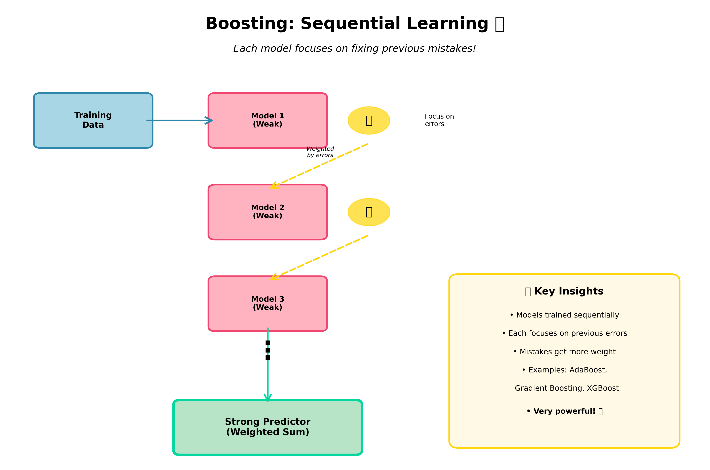
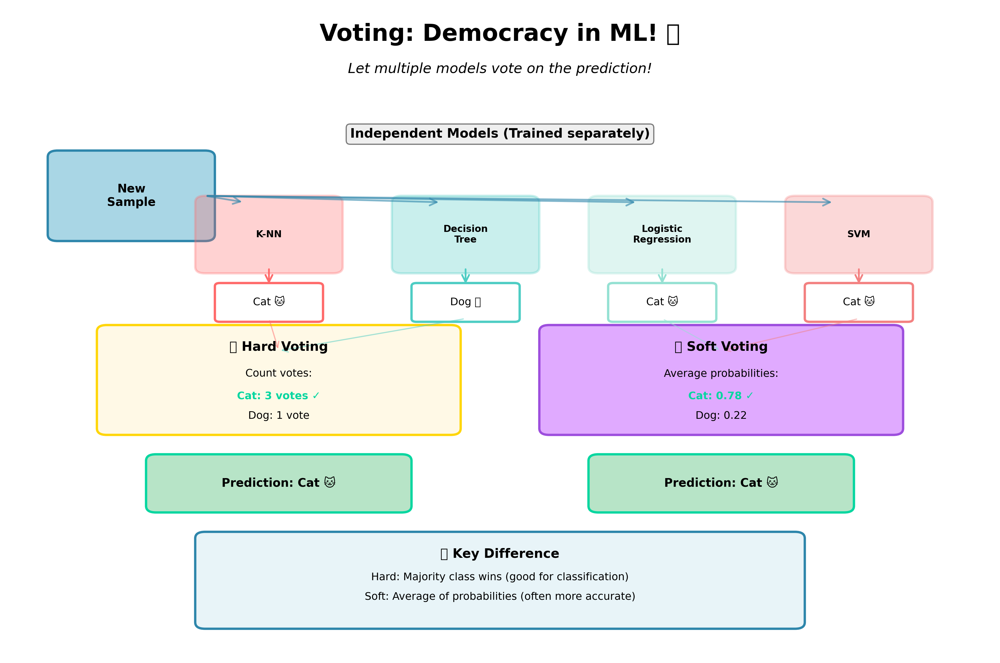
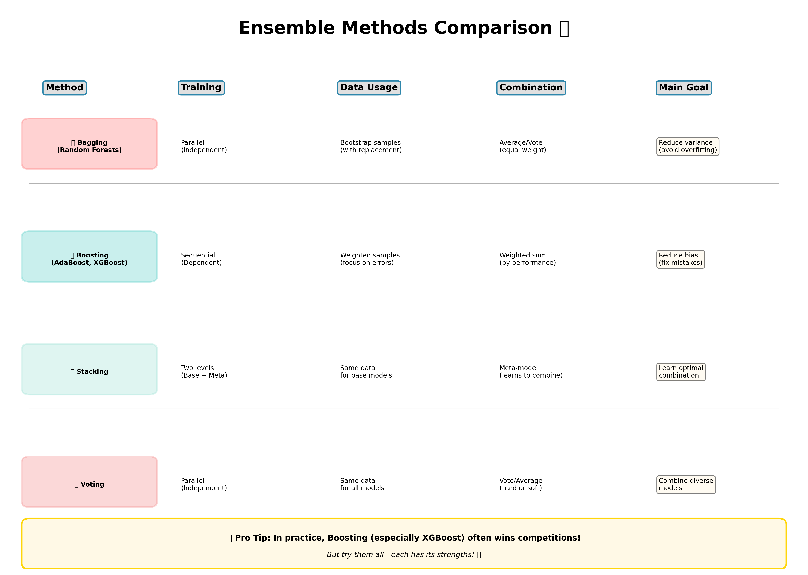

# Ensemble Methods: Advanced Techniques 🎭

**Building on Last Week's Random Forests!**

---

## 📚 Quick Recap: What We Learned Last Week

Last week, we learned about **Bagging** and **Random Forests**:
- **Bagging** = Bootstrap Aggregating
- We trained multiple decision trees on **different random samples** of data
- Each tree "votes" and we take the **average** or **majority vote**
- This helped us **reduce overfitting** and make our predictions more stable!

Think of it like asking multiple friends for advice - you get better answers than asking just one person! 🤝

---

## 🌟 Today's Journey: Three More Powerful Ensemble Techniques

We're going to explore three more ways to combine multiple models:

1. **Boosting** 🎯 - Models learn from each other's mistakes
2. **Stacking** 🏗️ - Models teach another model how to combine their predictions
3. **Voting** 🗳️ - Models cast votes to make final decisions

Let's dive in!

---

## 1. Boosting: Learning from Mistakes 🎯

### What is Boosting?

**Boosting** is like having a team where each member learns from the previous member's mistakes!

Imagine you're studying for a test:
- **Round 1**: You take a practice test and get some questions wrong ❌
- **Round 2**: You focus extra hard on the questions you missed
- **Round 3**: You focus on the NEW mistakes from round 2
- **Result**: You become really good at ALL the questions! ✨



### How Does Boosting Work?

**Step-by-Step Process:**

1. **Train Model 1** on the original data
2. **Find mistakes** - which data points did Model 1 get wrong?
3. **Give more weight** to those wrong predictions
4. **Train Model 2** focusing on those mistakes
5. **Repeat** this process for Model 3, Model 4, etc.
6. **Combine** all models with weighted voting

### Key Characteristics

| Feature | Description |
|---------|-------------|
| **Training Order** | Sequential (one after another) |
| **Focus** | Correcting previous mistakes |
| **Data Weighting** | Mistakes get higher weight |
| **Combination** | Weighted sum based on accuracy |
| **Goal** | Reduce bias (fix systematic errors) |

### Real-World Analogy 🎮

Think of a video game where:
- **Level 1**: You fight easy enemies, but some beat you
- **Level 2**: The game spawns MORE of the enemies that beat you
- **Level 3**: Even MORE of your weak spots appear
- **Result**: You become an expert at handling ALL enemy types!

### Popular Boosting Algorithms

#### 🔸 AdaBoost (Adaptive Boosting)
- The original boosting algorithm
- Adjusts weights after each round
- Great for binary classification
- Easy to understand and implement

```python
from sklearn.ensemble import AdaBoostClassifier
from sklearn.tree import DecisionTreeClassifier

# Create weak learner (shallow tree)
weak_learner = DecisionTreeClassifier(max_depth=1)

# Create AdaBoost with 50 weak learners
ada_boost = AdaBoostClassifier(
    estimator=weak_learner,
    n_estimators=50,
    learning_rate=1.0
)

# Train the model
ada_boost.fit(X_train, y_train)

# Make predictions
predictions = ada_boost.predict(X_test)
```

#### 🔸 Gradient Boosting
- Builds trees to predict the **residuals** (errors) of previous trees
- More flexible than AdaBoost
- Can work with different loss functions

```python
from sklearn.ensemble import GradientBoostingClassifier

gb_model = GradientBoostingClassifier(
    n_estimators=100,
    learning_rate=0.1,
    max_depth=3
)

gb_model.fit(X_train, y_train)
predictions = gb_model.predict(X_test)
```

#### 🔸 XGBoost (Extreme Gradient Boosting) ⭐
- The **superstar** of machine learning competitions!
- Extremely fast and efficient
- Has regularization to prevent overfitting
- Winner of many Kaggle competitions

```python
import xgboost as xgb

xgb_model = xgb.XGBClassifier(
    n_estimators=100,
    learning_rate=0.1,
    max_depth=3,
    subsample=0.8
)

xgb_model.fit(X_train, y_train)
predictions = xgb_model.predict(X_test)
```

### Important Hyperparameters

- **n_estimators**: Number of boosting rounds (how many models to train)
- **learning_rate**: How much each model contributes (lower = more conservative)
- **max_depth**: Maximum depth of each tree (controls complexity)

### ⚡ Strengths of Boosting

✅ **Very powerful** - Often wins ML competitions!
✅ **Handles complex patterns** - Great at finding subtle relationships
✅ **Reduces bias** - Fixes systematic errors
✅ **Works with weak learners** - Even simple models become strong together

### ⚠️ Challenges of Boosting

❌ **Can overfit** if not careful with parameters
❌ **Sequential training** - Can't parallelize like Bagging
❌ **Sensitive to outliers** - Bad data points get lots of attention
❌ **Slower to train** - Must wait for each model to finish

---

## 2. Stacking: The Meta-Learning Approach 🏗️

### What is Stacking?

**Stacking** (Stacked Generalization) is like having a team of experts and a **supervisor** who learns the best way to combine their opinions!

Imagine a panel of judges on a talent show:
- **Judge 1** (Dancer): Focuses on choreography
- **Judge 2** (Singer): Focuses on vocals
- **Judge 3** (Comedian): Focuses on entertainment
- **Head Judge**: Learns how to weight each judge's opinion based on the act type! 🎪


### How Does Stacking Work?

**Two-Level Architecture:**

**Level 0 (Base Models):**
1. Train several **different** types of models on your data
   - Decision Tree 🌳
   - Random Forest 🌲🌲
   - SVM 📐
   - Neural Network 🧠

2. Each model makes predictions

**Level 1 (Meta-Model):**
3. Use the **predictions from Level 0** as **new features**
4. Train a new model (meta-learner) to learn the best combination
5. The meta-model learns: "When Tree says 0.7 and Forest says 0.8, the answer is usually..."

### Key Characteristics

| Feature | Description |
|---------|-------------|
| **Training Levels** | Two levels: Base + Meta |
| **Model Diversity** | Use different types of models |
| **Meta Features** | Predictions become features |
| **Combination** | Meta-model learns optimal weights |
| **Goal** | Learn the best way to combine models |

### Real-World Analogy 🏥

Think of a hospital diagnosis:
- **Specialist 1** (Cardiologist): Checks heart health → "60% chance"
- **Specialist 2** (Neurologist): Checks brain health → "80% chance"
- **Specialist 3** (Radiologist): Checks X-rays → "70% chance"
- **General Doctor** (Meta): Has seen 1000s of cases and knows:
  - When cardiologist is usually right
  - When neurologist tends to overestimate
  - How to weight X-ray findings
  - Makes final diagnosis: "75% chance"

### Implementation Example

```python
from sklearn.ensemble import StackingClassifier
from sklearn.tree import DecisionTreeClassifier
from sklearn.ensemble import RandomForestClassifier
from sklearn.svm import SVC
from sklearn.linear_model import LogisticRegression

# Define base models (Level 0)
base_models = [
    ('dt', DecisionTreeClassifier(max_depth=5)),
    ('rf', RandomForestClassifier(n_estimators=50)),
    ('svm', SVC(probability=True))
]

# Define meta-model (Level 1)
meta_model = LogisticRegression()

# Create stacking classifier
stacking_clf = StackingClassifier(
    estimators=base_models,
    final_estimator=meta_model,
    cv=5  # Use cross-validation to create meta-features
)

# Train the entire stack
stacking_clf.fit(X_train, y_train)

# Make predictions
predictions = stacking_clf.predict(X_test)
```

### Why Cross-Validation is Important in Stacking

When creating meta-features, we use **cross-validation** to avoid overfitting:

1. Split training data into 5 folds
2. For each fold:
   - Train base models on 4 folds
   - Predict on the 5th fold
3. Collect all predictions as meta-features
4. Train meta-model on these meta-features

This ensures the meta-model sees predictions similar to what it will get during testing!

### ⚡ Strengths of Stacking

✅ **Learns optimal combination** - The meta-model figures out the best way to combine
✅ **Leverages diversity** - Different models catch different patterns
✅ **Often very accurate** - Can beat individual models significantly
✅ **Flexible** - Can use any models at any level

### ⚠️ Challenges of Stacking

❌ **Complex** - More parts to tune and maintain
❌ **Computationally expensive** - Training multiple levels takes time
❌ **Risk of overfitting** - Especially if not using proper cross-validation
❌ **Hard to interpret** - Multiple layers make it a "black box"

---

## 3. Voting: Democratic Decision Making 🗳️

### What is Voting?

**Voting** is the simplest ensemble method - just like a real election, each model gets a vote!

Imagine a group project decision:
- **Alice**: "Let's do topic A!" 
- **Bob**: "Let's do topic A!"
- **Charlie**: "Let's do topic B!"
- **Dana**: "Let's do topic A!"
- **Result**: Topic A wins 3-1! 🎉



### Two Types of Voting

#### 🔵 Hard Voting (Majority Vote)

Each model predicts a **class** and the class with the most votes wins!

```
Model 1: Cat 🐱
Model 2: Dog 🐕
Model 3: Cat 🐱
Model 4: Cat 🐱
-----------------
Final: Cat wins! (3 vs 1)
```

#### 🟢 Soft Voting (Average Probabilities)

Each model predicts **probabilities** and we average them!

```
Model 1: Cat=0.8, Dog=0.2
Model 2: Cat=0.6, Dog=0.4
Model 3: Cat=0.9, Dog=0.1
Model 4: Cat=0.7, Dog=0.3
-------------------------
Average: Cat=0.75, Dog=0.25
Final: Cat wins!
```

**Soft voting is usually more accurate** because it uses more information! 📊

### Key Characteristics

| Feature | Description |
|---------|-------------|
| **Training** | Independent (parallel) |
| **Diversity** | Works best with different model types |
| **Combination** | Simple majority or average |
| **Weights** | Can assign weights to models |
| **Goal** | Aggregate diverse opinions |

### Hard vs Soft Voting Comparison

| Aspect | Hard Voting | Soft Voting |
|--------|-------------|-------------|
| **Input** | Class predictions | Probability predictions |
| **Method** | Count votes | Average probabilities |
| **When to use** | Models don't predict probabilities | Models predict probabilities |
| **Accuracy** | Good | Usually better ✨ |
| **Requirement** | All models must predict classes | All models must predict probabilities |

### Implementation Example

```python
from sklearn.ensemble import VotingClassifier
from sklearn.tree import DecisionTreeClassifier
from sklearn.neighbors import KNeighborsClassifier
from sklearn.linear_model import LogisticRegression

# Define models
model1 = DecisionTreeClassifier(max_depth=5)
model2 = KNeighborsClassifier(n_neighbors=5)
model3 = LogisticRegression()

# Hard Voting Classifier
hard_voting = VotingClassifier(
    estimators=[
        ('dt', model1),
        ('knn', model2),
        ('lr', model3)
    ],
    voting='hard'  # Use hard voting
)

# Soft Voting Classifier
soft_voting = VotingClassifier(
    estimators=[
        ('dt', model1),
        ('knn', model2),
        ('lr', model3)
    ],
    voting='soft',  # Use soft voting
    weights=[2, 1, 1]  # Give decision tree 2x weight!
)

# Train
hard_voting.fit(X_train, y_train)
soft_voting.fit(X_train, y_train)

# Predict
hard_predictions = hard_voting.predict(X_test)
soft_predictions = soft_voting.predict(X_test)
```

### Weighted Voting

You can give more importance to better models!

```python
# Give different weights to models
voting_clf = VotingClassifier(
    estimators=[
        ('accurate_model', model1),
        ('okay_model', model2),
        ('weak_model', model3)
    ],
    voting='soft',
    weights=[3, 2, 1]  # Model 1 gets 3x the influence!
)
```

### ⚡ Strengths of Voting

✅ **Simple** - Easy to understand and implement
✅ **Parallel training** - All models train independently
✅ **Reduces variance** - Smooths out individual model errors
✅ **Robust** - Bad predictions from one model don't dominate

### ⚠️ Challenges of Voting

❌ **Requires diversity** - Similar models don't help much
❌ **Equal weight** (by default) - All models treated equally
❌ **No learning** - Doesn't learn optimal combination like Stacking
❌ **All models run** - Must wait for slowest model during prediction

---

## 🔄 Comparison: All Ensemble Methods Together



### Quick Reference Table

| Method | When to Use | Strengths | Challenges |
|--------|-------------|-----------|------------|
| **Bagging** 🎒 | High variance, prone to overfitting | Reduces overfitting, parallel training | May not reduce bias much |
| **Boosting** 🎯 | Need high accuracy, can tolerate longer training | Very powerful, handles complex patterns | Can overfit, sequential training |
| **Stacking** 🏗️ | Want maximum accuracy, have time to tune | Learns optimal combination, very flexible | Complex, computationally expensive |
| **Voting** 🗳️ | Have diverse models already, want simplicity | Simple, parallel training, robust | No learning of weights (unless manual) |

### Which Method Should You Choose? 🤔

**Start with Random Forests (Bagging)** if:
- You're new to ensemble methods
- You want something reliable and easy
- You have high variance issues
- You want parallel training

**Use Boosting (XGBoost)** if:
- You want to win a competition! 🏆
- You need maximum accuracy
- You can tune hyperparameters carefully
- You have clean data (not many outliers)

**Use Stacking** if:
- You want the absolute best performance
- You have different types of models ready
- You have time for complex tuning
- You don't mind "black box" models

**Use Voting** if:
- You already have several trained models
- You want a quick ensemble
- You want interpretability
- You want something simple to explain

---

## 💻 Complete Example: Comparing All Methods

Let's compare all ensemble methods on the same dataset!

```python
import numpy as np
from sklearn.datasets import make_classification
from sklearn.model_selection import train_test_split, cross_val_score
from sklearn.ensemble import (
    RandomForestClassifier,  # Bagging
    AdaBoostClassifier,      # Boosting
    GradientBoostingClassifier,  # Boosting
    StackingClassifier,      # Stacking
    VotingClassifier         # Voting
)
from sklearn.tree import DecisionTreeClassifier
from sklearn.neighbors import KNeighborsClassifier
from sklearn.svm import SVC
from sklearn.linear_model import LogisticRegression
import xgboost as xgb

# Create a dataset
X, y = make_classification(
    n_samples=1000,
    n_features=20,
    n_informative=15,
    n_redundant=5,
    random_state=42
)

# Split the data
X_train, X_test, y_train, y_test = train_test_split(
    X, y, test_size=0.3, random_state=42
)

# 1. BAGGING - Random Forest
print("🎒 Training Random Forest (Bagging)...")
rf_model = RandomForestClassifier(
    n_estimators=100,
    max_depth=10,
    random_state=42
)
rf_scores = cross_val_score(rf_model, X_train, y_train, cv=5)
print(f"   Mean CV Score: {rf_scores.mean():.4f} (+/- {rf_scores.std():.4f})")

# 2. BOOSTING - AdaBoost
print("\n🎯 Training AdaBoost...")
ada_model = AdaBoostClassifier(
    estimator=DecisionTreeClassifier(max_depth=1),
    n_estimators=50,
    random_state=42
)
ada_scores = cross_val_score(ada_model, X_train, y_train, cv=5)
print(f"   Mean CV Score: {ada_scores.mean():.4f} (+/- {ada_scores.std():.4f})")

# 3. BOOSTING - Gradient Boosting
print("\n🎯 Training Gradient Boosting...")
gb_model = GradientBoostingClassifier(
    n_estimators=100,
    learning_rate=0.1,
    max_depth=3,
    random_state=42
)
gb_scores = cross_val_score(gb_model, X_train, y_train, cv=5)
print(f"   Mean CV Score: {gb_scores.mean():.4f} (+/- {gb_scores.std():.4f})")

# 4. BOOSTING - XGBoost
print("\n🎯 Training XGBoost...")
xgb_model = xgb.XGBClassifier(
    n_estimators=100,
    learning_rate=0.1,
    max_depth=3,
    random_state=42
)
xgb_scores = cross_val_score(xgb_model, X_train, y_train, cv=5)
print(f"   Mean CV Score: {xgb_scores.mean():.4f} (+/- {xgb_scores.std():.4f})")

# 5. STACKING
print("\n🏗️ Training Stacking Classifier...")
base_models = [
    ('rf', RandomForestClassifier(n_estimators=50, max_depth=5, random_state=42)),
    ('knn', KNeighborsClassifier(n_neighbors=5)),
    ('svm', SVC(probability=True, random_state=42))
]
meta_model = LogisticRegression()
stacking_model = StackingClassifier(
    estimators=base_models,
    final_estimator=meta_model,
    cv=5
)
stacking_scores = cross_val_score(stacking_model, X_train, y_train, cv=5)
print(f"   Mean CV Score: {stacking_scores.mean():.4f} (+/- {stacking_scores.std():.4f})")

# 6. VOTING
print("\n🗳️ Training Voting Classifier (Soft)...")
voting_models = [
    ('rf', RandomForestClassifier(n_estimators=50, max_depth=5, random_state=42)),
    ('gb', GradientBoostingClassifier(n_estimators=50, random_state=42)),
    ('lr', LogisticRegression(random_state=42))
]
voting_model = VotingClassifier(
    estimators=voting_models,
    voting='soft'
)
voting_scores = cross_val_score(voting_model, X_train, y_train, cv=5)
print(f"   Mean CV Score: {voting_scores.mean():.4f} (+/- {voting_scores.std():.4f})")

# Train all models and test
print("\n" + "="*50)
print("FINAL TEST SET RESULTS:")
print("="*50)

models = {
    'Random Forest': rf_model,
    'AdaBoost': ada_model,
    'Gradient Boosting': gb_model,
    'XGBoost': xgb_model,
    'Stacking': stacking_model,
    'Voting': voting_model
}

for name, model in models.items():
    model.fit(X_train, y_train)
    score = model.score(X_test, y_test)
    print(f"{name:20s}: {score:.4f}")
```

---

## 🎓 Key Takeaways

### Remember These Points! 📝

1. **All ensemble methods combine multiple models** - That's what makes them powerful!

2. **Different approaches for different goals:**
   - **Bagging** → Reduce variance (overfitting)
   - **Boosting** → Reduce bias (underfitting)
   - **Stacking** → Learn optimal combination
   - **Voting** → Simple democratic combination

3. **Diversity is key** - Models should be different to provide value!

4. **More isn't always better** - Too many models can overfit or waste resources

5. **XGBoost wins competitions** - But Random Forests are easier to start with!

6. **Always use cross-validation** - Especially important for Stacking and hyperparameter tuning

---

## 🚀 Practice Exercises

### Exercise 1: Boosting Basics
Create an AdaBoost classifier and experiment with:
- Different numbers of estimators (10, 50, 100, 200)
- Different learning rates (0.1, 0.5, 1.0, 2.0)
- Plot how accuracy changes

### Exercise 2: Build a Stacking Ensemble
1. Create 3 different base models
2. Use a meta-learner of your choice
3. Compare with individual model performance

### Exercise 3: Hard vs Soft Voting
1. Create a voting classifier with 5 different models
2. Compare hard voting vs soft voting
3. Try adding weights to your models

### Exercise 4: Competition Challenge! 🏆
Take a dataset from Kaggle and:
1. Try Random Forest
2. Try XGBoost with different parameters
3. Try Stacking with 4+ base models
4. Compare all results - which wins?

---

## 📚 Additional Resources

### Want to Learn More?

- **Scikit-learn Documentation**: Comprehensive guides and examples
- **XGBoost Documentation**: Deep dive into gradient boosting
- **Kaggle Kernels**: See how winners use ensemble methods
- **Books**:
  - "Hands-On Machine Learning" by Aurélien Géron
  - "The Elements of Statistical Learning"

### Questions to Think About 💭

1. Why does boosting focus on mistakes while bagging samples randomly?
2. When would stacking NOT be worth the extra complexity?
3. Can you combine boosting AND bagging? (Hint: Yes! Look up Random Gradient Boosting)
4. Why is diversity among models so important for ensembles?

---

## 🎉 Conclusion

You now know the four major ensemble methods:

1. **Bagging** 🎒 - Train on different data samples (Random Forests)
2. **Boosting** 🎯 - Learn from mistakes sequentially (XGBoost)
3. **Stacking** 🏗️ - Use meta-learning to combine models
4. **Voting** 🗳️ - Simple democratic combination

Each has its place in your machine learning toolkit! 🧰

**Remember**: The best model is the one that works for YOUR specific problem. Always experiment, validate, and compare!

Happy Ensembling! 🎊

---

*Created for Python ML Course | Metro State University*
*Instructor: Siva | Learn and Help Program*
