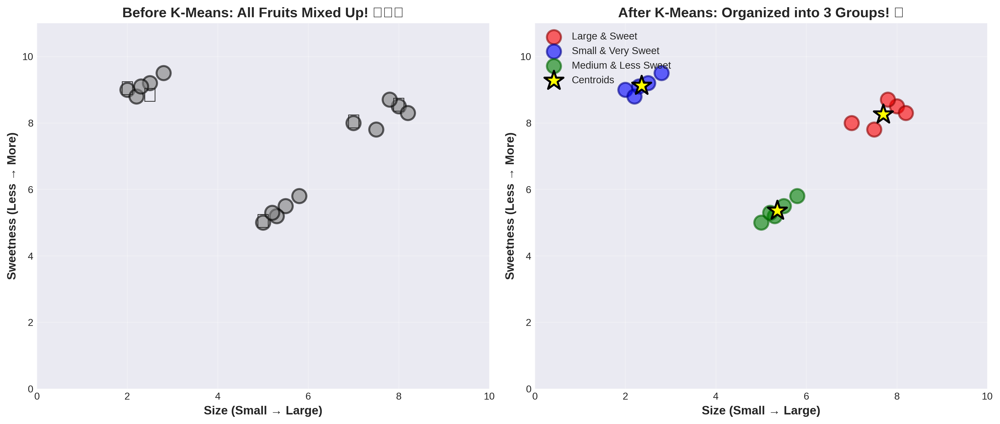
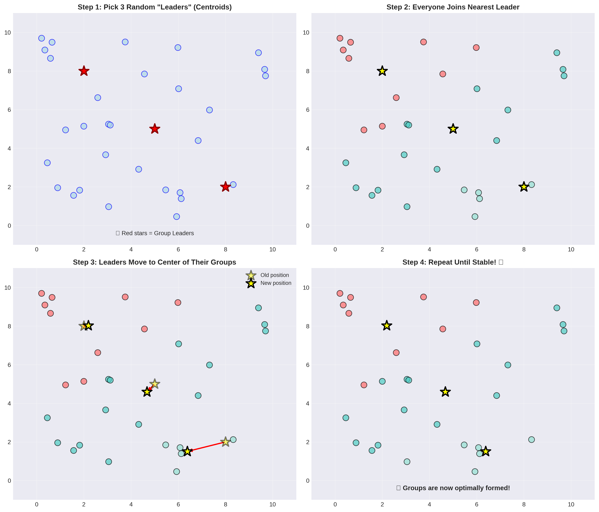
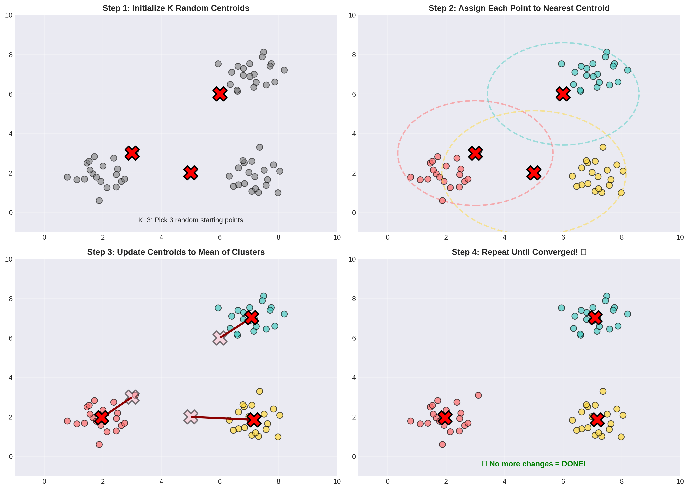
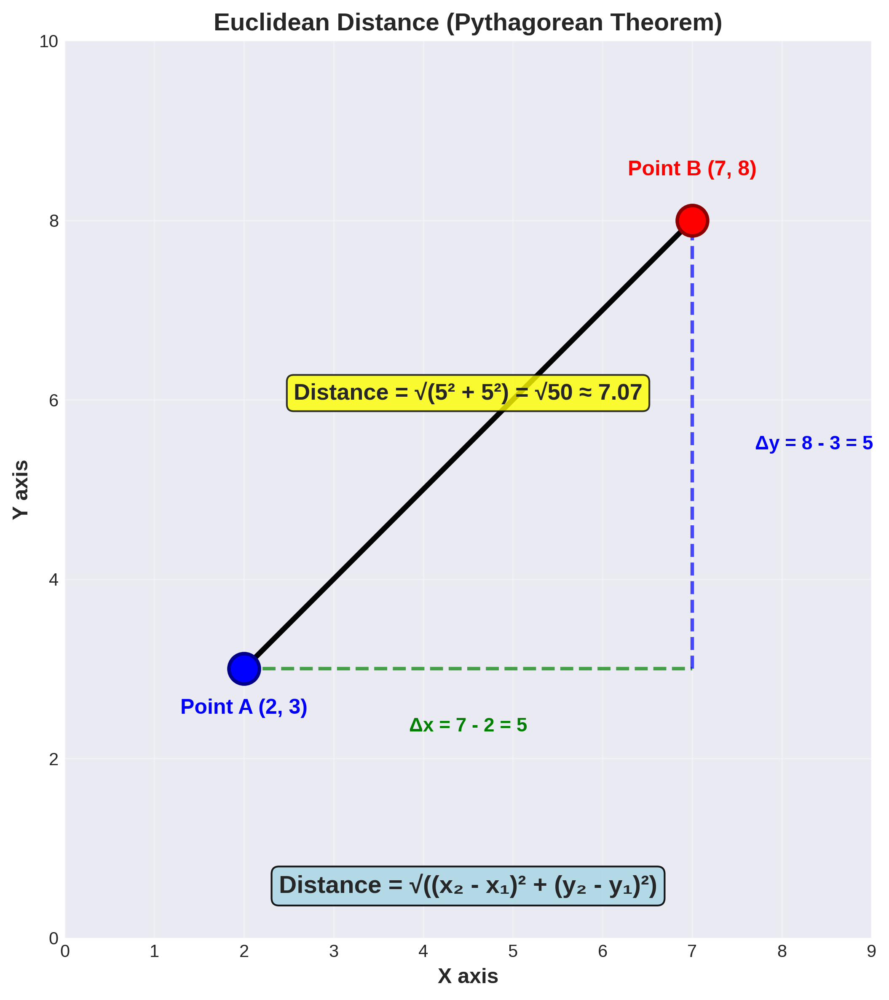
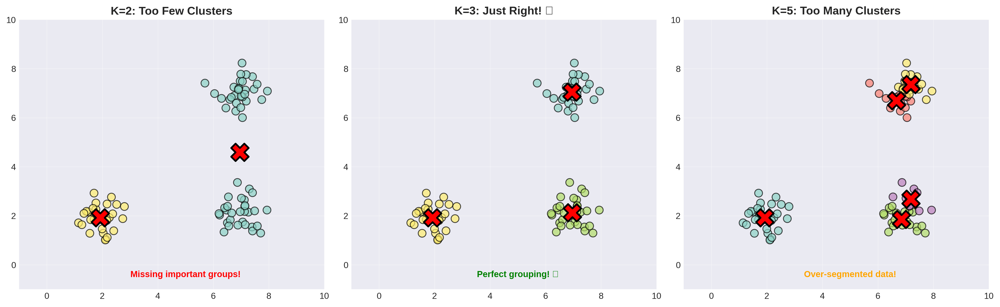
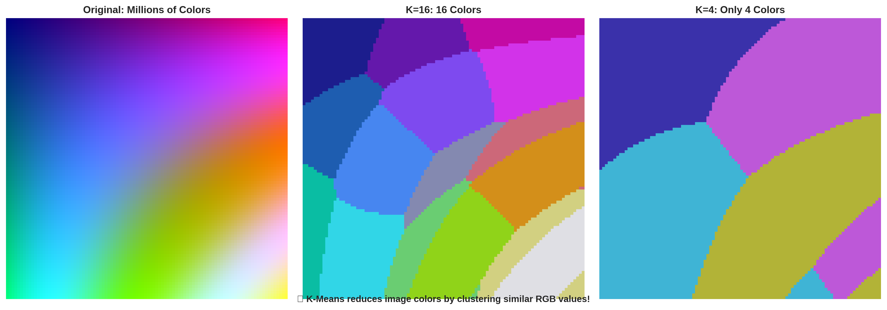
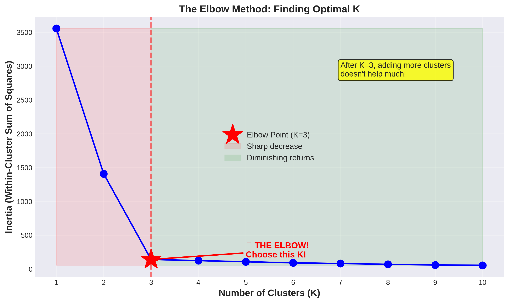
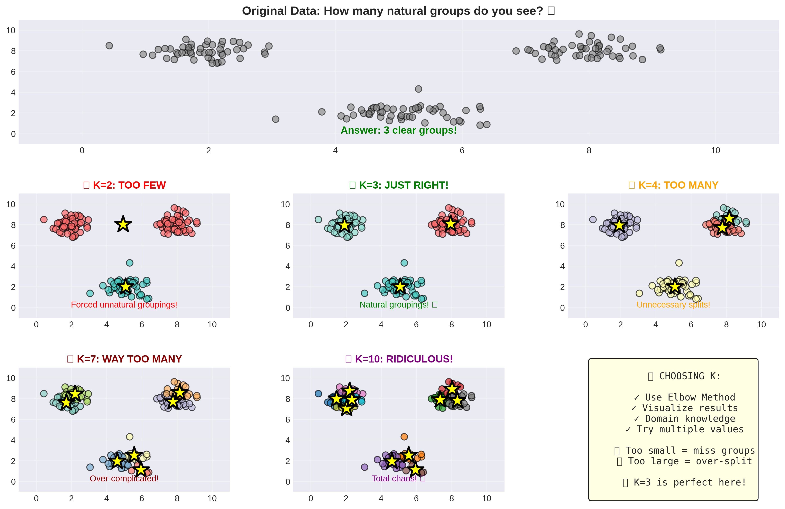

# K-Means Clustering 🎨
## A Fun Introduction to Grouping Similar Things Together!

---

## 🤔 What is K-Means Clustering?

Imagine your teacher asks you to organize your entire class into study groups. But here's the catch - you don't know ahead of time who should be in which group! You just need to put similar students together.

How would you do it?

You might:
1. Look at students' interests, study habits, and skills
2. Group students who are **similar** to each other
3. Keep adjusting until each group makes sense!

**That's exactly what K-Means Clustering does!** It automatically groups similar things together without being told what the groups should be.

---

## 🎯 KNN vs K-Means: What's the Difference?

Wait, didn't we just learn about KNN? Yes! But K-Means is different:

| Feature | KNN (K-Nearest Neighbors) | K-Means Clustering |
|---------|---------------------------|-------------------|
| **Type** | Supervised Learning | Unsupervised Learning |
| **Labels** | Needs labeled data | NO labels needed! |
| **Purpose** | Predict new data points | Find groups in data |
| **Question** | "What category is this?" | "What groups exist here?" |

**Think of it this way:**
- **KNN:** You know there are Soccer and Basketball players, and you want to classify a new student
- **K-Means:** You have students but don't know what groups exist - let the algorithm find natural groups!

---

## 🍎 The Fruit Store Example

Let's say you work at a fruit store, and you have a big pile of mixed fruits. You want to organize them into 3 groups based on their size and sweetness.



**Before K-Means:** All fruits are mixed up! 🍎🍌🍇🍊

**After K-Means:** 
- **Group 1 (Red):** Large, sweet fruits (apples, oranges)
- **Group 2 (Blue):** Small, very sweet fruits (grapes, berries)  
- **Group 3 (Green):** Medium, less sweet fruits (bananas, pears)

The algorithm found these groups **automatically** without us telling it what makes a "large sweet fruit"!

---

## 🎪 How K-Means Works: The Party Analogy

Imagine organizing a school dance where students naturally form groups:



**Step 1: Pick K Random "Group Leaders"**
- Randomly choose 3 students to be group leaders (if K=3)
- These are called **centroids** (center points)

**Step 2: Everyone Joins Their Nearest Leader**
- Each student walks to the leader they're closest to
- Now we have 3 groups!

**Step 3: Leaders Move to Group Center**
- Each leader moves to the center of their group
- They find the middle point of all their group members

**Step 4: Repeat!**
- Students might now be closer to a different leader
- They switch groups if needed
- Leaders move to new centers again

**Step 5: Stop When Stable**
- Keep repeating until nobody switches groups
- Groups are now optimally formed! 🎉

---

## 📊 K-Means Step-by-Step (Technical)

Let's break down the algorithm more precisely:



**Step 1: Initialize K Centroids**
```
Randomly pick K points from your data as starting centroids
```

**Step 2: Assignment**
```
For each data point:
    Calculate distance to each centroid
    Assign point to closest centroid
```

**Step 3: Update**
```
For each cluster:
    Calculate the mean (average) of all points in cluster
    Move centroid to this mean position
```

**Step 4: Check Convergence**
```
If centroids stopped moving (or moved very little):
    DONE! ✓
Else:
    Go back to Step 2
```

---

## 📐 How Do We Measure Distance?

Just like KNN, we need to measure how far apart things are. We use the same **Euclidean distance** formula:



**For 2D data:**
```
Distance = √((x₂ - x₁)² + (y₂ - y₁)²)
```

**For 3D data:**
```
Distance = √((x₂ - x₁)² + (y₂ - y₁)² + (z₂ - z₁)²)
```

**Example:**
- Point A: (2, 3)
- Point B: (5, 7)
- Distance = √((5-2)² + (7-3)²) = √(9 + 16) = √25 = 5

---

## 🔢 The "K" in K-Means

The **K** tells us **how many groups** we want to create.

- K = 2 means we want **2 groups**
- K = 3 means we want **3 groups**  
- K = 5 means we want **5 groups**



**How do we choose K?**

This is tricky! We'll learn more advanced methods later, but here are some quick tips:

1. **Know your data:** If you're grouping students by grade level (9th, 10th, 11th, 12th), use K=4
2. **Try different values:** Test K=2, K=3, K=4, etc. and see what makes sense
3. **Use the Elbow Method:** We'll learn this soon! (It's a graph that helps you pick K)

---

## 💻 Let's Code It! (Simple Version)

Here's a simple K-Means implementation to understand how it works:

```python
import math
import random

# Our data: student study hours and test scores
data = [
    [2, 60], [2.5, 65], [3, 70],      # Group 1: Low study, medium scores
    [5, 75], [6, 80], [5.5, 78],      # Group 2: Medium study, good scores  
    [8, 90], [9, 95], [8.5, 92]       # Group 3: High study, high scores
]

# Parameters
K = 3  # Number of clusters we want
max_iterations = 10

# Step 1: Initialize random centroids
def initialize_centroids(data, k):
    return random.sample(data, k)

# Step 2: Calculate distance between two points
def calculate_distance(point1, point2):
    return math.sqrt(sum((a - b) ** 2 for a, b in zip(point1, point2)))

# Step 3: Assign each point to nearest centroid
def assign_clusters(data, centroids):
    clusters = [[] for _ in range(len(centroids))]
    
    for point in data:
        # Find nearest centroid
        distances = [calculate_distance(point, centroid) for centroid in centroids]
        nearest_index = distances.index(min(distances))
        clusters[nearest_index].append(point)
    
    return clusters

# Step 4: Update centroids to mean of their clusters
def update_centroids(clusters):
    new_centroids = []
    
    for cluster in clusters:
        if len(cluster) > 0:
            # Calculate mean of all points in cluster
            mean = [sum(dim) / len(cluster) for dim in zip(*cluster)]
            new_centroids.append(mean)
        else:
            # Keep old centroid if cluster is empty
            new_centroids.append(cluster)
    
    return new_centroids

# Run K-Means!
print("🎯 Starting K-Means Clustering with K =", K)
print("="*50)

centroids = initialize_centroids(data, K)
print(f"\nInitial centroids: {centroids}")

for iteration in range(max_iterations):
    # Assign points to clusters
    clusters = assign_clusters(data, centroids)
    
    # Update centroids
    new_centroids = update_centroids(clusters)
    
    print(f"\nIteration {iteration + 1}:")
    print(f"  Centroids: {[[round(x, 2) for x in c] for c in new_centroids]}")
    
    # Check if converged
    if new_centroids == centroids:
        print(f"\n✓ Converged after {iteration + 1} iterations!")
        break
    
    centroids = new_centroids

# Display final clusters
print("\n" + "="*50)
print("📊 FINAL CLUSTERS:")
for i, cluster in enumerate(clusters):
    print(f"\nCluster {i + 1}:")
    for point in cluster:
        print(f"  Study Hours: {point[0]}, Test Score: {point[1]}")
```

**Sample Output:**
```
🎯 Starting K-Means Clustering with K = 3
==================================================

Initial centroids: [[8, 90], [2, 60], [6, 80]]

Iteration 1:
  Centroids: [[8.5, 92.33], [2.5, 65.0], [5.5, 77.67]]

Iteration 2:
  Centroids: [[8.5, 92.33], [2.5, 65.0], [5.5, 77.67]]

✓ Converged after 2 iterations!

==================================================
📊 FINAL CLUSTERS:

Cluster 1:
  Study Hours: 8, Test Score: 90
  Study Hours: 9, Test Score: 95
  Study Hours: 8.5, Test Score: 92

Cluster 2:
  Study Hours: 2, Test Score: 60
  Study Hours: 2.5, Test Score: 65
  Study Hours: 3, Test Score: 70

Cluster 3:
  Study Hours: 5, Test Score: 75
  Study Hours: 6, Test Score: 80
  Study Hours: 5.5, Test Score: 78
```

---

## 🎯 Real-World Uses of K-Means

K-Means is used everywhere! Here are some cool examples:

1. **Customer Segmentation** 🛍️
   - Grouping customers by shopping habits
   - "Budget shoppers", "Premium buyers", "Window shoppers"

2. **Image Compression** 🖼️
   - Reducing colors in an image
   - Group similar colors together

3. **Document Organization** 📚
   - Automatically sorting news articles
   - "Sports", "Politics", "Technology", etc.

4. **Social Network Analysis** 👥
   - Finding communities in social networks
   - Friend groups with similar interests

5. **Anomaly Detection** 🚨
   - Finding unusual patterns
   - Detecting fraud or system errors

6. **Academic Performance** 📊
   - Grouping students by performance patterns
   - Helping teachers identify who needs extra help

7. **Music Playlists** 🎵
   - Grouping similar songs
   - Creating automated playlists

---

## 🎨 Visual Example: Color Quantization

One of the coolest uses of K-Means is **image compression**! 



**How it works:**
1. Take an image with millions of colors
2. Use K-Means to group similar colors (say K=16)
3. Replace each color with its cluster center
4. Result: Image with only 16 colors, much smaller file size!

**Try this code:**

```python
from sklearn.cluster import KMeans
import numpy as np
from PIL import Image

# This is a simplified example - you'll need an actual image!
# Load image (replace with your image path)
# img = Image.open('your_image.jpg')
# pixels = np.array(img).reshape(-1, 3)  # Reshape to list of RGB values

# Reduce to K colors
# k = 16
# kmeans = KMeans(n_clusters=k, random_state=42)
# labels = kmeans.fit_predict(pixels)
# new_colors = kmeans.cluster_centers_[labels]
# compressed_img = new_colors.reshape(img.shape)

print("Image compressed from millions of colors to just", k, "colors!")
```

---

## 🤖 Using Scikit-Learn (The Pro Way)

Once you understand K-Means, use scikit-learn for better performance:

```python
from sklearn.cluster import KMeans
import numpy as np
import matplotlib.pyplot as plt

# Sample data: student study hours and test scores
X = np.array([
    [2, 60], [2.5, 65], [3, 70],
    [5, 75], [6, 80], [5.5, 78],
    [8, 90], [9, 95], [8.5, 92]
])

# Create and fit K-Means model
kmeans = KMeans(n_clusters=3, random_state=42)
kmeans.fit(X)

# Get cluster labels and centroids
labels = kmeans.labels_
centroids = kmeans.cluster_centers_

print("Cluster labels:", labels)
print("\nCentroid positions:")
for i, centroid in enumerate(centroids):
    print(f"  Cluster {i}: Study Hours = {centroid[0]:.2f}, Test Score = {centroid[1]:.2f}")

# Predict which cluster a new student belongs to
new_student = np.array([[4, 72]])
prediction = kmeans.predict(new_student)
print(f"\nA student with 4 study hours and score 72 belongs to Cluster {prediction[0]}")
```

**Output:**
```
Cluster labels: [0 0 0 1 1 1 2 2 2]

Centroid positions:
  Cluster 0: Study Hours = 2.50, Test Score = 65.00
  Cluster 1: Study Hours = 5.50, Test Score = 77.67
  Cluster 2: Study Hours = 8.50, Test Score = 92.33

A student with 4 study hours and score 72 belongs to Cluster 1
```

---

## 📈 The Elbow Method: Finding the Best K

How do we know if K=3 is better than K=4 or K=5? Use the **Elbow Method**!



**What is it?**
- We measure how "tight" our clusters are (called **inertia** or **WCSS**)
- Try different K values (K=1, 2, 3, 4, 5...)
- Plot K vs Inertia
- Look for the "elbow" - where adding more clusters doesn't help much

**Code Example:**

```python
from sklearn.cluster import KMeans
import matplotlib.pyplot as plt

# Calculate inertia for different K values
inertias = []
K_range = range(1, 10)

for k in K_range:
    kmeans = KMeans(n_clusters=k, random_state=42)
    kmeans.fit(X)
    inertias.append(kmeans.inertia_)

# Plot the elbow curve
plt.figure(figsize=(10, 6))
plt.plot(K_range, inertias, 'bo-')
plt.xlabel('Number of Clusters (K)')
plt.ylabel('Inertia (WCSS)')
plt.title('The Elbow Method')
plt.grid(True)
plt.show()

print("The 'elbow' point suggests the optimal K value!")
```

**How to read it:**
- Sharp decrease at the start? That's good!
- Curve starts to flatten? That's your elbow! 👈
- Choose K at the elbow point

---

## ✅ Pros and Cons

**Advantages (Why K-Means is Awesome!)** 👍
- **Fast and efficient** - works well with large datasets
- **Simple to understand** - easy concept to grasp
- **Scales well** - can handle millions of data points
- **Works in many dimensions** - not just 2D or 3D!
- **Guaranteed to converge** - will always finish

**Disadvantages (Things to Watch Out For)** 👎
- **Need to pick K** - choosing the right number of clusters is hard
- **Sensitive to initial centroids** - different starting points = different results
- **Assumes spherical clusters** - doesn't work well with weird shapes
- **Sensitive to outliers** - one extreme point can mess up a centroid
- **Requires numeric data** - can't directly cluster categories like "red, blue, green"

---

## 🎯 Common Pitfalls and Solutions

### Problem 1: Bad Initial Centroids

**Problem:** Random initialization can lead to poor clusters

**Solution:** Use `k-means++` initialization (scikit-learn does this by default!)

```python
kmeans = KMeans(n_clusters=3, init='k-means++', random_state=42)
```

### Problem 2: Choosing the Wrong K



**Problem:** Too few clusters (K=2) or too many clusters (K=10)

**Solution:** 
- Use the Elbow Method
- Try multiple K values and visualize
- Consider domain knowledge (if you know there should be 3 types, use K=3)

### Problem 3: Non-Spherical Clusters

**Problem:** K-Means expects round/spherical clusters

**Solution:** 
- Consider other algorithms (DBSCAN, Hierarchical Clustering)
- Transform your data first
- Accept that K-Means has limitations!

### Problem 4: Different Scales

**Problem:** One feature ranges 0-100, another ranges 0-1

**Solution:** **Standardize your data first!**

```python
from sklearn.preprocessing import StandardScaler

scaler = StandardScaler()
X_scaled = scaler.fit_transform(X)

kmeans = KMeans(n_clusters=3)
kmeans.fit(X_scaled)
```

---

## 🧪 Try It Yourself!

Here are some fun challenges:

**Challenge 1: Change K**  
Modify the code to use K=2 and K=4. How do the clusters change?

**Challenge 2: More Data**
Create a dataset about video game preferences with features:
- Hours played per week
- Preference for multiplayer (1-10 scale)

Cluster gamers into groups!

**Challenge 3: Real Dataset**
Try K-Means on the famous Iris dataset:

```python
from sklearn.datasets import load_iris
from sklearn.cluster import KMeans

iris = load_iris()
X = iris.data

kmeans = KMeans(n_clusters=3, random_state=42)
labels = kmeans.fit_predict(X)

print("Cluster sizes:", [sum(labels == i) for i in range(3)])
```

**Challenge 4: Elbow Method**
Implement the elbow method on your own dataset and determine the best K value.

**Challenge 5: Visualize It!**
Create a scatter plot showing your clusters with different colors:

```python
import matplotlib.pyplot as plt

plt.scatter(X[:, 0], X[:, 1], c=labels, cmap='viridis')
plt.scatter(centroids[:, 0], centroids[:, 1], c='red', marker='X', s=200)
plt.xlabel('Feature 1')
plt.ylabel('Feature 2')
plt.title('K-Means Clustering Results')
plt.show()
```

---

## 🔬 Advanced Topic: K-Means Variations

As you advance, you'll learn about improvements to basic K-Means:

1. **K-Means++**: Smarter initialization of centroids
2. **Mini-Batch K-Means**: Faster version for huge datasets
3. **Fuzzy C-Means**: Points can belong to multiple clusters
4. **K-Medoids**: Uses actual data points as centers (not means)

Don't worry about these now - just know they exist for when you need them!

---

## 🎓 Key Takeaways

Remember these important points about K-Means:

1. **Unsupervised learning** - finds patterns without labeled data
2. **K is your choice** - you decide how many clusters to find
3. **Iterative process** - assign → update → repeat until stable
4. **Distance-based** - uses Euclidean distance like KNN
5. **Fast but has limits** - great for many problems, but not perfect for all
6. **Standardize features** - always scale your data first!
7. **Elbow method helps** - use it to pick the best K value

---

## 📚 Vocabulary Check

- **Clustering:** Grouping similar things together (unsupervised)
- **K-Means:** Algorithm that creates K clusters by finding center points
- **Centroid:** The center point of a cluster (like a group leader)
- **Iteration:** One complete round of assigning points and updating centroids
- **Convergence:** When the algorithm stops because nothing changes anymore
- **Inertia (WCSS):** Measure of how tight/compact clusters are (lower is better)
- **Elbow Method:** Technique to find the optimal number of clusters
- **Unsupervised Learning:** Learning from data without labels

---

## 🆚 KNN vs K-Means Comparison

Let's put it all together:

| Aspect | KNN | K-Means |
|--------|-----|---------|
| **Learning Type** | Supervised | Unsupervised |
| **What it does** | Classifies new points | Groups existing points |
| **Needs labels?** | Yes! | No! |
| **K meaning** | # of neighbors to check | # of clusters to create |
| **Training** | No training (lazy) | Yes - iterative process |
| **Output** | Class label for new point | Cluster assignment for all points |
| **When to use** | You have labeled data | You want to discover patterns |

**Example Questions:**
- "Is this email spam?" → **KNN** (classification)
- "What groups exist in my customer data?" → **K-Means** (clustering)

---

## 🏠 Homework Ideas

1. **Research:** Find and describe one more real-world application of K-Means clustering

2. **Code:** Create a K-Means program that clusters students based on:
   - Hours of study per week
   - Hours of sleep per night
   - Extracurricular activities per week

3. **Experiment:** 
   - Generate random 2D data points
   - Try K-Means with K=2, 3, 4, 5
   - Visualize results with different colors
   - Which K looks best?

4. **Think:** 
   - Why might K-Means fail to cluster crescent-shaped groups?
   - When would you use K-Means vs KNN?

5. **Elbow Method:** 
   - Implement the elbow method
   - Create a plot showing the elbow curve
   - Identify the optimal K

---

## 🎉 Congratulations!

You now understand K-Means Clustering, one of the most popular unsupervised learning algorithms! Unlike KNN which needs labeled data, K-Means discovers patterns on its own - making it perfect for exploring new datasets.

**Next steps:** 
- Practice with different datasets
- Experiment with the elbow method
- Learn about other clustering algorithms (DBSCAN, Hierarchical)
- Combine K-Means with visualization for powerful data exploration
- Try image compression projects!

**Remember:** K-Means is great for finding natural groups in your data. Whether it's customer segments, student groups, or color palettes, K-Means helps you discover hidden patterns! 🔍

Keep exploring and have fun with clustering! 🚀

---

*Questions? Experiment with the code and try different datasets! The best way to learn is by doing!*
