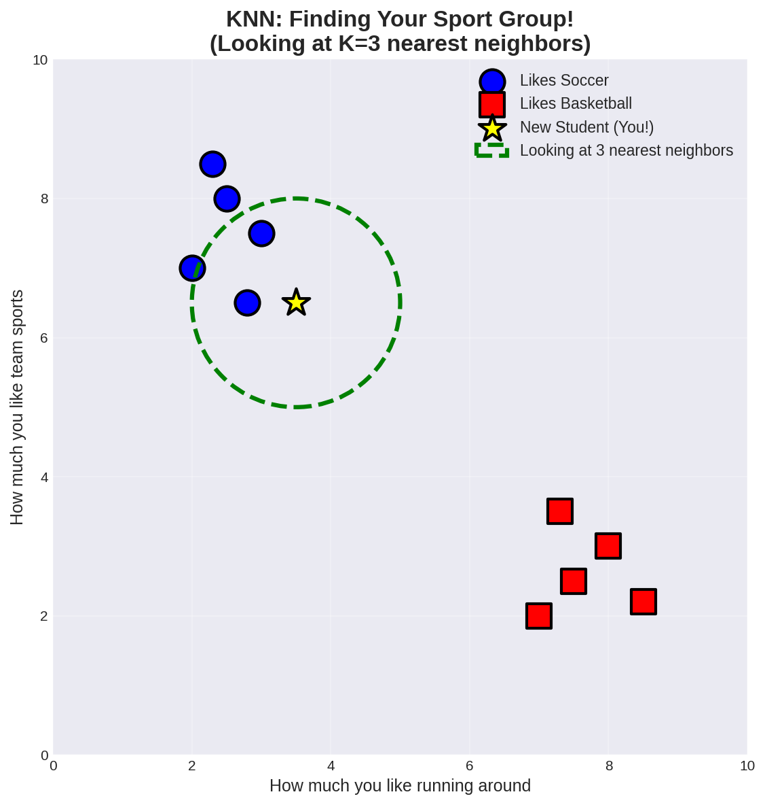
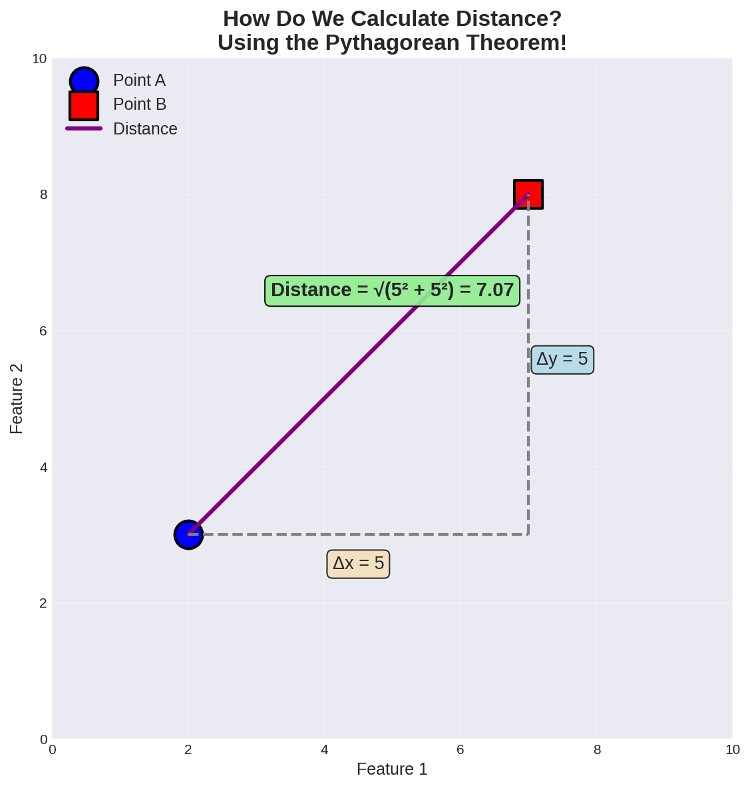
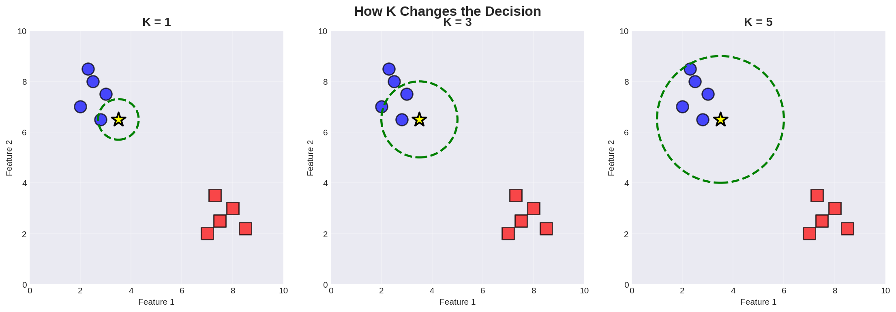
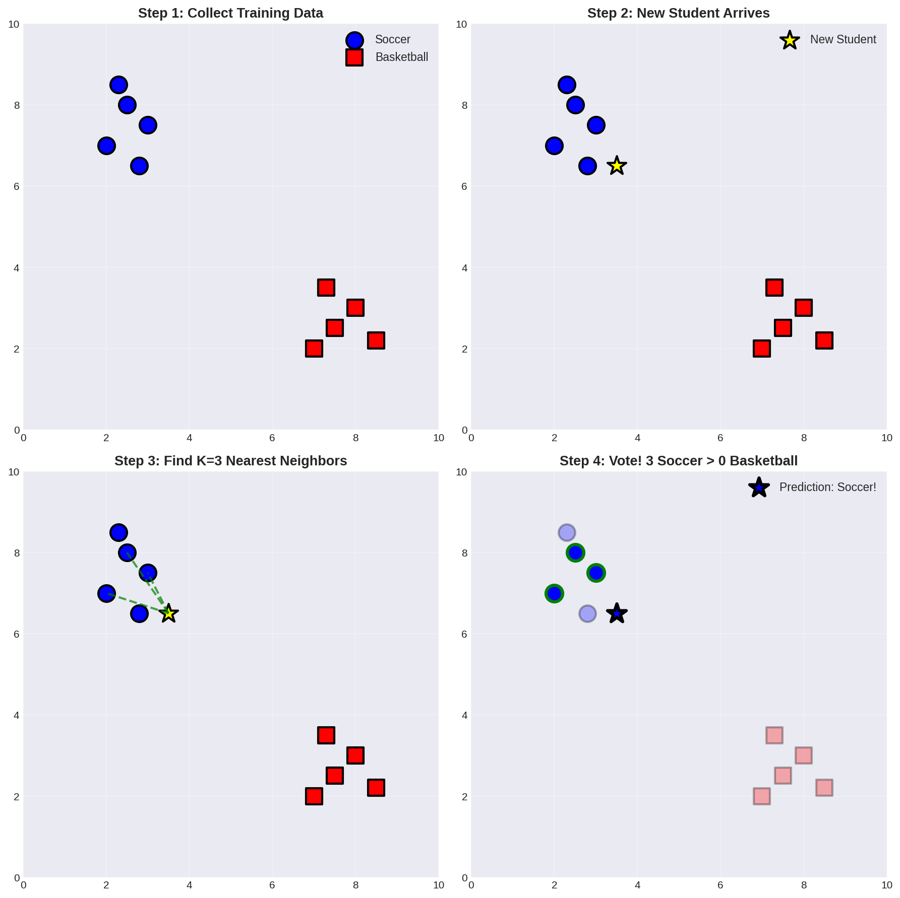

# K-Nearest Neighbors (KNN) 🎯
## A Fun Introduction to Your First Machine Learning Algorithm!

---

## 🤔 What is KNN?

Imagine you just moved to a new school, and you want to find friends who like the same things you do. How would you do it?

You'd probably:
1. Look at the students **closest** to you (maybe in your classes)
2. See what they like to do
3. Hang out with the ones who share your interests!

**That's exactly what KNN does!** It looks at the **K Nearest Neighbors** to make predictions.

---

## 🎮 The Sports Example

Let's say we have students who either like **Soccer** ⚽ or **Basketball** 🏀. 

You're a new student, and we want to predict which sport you'll like based on:
- How much you like running around
- How much you like team sports



In this picture:
- **Blue circles** = Students who like Soccer
- **Red squares** = Students who like Basketball  
- **Yellow star** = That's YOU! (the new student)
- **Green dashed circle** = We're looking at your 3 nearest neighbors (K=3)

**Result:** Your 3 nearest neighbors all like Soccer, so we predict you'll like Soccer too! ⚽

---

## 📏 How Do We Measure "Nearest"?

Great question! We use **distance** to find who's nearest. Remember the Pythagorean theorem from math class? We use it here!



**The Formula:**
```
Distance = √((x₂ - x₁)² + (y₂ - y₁)²)
```

It's like finding the length of the diagonal line between two points on a graph!

---

## 🔢 The "K" in KNN

The **K** is just a number that tells us **how many neighbors to look at**.

- K = 1 means we only look at the **1 closest** neighbor
- K = 3 means we look at the **3 closest** neighbors  
- K = 5 means we look at the **5 closest** neighbors



**Which K should we choose?**
- **Small K (like 1):** Quick decisions, but might be wrong if that one neighbor is unusual
- **Large K (like 10):** More stable, but might miss important details
- **Good K (like 3 or 5):** Usually just right! 😊

---

## 🪜 KNN Step-by-Step

Let's break down how KNN works into simple steps:



**Step 1: Collect Training Data**
- Gather information about students we already know
- Label each one (Soccer or Basketball)

**Step 2: New Student Arrives**  
- A new student shows up (that's you!)
- We have information about you but don't know which sport you'll like

**Step 3: Find K Nearest Neighbors**
- Calculate distance to ALL known students
- Pick the K closest ones (let's say K=3)

**Step 4: Vote!**
- Count how many of those 3 neighbors like Soccer vs Basketball
- The one with more votes wins!
- In our example: 3 like Soccer, 0 like Basketball → Prediction: **Soccer!** ⚽

---

## 💻 Let's Code It! (Simple Version)

Here's a super simple KNN in Python to get you started:

```python
import math

# Our training data: (x, y, label)
training_data = [
    (2, 7, "Soccer"),
    (3, 8, "Soccer"),
    (2.5, 7.5, "Soccer"),
    (7, 2, "Basketball"),
    (8, 3, "Basketball"),
    (7.5, 2.5, "Basketball"),
]

# New student's data
new_student = (3.5, 6.5)

# Step 1: Calculate distances
def calculate_distance(point1, point2):
    x1, y1 = point1
    x2, y2 = point2
    return math.sqrt((x2 - x1)**2 + (y2 - y1)**2)

# Calculate distance to each training point
distances = []
for data_point in training_data:
    x, y, label = data_point
    dist = calculate_distance(new_student, (x, y))
    distances.append((dist, label))

# Step 2: Sort by distance
distances.sort()

# Step 3: Pick K=3 nearest neighbors
k = 3
nearest_neighbors = distances[:k]

print("The 3 nearest neighbors:")
for dist, label in nearest_neighbors:
    print(f"  Distance: {dist:.2f}, Sport: {label}")

# Step 4: Vote!
votes = {}
for dist, label in nearest_neighbors:
    if label in votes:
        votes[label] += 1
    else:
        votes[label] = 1

# Find the winner
prediction = max(votes, key=votes.get)
print(f"\n🎉 Prediction: The new student will like {prediction}!")
print(f"   Votes: {votes}")
```

**Output:**
```
The 3 nearest neighbors:
  Distance: 1.12, Sport: Soccer
  Distance: 1.58, Sport: Soccer
  Distance: 1.80, Sport: Soccer

🎉 Prediction: The new student will like Soccer!
   Votes: {'Soccer': 3}
```

---

## 🎯 Real-World Uses of KNN

KNN isn't just for predicting sports! It's used in many real applications:

1. **Recommendation Systems** 📺
   - Netflix uses similar algorithms to recommend shows
   - "People who liked show A also liked show B"

2. **Handwriting Recognition** ✍️
   - Recognizing numbers and letters you write
   - Comparing your writing to known examples

3. **Medical Diagnosis** 🏥
   - Helping doctors identify diseases
   - Comparing symptoms to past patients

4. **Face Recognition** 📸
   - Unlocking your phone with your face
   - Finding similar faces in photo libraries

5. **Spam Detection** 📧
   - Identifying spam emails
   - Comparing to known spam messages

---

## ✅ Pros and Cons

**Advantages (Why KNN is Awesome!)** 👍
- **Super simple** to understand and explain
- **No training needed** - just store the data!
- Works well for many different types of problems
- Can handle complex patterns

**Disadvantages (Things to Watch Out For)** 👎
- **Slow for big datasets** - must check every point!
- **Sensitive to noisy data** - one weird point can mess things up
- Need to pick the right K value
- All features need to be on similar scales (we'll learn about this later!)

---

## 🧪 Try It Yourself!

Here are some challenges for you:

**Challenge 1: Change K**  
Modify the code above to use K=1 and K=5. How do the predictions change?

**Challenge 2: Add More Data**
Add 3 more students to the training data. Do you get the same prediction?

**Challenge 3: Different Features**
Think of a different problem where you could use KNN:
- Predicting if someone likes cats or dogs
- Predicting favorite ice cream flavor
- Predicting video game preference

What features (measurements) would you use?

---

## 🤓 Using Scikit-Learn (The Pro Way)

Once you understand how KNN works, you can use Python's scikit-learn library to do it faster:

```python
from sklearn.neighbors import KNeighborsClassifier
import numpy as np

# Prepare the data
X = np.array([[2, 7], [3, 8], [2.5, 7.5], 
              [7, 2], [8, 3], [7.5, 2.5]])
y = np.array(['Soccer', 'Soccer', 'Soccer', 
              'Basketball', 'Basketball', 'Basketball'])

# Create and train KNN model
knn = KNeighborsClassifier(n_neighbors=3)
knn.fit(X, y)

# Make a prediction
new_student = np.array([[3.5, 6.5]])
prediction = knn.predict(new_student)

print(f"Prediction: {prediction[0]}")
```

Same result, way less code! 🚀

---

## 🎓 Key Takeaways

Remember these important points about KNN:

1. **KNN is a "lazy learner"** - it doesn't train a model, just memorizes the data
2. **K is important** - too small = noisy, too large = over-simplified
3. **Distance matters** - we usually use Euclidean distance (Pythagorean theorem)
4. **Voting decides** - the majority class among neighbors wins
5. **Simple but powerful** - one of the easiest ML algorithms to understand!

---

## 🔍 Vocabulary Check

- **K-Nearest Neighbors (KNN):** An algorithm that makes predictions based on the K closest training examples
- **K:** The number of neighbors we look at when making a prediction
- **Distance:** How far apart two points are (we calculate this with math!)
- **Training Data:** The examples we already know about (with labels)
- **Classification:** Putting things into categories (like Soccer vs Basketball)
- **Voting:** Counting up the neighbors to see which category has the most

---

## 🏠 Homework Ideas

1. **Research:** Find one more real-world application of KNN and write 2-3 sentences about it

2. **Code:** Write a KNN program that predicts if a student likes:
   - Video games vs Board games
   - Use 2 features: "likes technology" and "likes competition"

3. **Experiment:** Try different K values (1, 3, 5, 7, 9) and see how predictions change

4. **Think:** Why do you think using K=1 might sometimes give wrong predictions?

---

## 🎉 Congratulations!

You now understand your first machine learning algorithm! KNN might seem simple, but it's a powerful tool that's used in many real applications. As you continue learning, you'll discover more complex algorithms, but they all build on these same basic ideas.

**Next steps:** 
- Practice coding KNN with different datasets
- Experiment with different K values
- Learn about other classification algorithms
- Try using scikit-learn for faster implementation

Keep coding and have fun with machine learning! 🚀

---

*Questions? Ask your teacher or experiment with the code to learn more!*
