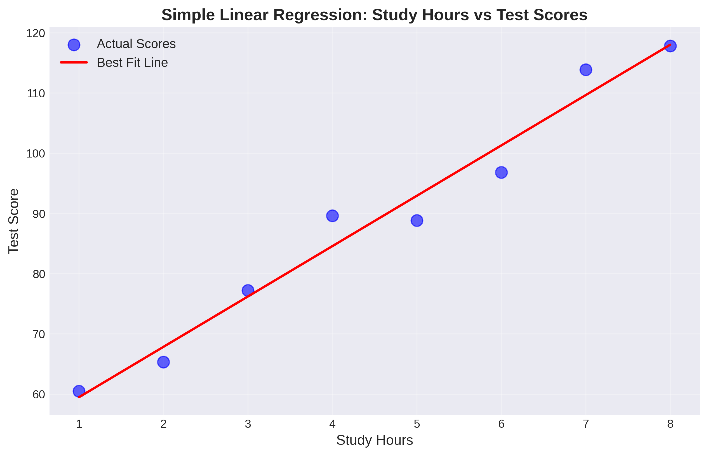
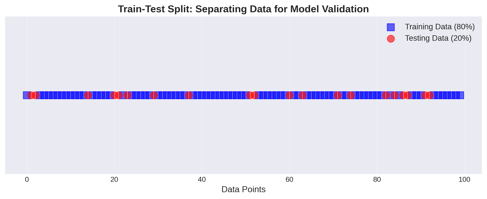

# Introduction to Linear Regression

## What is Machine Learning?

Machine Learning (ML) is a field of artificial intelligence where computers learn patterns from data without being explicitly programmed. Instead of writing rules for every situation, we feed the computer examples, and it figures out the patterns on its own.

**Linear Regression** is one of the foundational techniques in Machine Learning. It's a simple yet powerful method for predicting numerical values based on input data.

## Real-World Applications

Before diving into the math, let's see where Linear Regression is used in real life:

- **Real Estate**: Predicting house prices based on size, location, and number of bedrooms
- **Education**: Estimating test scores based on study hours
- **Business**: Forecasting sales based on advertising budget
- **Health**: Predicting blood pressure based on age and weight
- **Climate**: Estimating temperature based on various atmospheric conditions

## Understanding Variables

In Linear Regression, we work with two types of variables:

### Independent Variables (Features)
These are the **inputs** or **predictors** that we use to make predictions. They're called "independent" because we can control or observe them directly.
- Example: Square footage of a house, number of bedrooms, age of the house

### Dependent Variable (Target)
This is the **output** or **outcome** we want to predict. It "depends" on the independent variables.
- Example: Price of the house

## What Does "Linear" Mean?

The term "linear" means we're looking for a **straight-line relationship** between variables. If you plot the data on a graph, the best-fit line through the points is straight, not curved.

Think about this example:
- If you study for 2 hours, you might score 70 on a test
- If you study for 4 hours, you might score 85
- If you study for 6 hours, you might score 100

Notice how each additional 2 hours of study increases your score by roughly the same amount? That's a linear relationship!

## Simple Linear Regression

### The Equation

Remember the slope-intercept form from algebra class?

```
y = mx + b
```

In Machine Learning, we write it slightly differently:

```
y = β₀ + β₁x
```

Where:
- **y** = the predicted value (what we're trying to predict)
- **x** = the input feature (what we know)
- **β₁** (beta 1) = the slope (how much y changes when x increases by 1)
- **β₀** (beta 0) = the y-intercept (the value of y when x = 0)

### Example: Study Hours vs Test Scores

Let's say we find that:
```
Test Score = 50 + 8 × (Study Hours)
```

This tells us:
- If you study 0 hours, you'd score 50 (the baseline)
- For each additional hour of study, your score increases by 8 points
- If you study 5 hours: Score = 50 + 8(5) = 90



In the graph above, you can see the actual test scores (blue dots) and the best-fit line (red) that the model found. Notice how the line goes through the middle of the points, minimizing the overall distance to all data points.

## Finding the Best Line

When we have real data, the points don't fall perfectly on a line. So how do we find the "best" line?

### Residuals

A **residual** is the difference between the actual value and the predicted value:

```
Residual = Actual Value - Predicted Value
```

Imagine plotting study hours vs test scores for 20 students. Some points will be above our line, some below. The residuals measure how far off each prediction is.


The green dashed lines show the residuals - the vertical distance from each actual data point (blue) to the predicted line (red). Our goal is to make these distances as small as possible overall.

### The Goal: Minimize Errors

We want a line where the predictions are as close as possible to the actual values. We measure this using **Mean Squared Error (MSE)**:

```
MSE = Average of (all residuals squared)
```

Why do we square the residuals?
1. To make negative errors positive (a prediction that's 5 points too low is just as bad as 5 points too high)
2. To penalize larger errors more heavily (being off by 10 is worse than being off by 5 twice)

The algorithm finds the values of β₀ and β₁ that give us the smallest MSE. This is called **fitting the model**.

## Multiple Linear Regression

What if we want to use more than one feature to make predictions?

### The Extended Equation

For multiple features, the equation becomes:

```
y = β₀ + β₁x₁ + β₂x₂ + β₃x₃ + ... + βₙxₙ
```

Where:
- **x₁, x₂, x₃, ...** are different features
- **β₁, β₂, β₃, ...** are the coefficients for each feature

### Example: Predicting House Prices

```
Price = β₀ + β₁(Square Feet) + β₂(Bedrooms) + β₃(Age)
```

If our model finds:
```
Price = 50,000 + 100(Sq Ft) + 15,000(Bedrooms) - 2,000(Age)
```

This tells us:
- Base price is $50,000
- Each additional square foot adds $100
- Each additional bedroom adds $15,000
- Each year older decreases price by $2,000

For a 1,500 sq ft house with 3 bedrooms that's 10 years old:
```
Price = 50,000 + 100(1,500) + 15,000(3) - 2,000(10)
Price = 50,000 + 150,000 + 45,000 - 20,000
Price = $225,000
```


The bar chart shows how each feature contributes to the house price. Green bars (positive coefficients) increase the price, while red bars (negative coefficients) decrease it. Square footage has the smallest per-unit impact, but can add up quickly. Age has a negative impact - older houses are worth less.

## Evaluating Your Model

How do we know if our model is good? We need metrics!

### Training vs Testing Data

Before evaluating, we split our data:
- **Training Data (70-80%)**: Used to fit the model (find the best coefficients)
- **Testing Data (20-30%)**: Used to evaluate how well it works on new, unseen data

This split is crucial! If we only test on the data we trained on, we might have **overfitting** - where the model memorizes the training data but fails on new data.



Think of it like studying for a test: if you only memorize the practice problems (training data), you might struggle with new questions on the actual test (testing data). We want a model that understands the concepts, not just memorizes examples.

### Key Evaluation Metrics

#### 1. Mean Squared Error (MSE)
```
MSE = Average of (Predicted - Actual)²
```
- Lower is better
- Same units as your target variable, but squared
- Hard to interpret directly

#### 2. Root Mean Squared Error (RMSE)
```
RMSE = √MSE
```
- Lower is better
- Same units as your target variable
- More interpretable than MSE
- Example: If predicting test scores, RMSE of 5 means predictions are off by about 5 points on average

#### 3. R² Score (Coefficient of Determination)
```
R² ranges from 0 to 1 (can be negative for terrible models)
```
- Higher is better (1 is perfect)
- Tells you what percentage of variance your model explains
- Examples:
  - R² = 0.9 means your model explains 90% of the variation in the data (excellent!)
  - R² = 0.5 means your model explains 50% of the variation (okay)
  - R² = 0.1 means your model explains 10% of the variation (poor)

**How is R² Calculated?**

R² is determined by comparing your model's predictions to a baseline "naive" model that just predicts the average value every time:

```
R² = 1 - (Sum of Squared Residuals / Total Sum of Squares)

Or more formally:
R² = 1 - (SSres / SStot)

Where:
SSres = Σ(actual - predicted)²     [Your model's errors]
SStot = Σ(actual - mean)²          [Baseline model's errors]
```

**What does this mean?**
- **SSres** (Residual Sum of Squares): How much error your model makes
- **SStot** (Total Sum of Squares): How much error a naive model (predicting the mean) makes
- **R²**: The proportion of variance your model explains compared to the baseline

**Examples:**
- If SSres = 0 (perfect predictions), then R² = 1 - 0/SStot = 1 (perfect!)
- If SSres = SStot (your model is as bad as predicting the mean), then R² = 1 - 1 = 0
- If SSres > SStot (your model is worse than predicting the mean!), then R² becomes negative

Think of it this way: R² = 0.85 means your model reduced the prediction error by 85% compared to just always guessing the average.


The graphs above show what different R² scores look like visually. With a high R² (0.95), the points cluster tightly around the line. With a low R² (0.40), the points are scattered far from the line, indicating the model doesn't capture the relationship well.

### Comparing Model Performance

Here's what good and poor model fits look like side by side:


The left graph shows a good fit where the model captures the underlying pattern. The right graph shows a poor fit where there's too much scatter - the linear model may not be appropriate, or we may need more/better features.

## Interpreting Coefficients

The coefficients (β values) tell us important information:

### Magnitude
The size of the coefficient shows how important that feature is.
- Larger magnitude = bigger impact on the prediction

### Sign
- **Positive coefficient**: As the feature increases, the prediction increases
- **Negative coefficient**: As the feature increases, the prediction decreases

### Example Interpretation

```
Test Score = 50 + 8(Study Hours) - 3(Hours of Video Games)
```

- Studying has a positive effect (coefficient = +8)
- Playing video games has a negative effect (coefficient = -3)
- Studying has a larger impact than gaming

## Overfitting: A Common Pitfall

**Overfitting** happens when your model learns the training data too well, including the noise and random variations. It's like memorizing specific practice problems instead of understanding the underlying concepts.


The left graph shows a simple linear model that generalizes well - it captures the overall trend without getting distracted by individual variations. The right graph shows an overfit model that twists and turns to pass through every training point. While it's "perfect" on the training data, it will perform poorly on new data because it learned the noise, not the true pattern.

Signs of overfitting:
- Very high accuracy on training data
- Poor accuracy on testing data
- Model is too complex for the amount of data

How to avoid it:
- Use train/test split
- Don't use too many features relative to your data
- Keep your model simple when possible

## When to Use Linear Regression

### Good Situations
- The relationship between variables is approximately linear
- You need an interpretable model
- You want to understand which features are important
- You're predicting a continuous numerical value

### Not Ideal Situations
- The relationship is clearly non-linear (curved)
- You're classifying into categories (use Classification instead)
- You have very complex patterns in the data
- Features interact in complicated ways

## Assumptions of Linear Regression

Linear Regression works best when:
1. **Linearity**: The relationship is actually linear
2. **Independence**: Each observation is independent of others
3. **Homoscedasticity**: The variance of residuals is constant
4. **Normality**: Residuals are normally distributed (for small datasets)

Don't worry if these sound complicated - you'll develop intuition for them as you practice!

## Key Takeaways

1. Linear Regression finds the best-fit line through data points
2. Simple Linear Regression uses one feature; Multiple Linear Regression uses many
3. The goal is to minimize prediction errors (MSE)
4. Always split data into training and testing sets
5. Use metrics like RMSE and R² to evaluate performance
6. Coefficients tell you how much each feature matters
7. Overfitting is when your model memorizes training data
8. Linear Regression is simple, interpretable, and powerful for the right problems

## Next Steps

Now that you understand the concepts, you're ready to implement Linear Regression in Python! You'll learn how to:
- Load and explore datasets
- Visualize relationships between variables
- Build and train Linear Regression models
- Make predictions on new data
- Evaluate your model's performance

Welcome to the world of Machine Learning! 🚀
