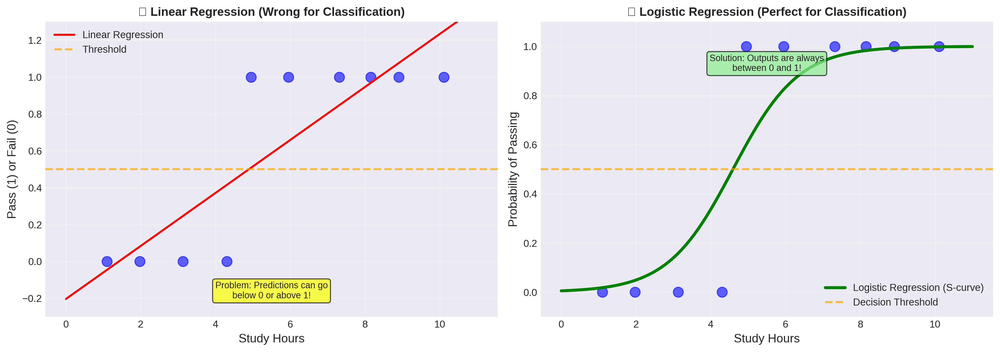
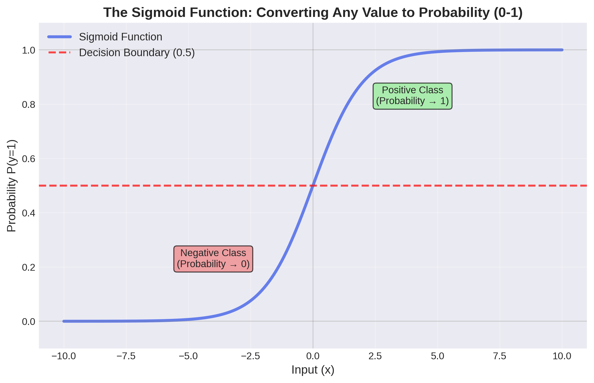
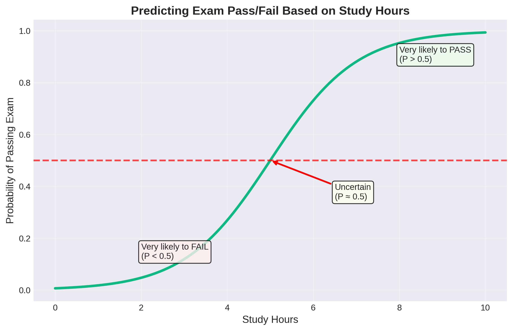
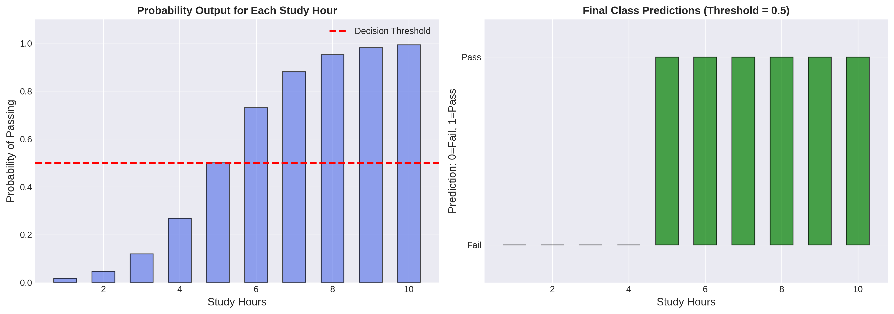
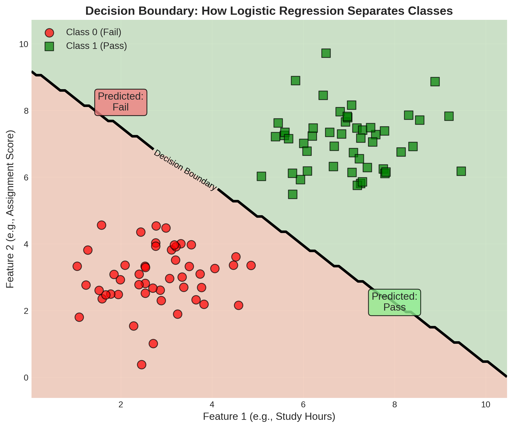
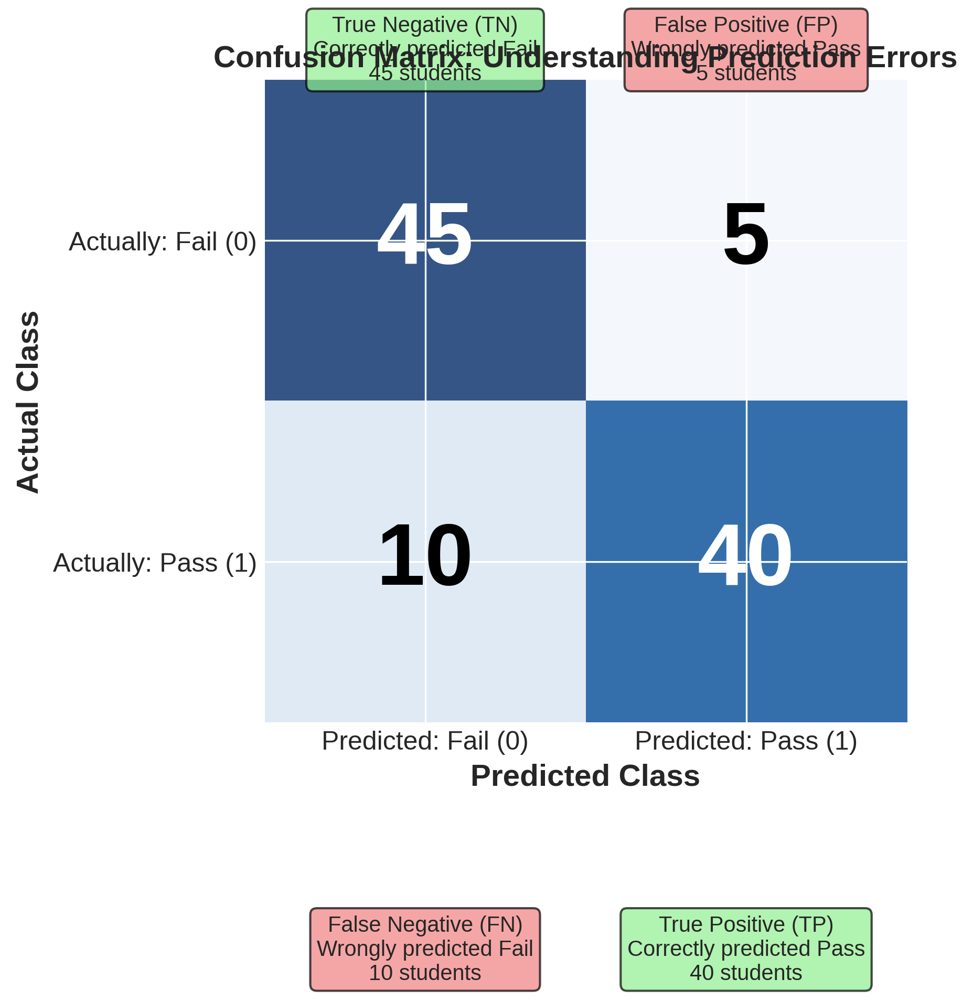
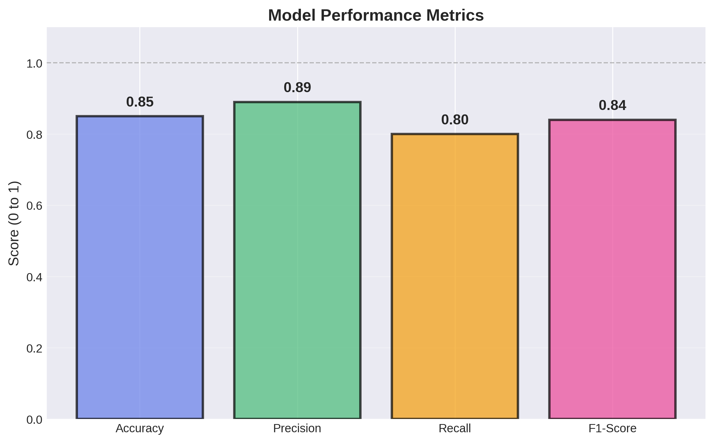

# Introduction to Logistic Regression

## What is Machine Learning Classification?

In our previous lesson, we learned about **Linear Regression**, which predicts *continuous numerical values* like test scores or house prices. But what if we want to predict *categories* instead?

**Logistic Regression** is a Machine Learning technique used for **classification** - predicting which category or class something belongs to. Despite its name containing "regression," it's actually used for classification problems!

## Real-World Applications for Students

Logistic Regression is everywhere in your daily life:

- **📧 Email**: Is this email spam or not spam?
- **🎮 Gaming**: Will a player win or lose the next match?
- **🎓 Education**: Will a student pass or fail an exam?
- **🏀 Sports**: Will your team make the playoffs or not?
- **📱 Social Media**: Will you like this post or not?
- **🎬 Streaming**: Will you watch this recommended movie or skip it?
- **🏥 Health**: Does a patient have a disease or not?

Notice a pattern? These are all **yes/no**, **true/false**, or **this/that** questions - not "how much" or "how many."

## Classification vs Regression

Let's understand the key difference:

| Type | What it predicts | Examples |
|------|------------------|----------|
| **Regression** | Continuous numbers | Grade (0-100), Temperature (°F), Price ($) |
| **Classification** | Categories or Classes | Pass/Fail, Spam/Not Spam, Dog/Cat/Bird |

**Linear Regression** → "What will be your test score?" (any number from 0 to 100)

**Logistic Regression** → "Will you pass or fail?" (only two options: Pass or Fail)

## Understanding the Problem: Why Not Use Linear Regression?

Let's say we want to predict if a student will pass or fail based on study hours:
- Pass = 1
- Fail = 0

If we try to use Linear Regression, we run into a problem:



**The Problem with Linear Regression for Classification:**
- It can predict values like -0.3 or 1.7, which make no sense for pass/fail
- We need predictions between 0 and 1 (like probabilities)
- Linear lines don't capture the "S-shaped" nature of many classification problems

**The Solution: Logistic Regression**
- Always outputs values between 0 and 1
- Can be interpreted as probabilities
- Uses an S-curve (sigmoid function) instead of a straight line

## The Sigmoid Function: The Secret Sauce

The magic behind Logistic Regression is the **sigmoid function** (also called the logistic function):

```
σ(x) = 1 / (1 + e^(-x))
```

Don't worry about the math! The key idea is that this function:
- Takes any input (positive or negative, large or small)
- Outputs a value between 0 and 1
- Creates an S-shaped curve



**What the Sigmoid Function Does:**
- When input is very negative → output approaches 0 (predicts Class 0/Fail)
- When input is near zero → output is around 0.5 (uncertain)
- When input is very positive → output approaches 1 (predicts Class 1/Pass)

## How Logistic Regression Works

### Step 1: Calculate a Score
Just like Linear Regression, we start with a linear combination:
```
z = β₀ + β₁x₁ + β₂x₂ + ... + βₙxₙ
```

### Step 2: Apply the Sigmoid Function
Convert the score to a probability:
```
P(y = 1) = 1 / (1 + e^(-z))
```

This gives us a probability between 0 and 1.

### Step 3: Make a Decision
Use a threshold (usually 0.5):
- If P(y = 1) ≥ 0.5 → Predict Class 1 (e.g., Pass)
- If P(y = 1) < 0.5 → Predict Class 0 (e.g., Fail)

### Example: Predicting Exam Pass/Fail

Let's say we build a model:
```
P(Pass) = 1 / (1 + e^(-(study_hours - 5)))
```



**Interpreting the Results:**
- Student studies 2 hours → P(Pass) = 0.05 → Predict: **Fail** (5% chance)
- Student studies 5 hours → P(Pass) = 0.50 → **Uncertain** (50-50)
- Student studies 8 hours → P(Pass) = 0.95 → Predict: **Pass** (95% chance)

## From Probability to Prediction

Logistic Regression outputs probabilities, which we then convert to final class predictions:



**Key Points:**
- The model gives you a probability for each prediction
- You choose a threshold (typically 0.5) to make the final decision
- You can adjust the threshold based on your needs (more on this later!)

## The Decision Boundary

When you have multiple features, Logistic Regression creates a **decision boundary** - a line (or curve) that separates the two classes:



Think of it like drawing a line on a map:
- Everything on one side is predicted as Class 0 (Fail)
- Everything on the other side is predicted as Class 1 (Pass)

## Evaluating Classification Models

Unlike regression (where we use MSE and R²), classification uses different metrics. Let's explore them!

### The Confusion Matrix

The **confusion matrix** shows all four possible outcomes:



Let's break this down with our exam example:

| | Predicted: Fail | Predicted: Pass |
|---|---|---|
| **Actually Failed** | ✅ **True Negative (TN)**: 45<br>Correctly predicted fail | ❌ **False Positive (FP)**: 5<br>Wrongly predicted pass<br>("False Alarm") |
| **Actually Passed** | ❌ **False Negative (FN)**: 10<br>Wrongly predicted fail<br>("Missed") | ✅ **True Positive (TP)**: 40<br>Correctly predicted pass |

**Real-World Impact:**
- **False Positive (FP)**: We told a student they'd pass, but they failed. They might not study enough! 😰
- **False Negative (FN)**: We told a student they'd fail, but they passed. They might have been stressed unnecessarily! 😅

### Key Evaluation Metrics

Now let's calculate important metrics from the confusion matrix:

#### 1. Accuracy
```
Accuracy = (TP + TN) / (TP + TN + FP + FN)
Accuracy = (40 + 45) / (40 + 45 + 5 + 10) = 85/100 = 0.85 or 85%
```

**What it means:** Out of all predictions, 85% were correct.

**Limitation:** Can be misleading with imbalanced data. If 95% of emails are not spam, a model that predicts "not spam" for everything gets 95% accuracy but is useless!

#### 2. Precision
```
Precision = TP / (TP + FP)
Precision = 40 / (40 + 5) = 40/45 = 0.89 or 89%
```

**What it means:** When we predict "Pass," we're correct 89% of the time.

**In other words:** How many of our positive predictions were actually correct?

**Real example:** Of all emails marked as spam, 89% are actually spam.

#### 3. Recall (Sensitivity or True Positive Rate)
```
Recall = TP / (TP + FN)
Recall = 40 / (40 + 10) = 40/50 = 0.80 or 80%
```

**What it means:** We correctly identified 80% of students who actually passed.

**In other words:** How many actual positives did we find?

**Real example:** Of all actual spam emails, we caught 80% of them.

#### 4. F1-Score
```
F1-Score = 2 × (Precision × Recall) / (Precision + Recall)
F1-Score = 2 × (0.89 × 0.80) / (0.89 + 0.80) = 0.84 or 84%
```

**What it means:** A balanced measure that considers both Precision and Recall.

**When to use it:** When you care about both false positives AND false negatives equally.



### Choosing the Right Metric

Different situations require different metrics:

| Scenario | Best Metric | Why? |
|----------|-------------|------|
| **Email Spam Filter** | Recall | Don't want spam in your inbox! Missing spam (FN) is worse than blocking a real email (FP) |
| **Disease Diagnosis** | Recall | Don't want to miss sick patients! Better to have false alarms (FP) than miss diseases (FN) |
| **Criminal Conviction** | Precision | Don't want to convict innocent people! False accusation (FP) is very serious |
| **Balanced Problem** | F1-Score | When both types of errors matter equally |

### Understanding the Trade-offs

There's often a trade-off between Precision and Recall:

**High Precision, Lower Recall:**
- Being very cautious - only predicting "positive" when very confident
- Example: Spam filter that rarely blocks emails (few false positives) but lets some spam through (more false negatives)

**High Recall, Lower Precision:**
- Being very aggressive - trying to catch all positives
- Example: Spam filter that blocks everything suspicious (few false negatives) but blocks some real emails too (more false positives)

**The Sweet Spot:**
- Balance both with F1-Score
- Or adjust the decision threshold based on your priorities!

## Adjusting the Decision Threshold

Remember we said predictions use a threshold of 0.5? We can change that!

**Lowering the Threshold (e.g., 0.3):**
- More predictions will be "positive" (Pass/Spam/Disease)
- Higher Recall (catch more positives)
- Lower Precision (more false alarms)
- Use when: Missing a positive is very costly

**Raising the Threshold (e.g., 0.7):**
- Fewer predictions will be "positive"
- Higher Precision (fewer false alarms)
- Lower Recall (miss more positives)
- Use when: False alarms are very costly

## Binary vs Multi-Class Classification

So far, we've talked about **binary classification** (two classes):
- Pass or Fail
- Spam or Not Spam
- Dog or Cat

But what about multiple classes?
- Grade: A, B, C, D, F (5 classes)
- Fruit: Apple, Banana, Orange (3 classes)

**Good news:** Logistic Regression can handle this too! It's called **multi-class classification**, where we use techniques like:
- **One-vs-Rest**: Train one classifier for each class
- **Softmax Regression**: Extension of logistic regression for multiple classes

## Logistic Regression vs Other Classifiers

Logistic Regression is great, but it's not always the best choice:

| Method | Best For | Limitations |
|--------|----------|-------------|
| **Logistic Regression** | Linear relationships, need probabilities, interpretability | Can't handle complex non-linear patterns |
| **Decision Trees** | Non-linear relationships, easy interpretation | Can overfit easily |
| **Random Forest** | Complex patterns, robust | Less interpretable, slower |
| **Neural Networks** | Very complex patterns, lots of data | Needs lots of data, hard to interpret |
| **SVM** | High-dimensional data | Can be slow with large datasets |

## Key Assumptions of Logistic Regression

For best results, Logistic Regression assumes:

1. **Linear Relationship**: Between features and the log-odds (not the probability directly)
2. **Independence**: Observations are independent of each other
3. **No Multicollinearity**: Features shouldn't be highly correlated with each other
4. **Large Sample Size**: Need enough data, especially for rare classes

Don't worry too much about these now - you'll develop intuition as you practice!

## Common Pitfalls to Avoid

1. **Imbalanced Classes**: When one class dominates (e.g., 95% not spam, 5% spam)
   - Solution: Use techniques like oversampling, undersampling, or adjust class weights

2. **Using Accuracy for Imbalanced Data**: As mentioned, accuracy can be misleading
   - Solution: Look at Precision, Recall, F1-Score, or use ROC-AUC

3. **Overfitting**: Model memorizes training data instead of learning patterns
   - Solution: Use regularization (L1/L2), get more data, or use simpler models

4. **Wrong Threshold**: Using 0.5 isn't always optimal
   - Solution: Analyze your specific problem and adjust the threshold

## Key Takeaways

1. **Logistic Regression** is used for **classification** (predicting categories), not regression (predicting numbers)

2. It uses the **sigmoid function** to convert any input into a probability between 0 and 1

3. The output is a **probability** that can be converted to a class prediction using a threshold

4. **Confusion Matrix** shows four outcomes: TP, TN, FP, FN

5. Important metrics:
   - **Accuracy**: Overall correctness
   - **Precision**: How many positive predictions were correct
   - **Recall**: How many actual positives we found
   - **F1-Score**: Balance between Precision and Recall

6. Choose metrics based on your problem:
   - Medical diagnosis → High Recall (don't miss diseases)
   - Criminal justice → High Precision (don't convict innocent)
   - Balanced problems → F1-Score

7. The **decision threshold** can be adjusted based on costs of different errors

8. Works best for **linearly separable** classes, but extensions can handle complex patterns

## Next Steps

Now that you understand the concepts, you're ready to implement Logistic Regression in Python! You'll learn how to:
- Load and prepare data for classification
- Build and train Logistic Regression models
- Make predictions and get probabilities
- Calculate and interpret evaluation metrics
- Tune the decision threshold for your specific problem

Welcome to the world of Classification! 🎯
