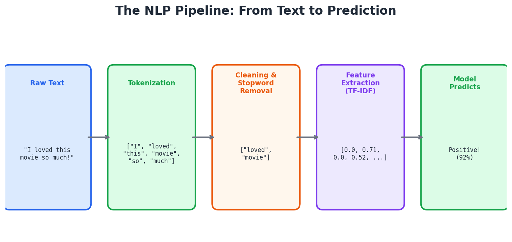
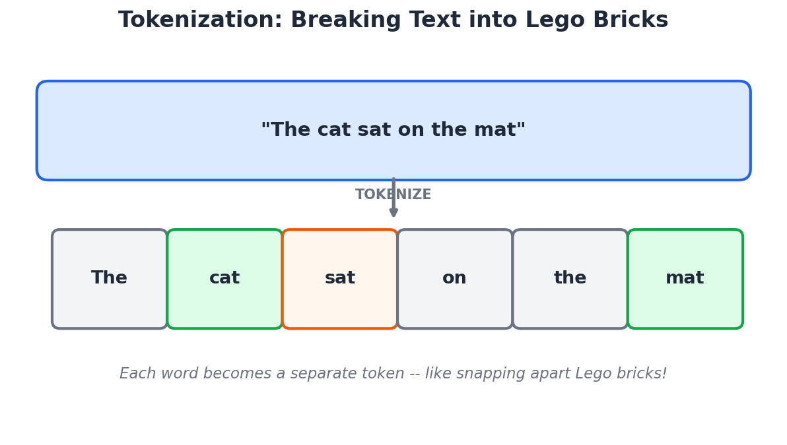
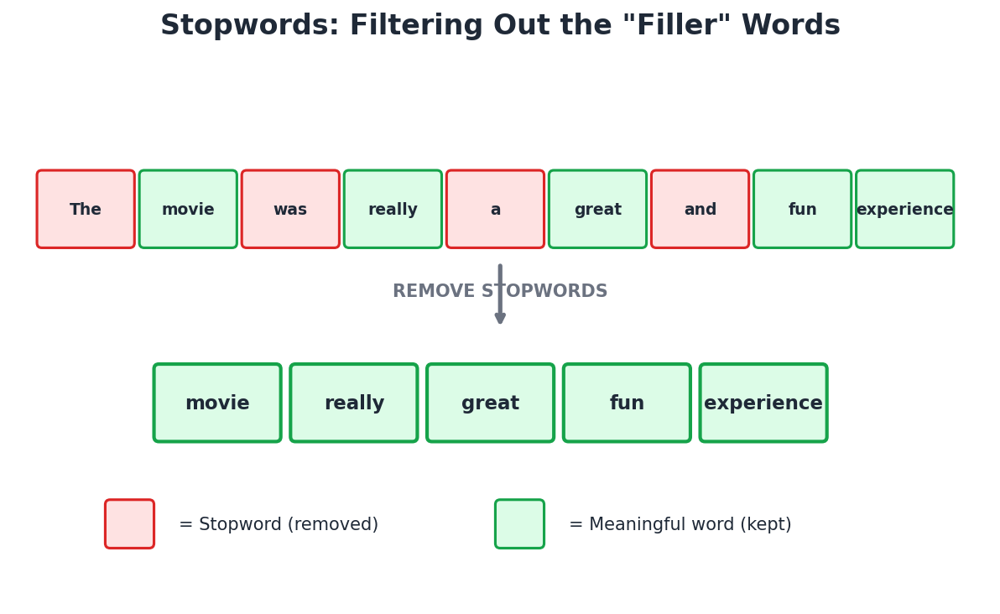
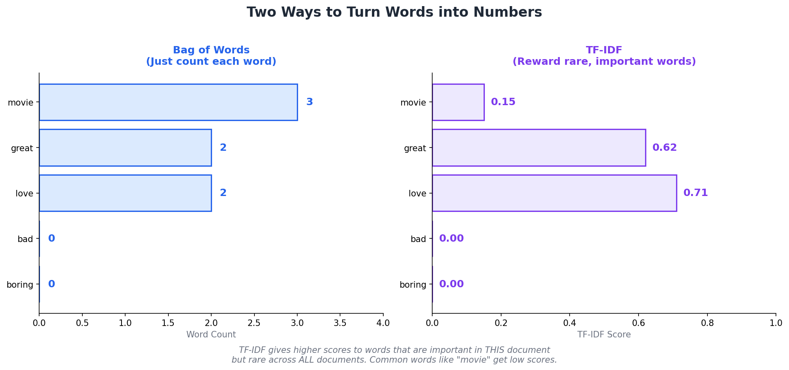
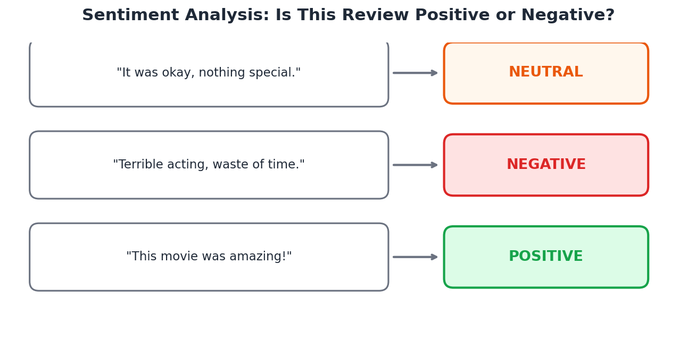
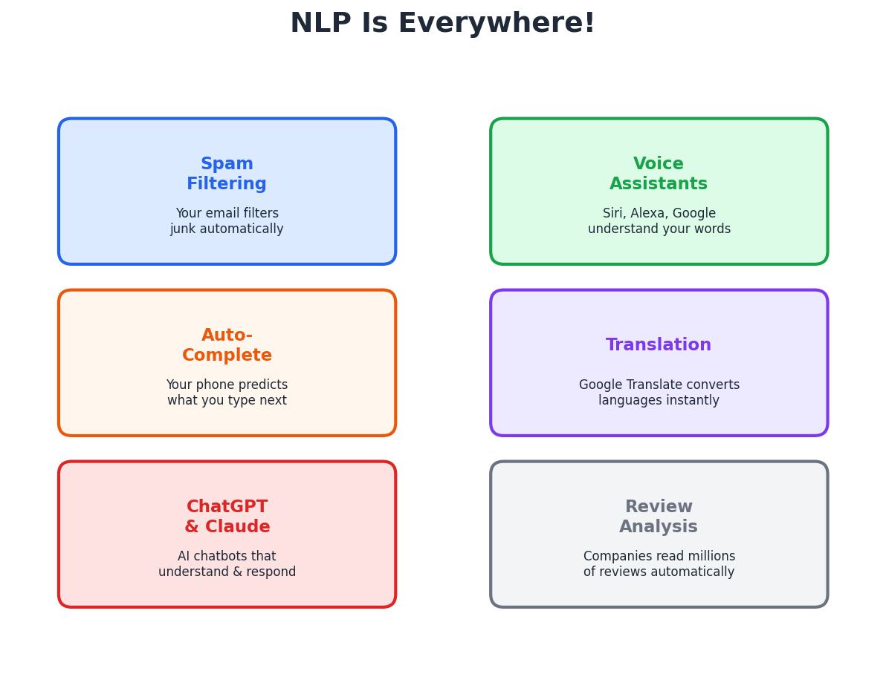
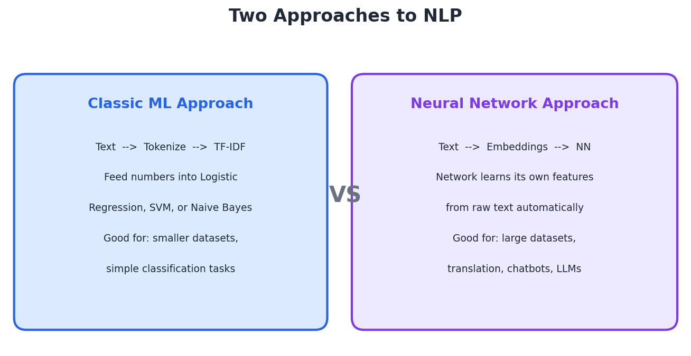

# Introduction to Natural Language Processing (NLP)

**Python Machine Learning Course — Week 25**  
**Learn and Help | Academic Year 2025–2026**

---

## Learning Goals

By the end of this lesson, you will be able to:

1. Explain what NLP is and why it matters
2. Break text into tokens and remove stopwords
3. Understand two ways to turn words into numbers: Bag of Words and TF-IDF
4. Build a sentiment analysis classifier using scikit-learn
5. Build a text classifier using Keras
6. Identify real-world NLP applications you already use every day

---

## Part 1: What Is NLP?

### The Big Idea

In Week 23 you taught a neural network to recognize handwritten digits. In Week 24 you taught a CNN to classify images. Both of those dealt with **numbers** and **pixels** — things computers naturally understand.

But what about **words**? When you text a friend "That movie was fire," you instantly know it means the movie was great. A computer just sees a sequence of characters — it has no idea what "fire" means in this context.

**Natural Language Processing (NLP)** is the branch of AI that teaches computers to read, understand, and work with human language.

### The Core Challenge

Computers only understand numbers. So the fundamental question of NLP is:

**How do we turn words into numbers that a machine learning model can use?**

That's what this entire lesson is about.



---

## Part 2: Step 1 — Tokenization

### Breaking Text into Pieces

Before a computer can analyze text, it needs to break the text into smaller pieces called **tokens**. This is called **tokenization**.

Think of it like this: if someone hands you a sentence written on a long strip of paper, the first thing you'd do is cut it into individual words so you can examine each one.



### How It Works

```
Original:  "The cat sat on the mat"
Tokenized: ["The", "cat", "sat", "on", "the", "mat"]
```

Each word becomes its own token — like snapping apart Lego bricks. The sentence goes from being one long string to a **list of individual words** that we can count, sort, and analyze.

### Try It in Python

```python
from sklearn.feature_extraction.text import CountVectorizer

text = ["The cat sat on the mat"]
vectorizer = CountVectorizer()
vectorizer.fit(text)
print("Tokens:", vectorizer.get_feature_names_out())
# Output: ['cat', 'mat', 'on', 'sat', 'the']
```

Notice that scikit-learn automatically lowercases everything and removes duplicates. The word "the" appears twice in the sentence but only once in the vocabulary.

---

## Part 3: Step 2 — Stopword Removal

### Filtering Out the Filler

Not all words are equally useful. Words like "the," "is," "and," "a," and "on" appear in almost every sentence. They are grammatically necessary but carry almost no meaning for classification. These are called **stopwords**.



### The Analogy

Imagine you're taking notes in class. You wouldn't write down every single word the teacher says — you'd skip the filler and write down the **important** words. That's exactly what stopword removal does for a computer.

**Before:** "The movie was really a great and fun experience"  
**After:** "movie really great fun experience"

The meaning is preserved, but the noise is gone.

### Common English Stopwords

Some of the most common stopwords in English include: the, is, at, which, on, a, an, and, or, but, in, with, he, she, it, was, for, that, this, are, be, has, have, had, do, will, of, to, from.

There are about 100–200 stopwords in English depending on which list you use.

### Try It in Python

```python
from sklearn.feature_extraction.text import CountVectorizer

text = ["The movie was really a great and fun experience"]

# Without stopword removal
vec1 = CountVectorizer()
vec1.fit(text)
print("All words:", vec1.get_feature_names_out())

# With stopword removal
vec2 = CountVectorizer(stop_words='english')
vec2.fit(text)
print("After removing stopwords:", vec2.get_feature_names_out())
```

---

## Part 4: Step 3 — Turning Words into Numbers

Now comes the key question: we have a list of meaningful words — how do we turn them into **numbers** that a model can use?

There are two main approaches you'll learn today.

### Approach 1: Bag of Words (BoW)

The simplest idea: just **count how many times each word appears**.

```
Review 1: "I love this movie, love the acting"
Review 2: "I hate this movie, terrible acting"

Vocabulary: [acting, hate, love, movie, terrible]

Review 1 → [1, 0, 2, 1, 0]   (love appears twice!)
Review 2 → [1, 1, 0, 1, 1]
```

It's called "Bag of Words" because it throws all the words into a bag and just counts them — **word order doesn't matter**.

### Approach 2: TF-IDF (Term Frequency–Inverse Document Frequency)

Bag of Words has a problem: it treats every word as equally important. But some words (like "movie" in movie reviews) appear in almost every document. They're not very helpful for telling reviews apart.

**TF-IDF** fixes this by giving **higher scores to words that are important in one document but rare across all documents**.

Think of it like this: if a student uses the word "phenomenal" in their essay and nobody else does, that word tells you a lot about their essay. But if everyone uses the word "good," it doesn't help distinguish anyone.



### TF-IDF Broken Down

| Part | Stands For | What It Measures |
|------|-----------|-----------------|
| **TF** | Term Frequency | How often a word appears in THIS document |
| **IDF** | Inverse Document Frequency | How rare a word is across ALL documents |
| **TF-IDF** | TF x IDF | Words that are frequent here but rare overall get the highest scores |

> Key Insight: TF-IDF is the most popular feature extraction method for classic NLP. It's what we'll use in our scikit-learn classifier.

---

## Part 5: Sentiment Analysis — The "Hello World" of NLP

### What Is Sentiment Analysis?

**Sentiment analysis** is the task of determining whether a piece of text expresses a positive, negative, or neutral opinion. It's one of the most common and practical NLP tasks.



### Why Does It Matter?

Companies use sentiment analysis every day to understand what customers think about their products without manually reading thousands of reviews. A restaurant can analyze 10,000 Yelp reviews in seconds. A movie studio can gauge audience reaction from social media posts on opening night.

### The Machine Learning Approach

Here's the plan for building a sentiment classifier — notice how it follows the same fit/predict pattern you've been using all year:

1. **Collect data:** Movie reviews labeled as positive or negative
2. **Tokenize and clean:** Break reviews into words, remove stopwords
3. **Extract features:** Use TF-IDF to turn words into numbers
4. **Train a model:** Feed the numbers into Logistic Regression (or another classifier)
5. **Predict:** Give the model a new review and it predicts the sentiment

---

## Part 6: NLP Is Everywhere!

You interact with NLP dozens of times every day without realizing it.



### Applications You Already Use

| Application | How NLP Is Used |
|-------------|----------------|
| **Spam filtering** | Your email reads every incoming message and classifies it as spam or not spam — that's NLP |
| **Autocomplete** | When your phone predicts the next word you'll type, it's using an NLP language model |
| **Voice assistants** | Siri, Alexa, and Google Assistant convert your speech to text and then use NLP to understand what you mean |
| **Google Translate** | Translating between languages is one of the hardest NLP tasks — it requires understanding meaning, grammar, and context |
| **ChatGPT and Claude** | These AI chatbots are NLP at its most advanced — they read your text, understand your intent, and generate a response |
| **Review analysis** | Amazon, Netflix, and Yelp automatically analyze millions of reviews to surface the most relevant ones |

> Fun Fact: Every time you search on Google, NLP helps understand what you're really looking for — even if you misspell words or phrase your question oddly.

---

## Part 7: Classic ML vs. Neural Networks for NLP

You've now seen two broad approaches to ML: classic algorithms and neural networks. Both can be used for NLP, but they work differently.



### When to Use Each

| Use Classic ML (TF-IDF + Logistic Regression) When... | Use Neural Networks When... |
|-------------------------------------------------------|-----------------------------|
| Your dataset is small to medium (hundreds to low thousands) | You have a very large dataset (tens of thousands+) |
| You need fast training and quick results | You have time and computing power to train longer |
| The task is straightforward classification | The task involves understanding context, word order, or meaning |
| You want a simple, interpretable model | You need state-of-the-art accuracy |
| Examples: spam detection, simple sentiment analysis | Examples: translation, chatbots, summarization |

> Key Insight: For this week's project, we'll use **both** approaches — a classic ML pipeline with TF-IDF + Logistic Regression, and a Keras neural network with word embeddings. This mirrors exactly what we did in Week 23 with MNIST!

---

## Part 8: Hands-On Activities

### Activity 1: Explore Tokenization and TF-IDF (No Model Yet)

Open the Colab notebook and run the first section. You'll see how raw text is transformed step by step into numbers.

**Try These Experiments:**

1. Type in your own sentence and see how it gets tokenized
2. Add stopwords — how does the token list change?
3. Compare the Bag of Words vector and the TF-IDF vector for the same sentence
4. Feed in two very different sentences — which words get the highest TF-IDF scores? Why?

---

### Activity 2: Build a Sentiment Classifier with scikit-learn

We'll classify **IMDB movie reviews** as positive or negative using TF-IDF and Logistic Regression — tools you already know!

```python
# ===========================================
# Sentiment Analysis with scikit-learn
# ===========================================
# Same fit/predict pattern you already know!

from sklearn.feature_extraction.text import TfidfVectorizer
from sklearn.linear_model import LogisticRegression
from sklearn.model_selection import train_test_split
from sklearn.metrics import accuracy_score, classification_report
import time

# Step 1: Load the dataset
# We'll use a sample of IMDB movie reviews
from sklearn.datasets import fetch_20newsgroups  # As a demo text dataset

# For the real project, we provide IMDB reviews in the notebook
# Here's a simplified example with sample reviews:
reviews = [
    "This movie was absolutely wonderful. The acting was superb.",
    "Terrible film. Waste of time. The plot made no sense.",
    "I loved every minute of it! Great story and characters.",
    "Boring and predictable. I fell asleep halfway through.",
    "An amazing experience. The cinematography was breathtaking.",
    "The worst movie I have ever seen. Awful acting.",
    "Brilliant performances and a gripping storyline!",
    "Dull, lifeless, and completely forgettable.",
    "A masterpiece! One of the best films this year.",
    "So bad. The dialogue was cringeworthy.",
]
labels = [1, 0, 1, 0, 1, 0, 1, 0, 1, 0]  # 1 = positive, 0 = negative

# Step 2: Turn words into numbers using TF-IDF
print("Step 2: Converting text to TF-IDF features...")
tfidf = TfidfVectorizer(stop_words='english', max_features=5000)
X = tfidf.fit_transform(reviews)
print(f"  Vocabulary size: {len(tfidf.vocabulary_)} words")
print(f"  Feature matrix shape: {X.shape}")

# Step 3: Train a Logistic Regression classifier
print("\nStep 3: Training Logistic Regression...")
start = time.time()
model = LogisticRegression(max_iter=1000)
model.fit(X, labels)
train_time = time.time() - start
print(f"  Training time: {train_time:.3f} seconds")

# Step 4: Test on new reviews!
print("\nStep 4: Predicting sentiment on new reviews...")
new_reviews = [
    "I really enjoyed this film, it was fantastic!",
    "What a waste of money. Horrible movie.",
    "Pretty good, but the ending was disappointing.",
]

X_new = tfidf.transform(new_reviews)
predictions = model.predict(X_new)

for review, pred in zip(new_reviews, predictions):
    sentiment = "POSITIVE" if pred == 1 else "NEGATIVE"
    print(f'  "{review}"')
    print(f'   --> {sentiment}\n')
```

---

### Activity 3: Build a Text Classifier with Keras

Now let's use a neural network! Keras can learn directly from text using **word embeddings** — a technique where each word is represented as a dense vector that captures its meaning.

```python
# ===========================================
# Sentiment Analysis with Keras
# ===========================================
# Neural network approach to text classification!

import numpy as np
from tensorflow import keras
from tensorflow.keras import layers
import time

# Step 1: Load the IMDB dataset (Keras has it built-in!)
print("Loading IMDB dataset...")
max_words = 10000    # Only use top 10,000 most common words
max_len = 200        # Pad/truncate reviews to 200 words

(x_train, y_train), (x_test, y_test) = keras.datasets.imdb.load_data(num_words=max_words)
print(f"  Training reviews: {len(x_train)}")
print(f"  Test reviews: {len(x_test)}")

# Step 2: Pad sequences to equal length
# Reviews have different lengths — pad short ones, truncate long ones
x_train = keras.preprocessing.sequence.pad_sequences(x_train, maxlen=max_len)
x_test = keras.preprocessing.sequence.pad_sequences(x_test, maxlen=max_len)
print(f"  Each review is now {max_len} numbers long")

# Step 3: Build the neural network
model = keras.Sequential([
    layers.Embedding(max_words, 32, input_length=max_len),  # Word Embeddings!
    layers.GlobalAveragePooling1D(),                         # Average all word vectors
    layers.Dense(64, activation="relu"),                     # Hidden layer
    layers.Dense(1, activation="sigmoid")                    # Output: 0 or 1
])

model.compile(
    optimizer="adam",
    loss="binary_crossentropy",
    metrics=["accuracy"]
)

model.summary()

# Step 4: Train!
print("\nTraining Keras model...")
start = time.time()
history = model.fit(
    x_train, y_train,
    epochs=5,
    batch_size=32,
    validation_split=0.2,
    verbose=1
)
train_time = time.time() - start

# Step 5: Evaluate
test_loss, test_acc = model.evaluate(x_test, y_test, verbose=0)
print(f"\nTest Accuracy: {test_acc * 100:.2f}%")
print(f"Training Time: {train_time:.1f} seconds")
```

**What's New Here:**

- **Embedding layer:** Instead of TF-IDF, the network learns its own number representation for each word. Words with similar meanings end up with similar vectors!
- **GlobalAveragePooling1D:** Averages all the word vectors in a review into a single vector — a simple way to go from variable-length text to fixed-size input.
- **Sigmoid output:** Since this is binary classification (positive/negative), we use sigmoid instead of softmax.

---

### Activity 4: Compare Both Approaches

| Feature | scikit-learn (TF-IDF + LR) | Keras (Embedding + NN) |
|---------|---------------------------|----------------------|
| **Feature extraction** | Manual (TF-IDF) | Automatic (Embeddings) |
| **Lines of code** | ~15 | ~25 |
| **Training time** | Very fast (seconds) | Slower (minutes) |
| **Accuracy on IMDB** | ~87-89% | ~85-88% |
| **Handles word order?** | No (bag of words) | Partially (embeddings) |
| **Best for** | Quick experiments | Larger, more complex tasks |

> Surprise! Classic ML often matches or beats simple neural networks on text classification. Neural networks really shine on harder tasks like translation and generation — which is what Transformers (Week 26+) are all about.

---

## Part 9: Recommended Videos and Resources

### Must-Watch Videos

| Video | Length | Why Watch It |
|-------|--------|-------------|
| [Crash Course AI: Natural Language Processing](https://www.youtube.com/watch?v=fOvTtapxa9c) | 12 min | Fun, fast overview of NLP concepts with great visuals |
| [IBM: What is NLP?](https://www.youtube.com/watch?v=CMrHM8a3hqw) | 6 min | Clear industry perspective on what NLP is and why it matters |
| [StatQuest: TF-IDF](https://www.youtube.com/watch?v=OeiKbGDdMaI) | 11 min | The best visual explanation of how TF-IDF works |

### Interactive Tools

| Tool | Link | What You Can Do |
|------|------|----------------|
| **MonkeyLearn Sentiment Demo** | [monkeylearn.com/sentiment-analysis-online](https://monkeylearn.com/sentiment-analysis-online/) | Paste any text and see instant sentiment analysis — positive, negative, or neutral |
| **Word Cloud Generator** | [wordclouds.com](https://www.wordclouds.com/) | Paste in text and visualize which words appear most often |

---

## Part 10: Quick Review — Key Takeaways

1. **NLP** teaches computers to understand human language — the bridge between text and math.
2. **Tokenization** breaks text into individual words (tokens) — like snapping apart Lego bricks.
3. **Stopwords** are common filler words (the, is, a, and) that get removed because they don't help classification.
4. **Bag of Words** counts how many times each word appears. Simple but effective.
5. **TF-IDF** improves on Bag of Words by giving higher scores to words that are important in one document but rare overall.
6. **Sentiment analysis** is the most common NLP task — determining if text is positive, negative, or neutral.
7. **Classic ML approach:** Tokenize, remove stopwords, extract TF-IDF features, feed into Logistic Regression. Fast, simple, and surprisingly effective.
8. **Neural network approach:** Use embeddings to let the network learn its own word representations. More powerful for complex tasks.
9. **NLP is everywhere:** spam filters, autocomplete, voice assistants, translation, ChatGPT, Claude — you use it every day.

---

## What's Coming Next?

Now that you understand how machines process text, in the coming weeks we'll explore:

- **Transformers and LLMs** — The attention mechanism that powers ChatGPT and Claude
- **How ChatGPT Actually Works** — From tokens to responses, step by step

Everything we learned today — tokenization, embeddings, and the idea of turning text into numbers — is the foundation that Transformers build on!

---

*Last Updated: April 2026*  
*Python ML Course — Learn and Help*
