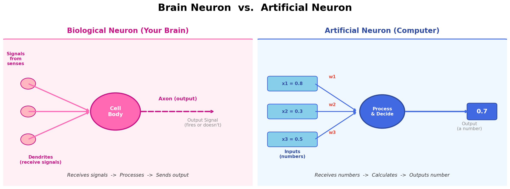
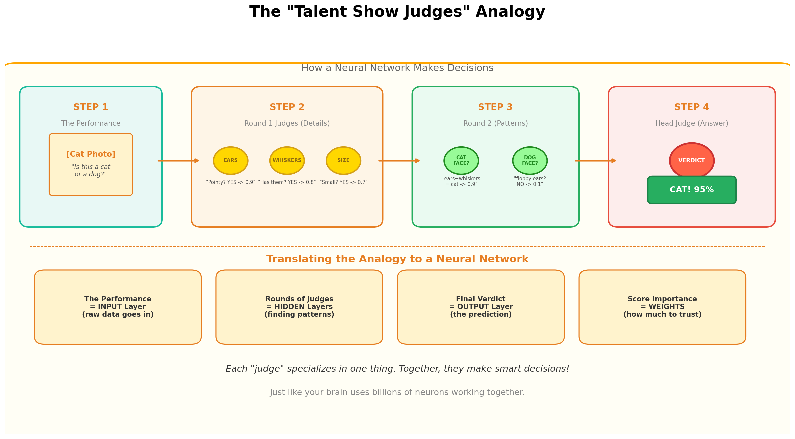
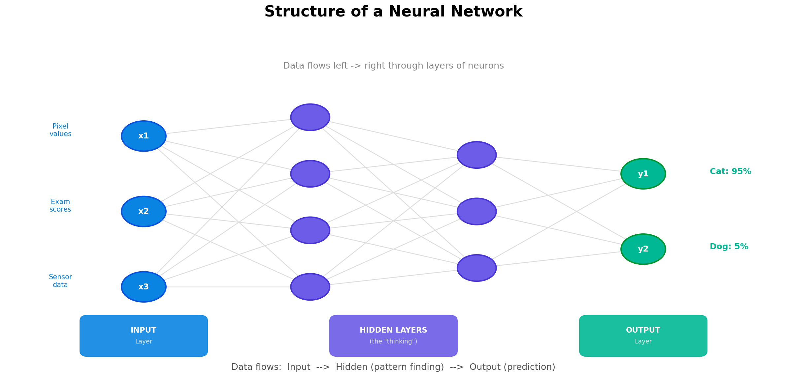
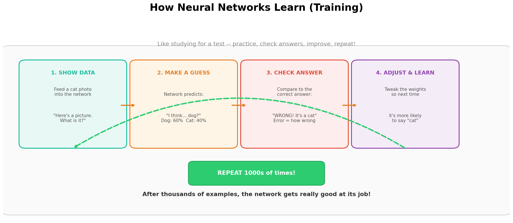
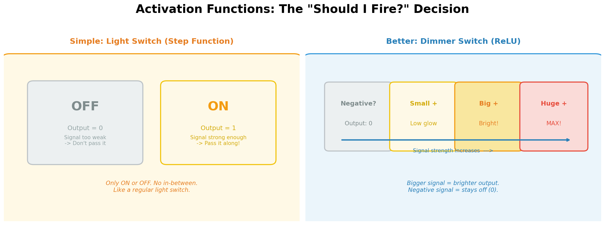
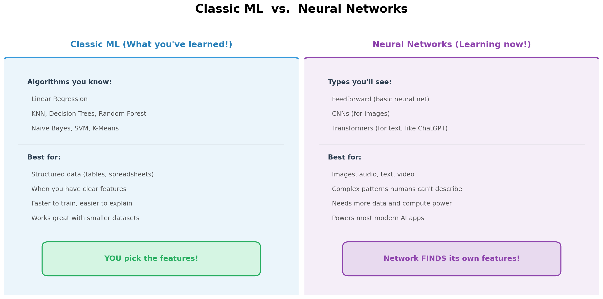

# 🧠 Introduction to Neural Networks

**Python Machine Learning Course — Week 23**  
**Learn and Help | Academic Year 2025–2026**

---

## 🎯 Learning Goals

By the end of this lesson, you will be able to:

1. Explain what a neural network is using a real-world analogy
2. Identify the three types of layers: Input, Hidden, and Output
3. Understand how a neural network *learns* from data (training)
4. Know when to use a neural network vs. classic ML algorithms
5. Experiment with a neural network using TensorFlow Playground
6. Run a simple neural network in Python using Keras

---

## 📖 Part 1: What Is a Neural Network?

### The Big Idea

You've already learned algorithms like KNN, Decision Trees, and SVM. Those are powerful, but they struggle with certain tasks — like recognizing a photo of your friend, understanding your voice, or translating a sentence to Spanish.

**Neural networks** are a different kind of algorithm inspired by how your brain works. Your brain has about **86 billion neurons** connected together. When you see a cat, millions of neurons fire in a chain — some detect edges, some detect shapes, some recognize "cat face" — and in milliseconds you just *know* it's a cat.

An **artificial neural network** works the same way, but with math instead of biology.

### Brain Neuron vs. Artificial Neuron



**How they compare:**

| Your Brain's Neuron | Artificial Neuron |
|---|---|
| Receives electrical signals from other neurons | Receives numbers as inputs |
| Processes signals in the cell body | Multiplies inputs by weights and adds them up |
| Fires (or doesn't) based on signal strength | Uses an activation function to decide output |
| Sends output through the axon | Passes its output number to the next layer |

> 💡 **Key Insight:** A single artificial neuron is basically **logistic regression** — something you already learned! A neural network is just *lots* of these connected together.

---

## 📖 Part 2: The "Talent Show Judges" Analogy

This is the easiest way to understand how a neural network makes decisions.

### The Setup

Imagine a **talent show** where a performer (the data) goes on stage, and the judges need to decide: *"Is this performer a singer or a dancer?"*

But here's the twist — instead of one panel of judges, there are **multiple rounds**.



### How It Works, Step by Step

**Round 1 Judges (Hidden Layer 1) — The Detail Spotters**
- Judge A only looks at one thing: *"Are they holding a microphone?"*
- Judge B checks: *"Are they wearing dance shoes?"*
- Judge C listens: *"Is there music with a beat?"*
- Each judge gives a score from 0.0 to 1.0

**Round 2 Judges (Hidden Layer 2) — The Pattern Combiners**
- These judges don't look at the performer directly
- They combine the Round 1 scores to find bigger patterns
- "Microphone + no dance shoes = probably a singer"
- "Dance shoes + beat music = probably a dancer"

**Head Judge (Output Layer) — The Final Decision**
- Takes all the Round 2 input
- Makes the final call: **"Singer! 92% confidence."**

### The Key Concepts Hidden in This Analogy

| Talent Show Term | Neural Network Term | What It Means |
|---|---|---|
| The performer on stage | **Input Layer** | The raw data (an image, numbers, text) |
| Rounds of judges | **Hidden Layers** | Where the "thinking" happens |
| How much a judge trusts another judge | **Weights** | Numbers that control how important each connection is |
| "Is the score high enough to matter?" | **Activation Function** | Decides if a neuron should "fire" |
| The final verdict | **Output Layer** | The prediction or classification |
| Judges learning from wrong guesses | **Training** | Adjusting weights to get better answers |

---

## 📖 Part 3: The Structure of a Neural Network

Every neural network has the same basic architecture: layers of neurons connected by weighted edges.



### The Three Types of Layers

**1. Input Layer** — The "eyes and ears" of the network.
- Takes in raw data (pixel values, numbers, words)
- Does NO processing — just passes data forward
- One neuron per feature in your data

**2. Hidden Layers** — The "brain" of the network.
- This is where the magic happens
- Each neuron finds a different pattern
- More layers = network can find more complex patterns
- Called "hidden" because we don't directly see what they're doing

**3. Output Layer** — The "answer."
- Gives the final prediction
- For classification: one neuron per category (e.g., "cat" neuron, "dog" neuron)
- The neuron with the highest value wins

> 🤔 **What is "Deep Learning"?** A neural network with **2 or more hidden layers** is called a "deep" neural network. That's where the term **Deep Learning** comes from — it's just neural networks with many layers!

---

## 📖 Part 4: How Neural Networks Learn

Neural networks learn the same way you do — by making mistakes and improving.



### The Training Process (Like Studying for a Test)

Think about how you learned to spell difficult words:

1. **See the word** → Your teacher shows you "NECESSARY"
2. **Try to spell it** → You write "NECCESSARY"
3. **Check your answer** → Teacher says "Wrong! One 'C', two 'S's"
4. **Learn from the mistake** → You adjust and try again
5. **Repeat hundreds of times** → Eventually you get it right every time!

A neural network does the exact same thing:

1. **Show it data** → Feed in a photo of a cat
2. **It makes a guess** → "Hmm, I think this is a dog" (60% dog, 40% cat)
3. **Check against the right answer** → The label says CAT — the network was wrong!
4. **Adjust the weights** → Tweak internal numbers so next time it's more likely to say "cat"
5. **Repeat with thousands of examples** → After enough practice, accuracy goes way up!

### Key Training Terms (Simplified)

| Term | Simple Explanation |
|---|---|
| **Epoch** | One full pass through all training data. Like reviewing your entire study guide once. |
| **Loss / Error** | How wrong the network is. High = very wrong, Low = almost right. |
| **Learning Rate** | How big of a correction to make each time. Too big = overshoots, too small = too slow. |
| **Backpropagation** | The process of figuring out *which* weights caused the error and fixing them. (You don't need to know the math — just the concept!) |

> 🏀 **Sports Analogy:** Training a neural network is like a basketball player practicing free throws. Each shot (prediction), they see if it went in (check the error), and they adjust their form (update weights). After 10,000 shots, they rarely miss!

---

## 📖 Part 5: Activation Functions — The "Should I Fire?" Decision

Each neuron needs to decide: *"Is my signal strong enough to pass along?"*

This is called an **activation function**.



### Two Ways to Think About It

**Light Switch (Step Function):** Either ON or OFF. Signal above a threshold? Fire! Below? Stay silent. Simple but too rigid.

**Dimmer Switch (ReLU):** The brighter you turn the dial, the more light comes out. Negative signal? Stays off (output = 0). Positive signal? Output equals the signal strength. This is what modern neural networks actually use!

> 📝 **ReLU** stands for **Re**ctified **L**inear **U**nit. It's the most popular activation function today because it's simple and works really well. The rule is: if the input is negative, output 0. If it's positive, output the input as-is.

---

## 📖 Part 6: Classic ML vs. Neural Networks

You already know classic ML algorithms — so when should you use them, and when should you use neural networks?



### The Rule of Thumb

| Use Classic ML When... | Use Neural Networks When... |
|---|---|
| You have structured/tabular data (spreadsheets) | You have images, audio, text, or video |
| Your dataset is small to medium | You have lots and lots of data |
| You need to explain *why* the model decided something | You care more about accuracy than explainability |
| You want fast training | You have access to powerful computers (or GPUs) |
| Features are clear and well-defined | The patterns are too complex for humans to define |

### Real-World Examples

| Task | Better Approach | Why |
|---|---|---|
| Predict house prices from a spreadsheet | Classic ML (Linear Regression) | Tabular data, clear features |
| Identify whether a photo contains a cat | Neural Network (CNN) | Image data, complex visual patterns |
| Classify spam emails by word counts | Classic ML (Naïve Bayes) | Simple text features, smaller dataset |
| Translate English to French | Neural Network (Transformer) | Complex language patterns |
| Predict if a student passes based on study hours | Classic ML (Logistic Regression) | Simple, small dataset |
| Generate realistic images from text | Neural Network (Diffusion Model) | Extremely complex task |

> 💡 **Important:** Neural networks are NOT always better! For many everyday problems, classic ML is faster, simpler, and works just as well. Use the right tool for the job.

---

## 🎮 Part 7: Hands-On Activities

### Activity 1: TensorFlow Playground (No Coding Required!)

🔗 **[playground.tensorflow.org](https://playground.tensorflow.org/)**

This is an interactive website where you can build and train a neural network right in your browser. No code needed!

**Try These Experiments:**

1. **Start simple:** Pick the "Circle" dataset (top left). Use 1 hidden layer with 2 neurons. Hit play ▶️ and watch it learn! Can it separate the orange and blue dots?

2. **Add more neurons:** Increase to 4, then 8 neurons in the hidden layer. What changes?

3. **Add more layers:** Try 2 hidden layers, then 3. Does it learn faster or slower?

4. **Try the spiral dataset:** This is the hardest one. Can a single layer solve it? How many layers and neurons do you need?

5. **Change the learning rate:** Set it very high (3.0). What happens? Set it very low (0.001). What happens?

**📝 Record Your Findings:**

| Experiment | # Layers | # Neurons | Learning Rate | Could It Solve It? | Epochs Needed |
|---|---|---|---|---|---|
| Circle (simple) | 1 | 2 | 0.03 | ? | ? |
| Circle (more neurons) | 1 | 8 | 0.03 | ? | ? |
| Spiral | 1 | 4 | 0.03 | ? | ? |
| Spiral | 3 | 8 | 0.03 | ? | ? |
| Spiral (high LR) | 3 | 8 | 3.0 | ? | ? |

---

### Activity 2: Your First Neural Network in Python (Keras)

Here's a complete, runnable script that trains a neural network on the famous **MNIST handwritten digits** dataset — 70,000 images of handwritten numbers (0–9).

```python
# ===========================================
# My First Neural Network - MNIST Digits
# ===========================================

# Step 1: Import libraries
import numpy as np
from tensorflow import keras
from tensorflow.keras import layers

# Step 2: Load the MNIST dataset
# This dataset has 60,000 training images and 10,000 test images
# Each image is 28x28 pixels of a handwritten digit (0-9)
(x_train, y_train), (x_test, y_test) = keras.datasets.mnist.load_data()

# Step 3: Prepare the data
# Flatten each 28x28 image into a single row of 784 numbers
x_train = x_train.reshape(-1, 784).astype("float32") / 255.0
x_test = x_test.reshape(-1, 784).astype("float32") / 255.0
# We divide by 255 to scale pixel values from 0-255 to 0.0-1.0

# Step 4: Build the Neural Network
model = keras.Sequential([
    layers.Dense(128, activation="relu", input_shape=(784,)),  # Hidden Layer 1: 128 neurons
    layers.Dense(64, activation="relu"),                        # Hidden Layer 2: 64 neurons
    layers.Dense(10, activation="softmax")                      # Output Layer: 10 neurons (digits 0-9)
])

# Step 5: Compile the model (set up the training process)
model.compile(
    optimizer="adam",           # The algorithm that adjusts weights
    loss="sparse_categorical_crossentropy",  # How we measure errors
    metrics=["accuracy"]       # What we want to track
)

# Step 6: Train the model!
print("Training the neural network...")
print("=" * 50)
model.fit(x_train, y_train, epochs=5, batch_size=32, validation_split=0.1)

# Step 7: Test the model
print("\n" + "=" * 50)
print("Testing on images the network has NEVER seen...")
test_loss, test_accuracy = model.evaluate(x_test, y_test)
print(f"\n🎯 Test Accuracy: {test_accuracy * 100:.2f}%")

# Step 8: Make some predictions
predictions = model.predict(x_test[:5])
print("\nFirst 5 predictions:")
for i in range(5):
    predicted_digit = np.argmax(predictions[i])
    actual_digit = y_test[i]
    confidence = predictions[i][predicted_digit] * 100
    status = "✅" if predicted_digit == actual_digit else "❌"
    print(f"  {status} Predicted: {predicted_digit} | Actual: {actual_digit} | Confidence: {confidence:.1f}%")
```

**🧪 Experiments to Try:**

After running the basic script, try changing these things one at a time:

| What to Change | How to Change It | What to Observe |
|---|---|---|
| Number of neurons | Change `128` to `32` or `256` | Does accuracy go up or down? |
| Number of layers | Add another `layers.Dense(32, activation="relu")` | Better or worse? |
| Number of epochs | Change `epochs=5` to `epochs=1` or `epochs=20` | More training = better? |
| Activation function | Change `"relu"` to `"sigmoid"` | Any difference in accuracy? |

---

### Activity 3: Compare Neural Net vs. Classic ML

Train a classic ML model on the same MNIST data to compare!

```python
# ===========================================
# Classic ML (Random Forest) on MNIST
# ===========================================

from sklearn.ensemble import RandomForestClassifier
from sklearn.metrics import accuracy_score
from tensorflow import keras
import time

# Load same data
(x_train, y_train), (x_test, y_test) = keras.datasets.mnist.load_data()
x_train_flat = x_train.reshape(-1, 784)
x_test_flat = x_test.reshape(-1, 784)

# Use a smaller subset (Random Forest is slower on big data)
x_train_small = x_train_flat[:10000]
y_train_small = y_train[:10000]

# Train Random Forest
print("Training Random Forest...")
start = time.time()
rf = RandomForestClassifier(n_estimators=100, random_state=42)
rf.fit(x_train_small, y_train_small)
rf_time = time.time() - start

# Test
rf_accuracy = accuracy_score(y_test, rf.predict(x_test_flat))
print(f"🌲 Random Forest Accuracy: {rf_accuracy * 100:.2f}%  (trained in {rf_time:.1f}s)")
print(f"🧠 Neural Network Accuracy: ~97-98%  (from Activity 2)")
print(f"\nBoth work well! The neural net is slightly better on image data.")
```

---

## 📺 Part 8: Recommended Videos and Resources

### Must-Watch Videos 🎬

| Video | Length | Why Watch It |
|---|---|---|
| [3Blue1Brown: But What Is a Neural Network?](https://www.youtube.com/watch?v=aircAruvnKk) | 19 min | The BEST visual explanation of neural networks. Beautiful animations, clear explanations. Start here! |
| [3Blue1Brown: Gradient Descent — How Neural Networks Learn](https://www.youtube.com/watch?v=IHZwWFHWa-w) | 21 min | Explains *how* networks learn, step by step. Watch after the first video. |
| [3Blue1Brown: What Is Backpropagation Really Doing?](https://www.youtube.com/watch?v=Ilg3gGewQ5U) | 14 min | Goes deeper into the training process. Optional but great if you're curious. |
| [Simplilearn: Neural Network In 5 Minutes](https://www.youtube.com/watch?v=bHvf7Tagt18) | 5 min | Quick, simple overview if you want a short refresher. |

### Interactive Playgrounds 🎮

| Tool | Link | What You Can Do |
|---|---|---|
| **TensorFlow Playground** | [playground.tensorflow.org](https://playground.tensorflow.org/) | Build and visualize neural networks in your browser. Change layers, neurons, learning rate — see results instantly! |
| **Teachable Machine** | [teachablemachine.withgoogle.com](https://teachablemachine.withgoogle.com/) | Train a neural network using your webcam! Teach it to recognize objects, poses, or sounds with zero code. |
| **ML Playground** | [ml-playground.com](https://ml-playground.com/) | Compare different ML algorithms visually on 2D datasets. Great for seeing how neural nets differ from KNN, SVM, etc. |
| **CNN Explainer** | [poloclub.github.io/cnn-explainer](https://poloclub.github.io/cnn-explainer/) | Visualize how a Convolutional Neural Network (CNN) processes images layer by layer. (Preview for our CNN lesson!) |

### Further Reading 📚

- [Neural Networks for Kids — Kiddle Encyclopedia](https://kids.kiddle.co/Neural_network)
- [Machine Learning for Kids — Interactive Projects](https://machinelearningforkids.co.uk/)
- [Kaggle: Intro to Deep Learning (Free Course)](https://www.kaggle.com/learn/intro-to-deep-learning)

---

## 📝 Part 9: Assignment

### Task 1: TensorFlow Playground Exploration (Required)

Complete the experiment table from **Activity 1** and answer these questions:

1. What happens when you add more neurons to a hidden layer?
2. What happens when you add more hidden layers?
3. What is the minimum network (layers × neurons) needed to solve the **spiral** dataset?
4. What happens when the learning rate is too high? Too low?
5. In your own words, explain what "training" a neural network means.

### Task 2: Python Neural Network (Required)

Run the MNIST neural network code from **Activity 2** and:

1. Take a screenshot of your training output showing the accuracy
2. Try at least 2 of the experiments from the table (change neurons, layers, epochs, etc.)
3. Write a short paragraph: How does the neural network's accuracy compare to the Random Forest you trained in Activity 3?

### Task 3: Teachable Machine (Bonus — Extra Credit)

Go to [Teachable Machine](https://teachablemachine.withgoogle.com/) and train a model to recognize 3 different hand gestures (like rock/paper/scissors) using your webcam. Take a screenshot of it working and write 2–3 sentences about your experience.

---

## 🧠 Part 10: Quick Review — Key Takeaways

1. **A neural network** is an algorithm inspired by the brain. It's made of layers of neurons connected by weighted edges.

2. **Three types of layers:** Input (data in), Hidden (pattern finding), Output (prediction out).

3. **Training** = showing the network thousands of examples, checking its errors, and adjusting weights to improve. Just like studying for a test.

4. **Activation functions** (like ReLU) decide whether a neuron should "fire" — like a dimmer switch for each neuron.

5. **Neural networks are great for** images, audio, text, and complex patterns. **Classic ML is great for** structured/tabular data and smaller datasets.

6. **Deep Learning** = neural networks with 2+ hidden layers. That's it — it's not as scary as it sounds!

7. A single artificial neuron is essentially **logistic regression** — something you already know. Neural networks are just *lots* of them working together.

---

## 🔮 What's Coming Next?

Now that you understand the foundation of neural networks, in the coming weeks we'll explore:

- **Convolutional Neural Networks (CNNs)** — Neural networks specially designed for images
- **Natural Language Processing (NLP)** — Teaching computers to understand text
- **Transformers & LLMs** — The technology behind ChatGPT and Claude

Everything builds on what you learned today!

---

*Last Updated: March 2026*  
*Python ML Course — Learn and Help*
