# 🌲🌳 Random Forests: When Trees Work Together! 🌳🌲

## 📚 Introduction

Remember how we learned about decision trees (CART)? A single decision tree is like asking one friend for advice about what movie to watch. They might give you a good suggestion based on what they know, but they might also have their own biases or might not consider all the factors.

Now, imagine instead of asking just ONE friend, you asked 100 different friends! Each friend gives you their movie recommendation, and then you pick the movie that most of them suggested. You'd probably end up with a better choice, right?

**That's exactly what a Random Forest does!** 🎯

A Random Forest is a collection of many decision trees working together to make better predictions. It's like having a whole forest of trees instead of just one!

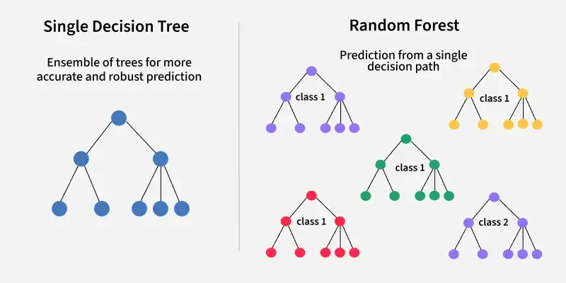

---

## 🤔 What is a Random Forest?

A **Random Forest** is an **ensemble learning method** that combines multiple decision trees to create a more powerful and accurate model.

### Key Ideas:
- **Ensemble Learning**: Using multiple models together (like a team!)
- **Forest**: A collection of decision trees
- **Random**: Each tree is trained on random samples of data and random features
- **Voting**: All trees vote on the final prediction

### The Big Picture:

```
Single Decision Tree:
    🌳 → Prediction

Random Forest:
    🌳 → Vote
    🌲 → Vote      } → Final Prediction (Majority Vote)
    🌳 → Vote
    🌲 → Vote
    🌳 → Vote
```

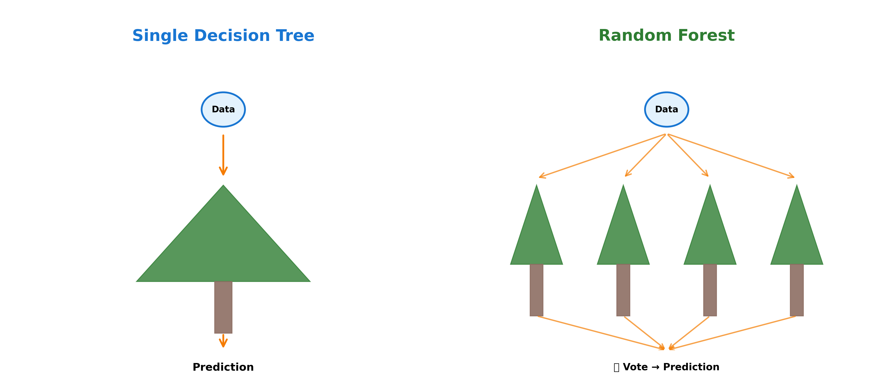

---

## 🎲 How Random Forests Work

Random Forests use two key techniques to create diverse trees:

### 1️⃣ **Bootstrap Aggregating (Bagging)** 🎒

Imagine you have a bag of 1000 colored marbles. Instead of giving all 1000 marbles to each tree, you:

1. Randomly pick marbles FROM the bag (with replacement - meaning you put each marble back after picking it)
2. Create a new bag of 1000 marbles (some might be duplicates!)
3. Give this new bag to one tree
4. Repeat this process for each tree in the forest

This way, each tree sees a slightly different dataset!

**Technical terms:**
- **Bootstrap Sample**: Random sample WITH replacement
- **Aggregating**: Combining all the predictions

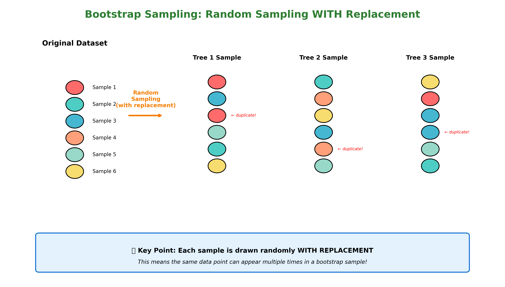

### 2️⃣ **Feature Randomness** 🎰

When building each split in a tree, instead of considering ALL features, we only consider a random subset of features!

**Example:**
- Total features in dataset: 20
- Features considered at each split: √20 ≈ 4-5 random features

This ensures trees look at different aspects of the data and don't all make the same mistakes!

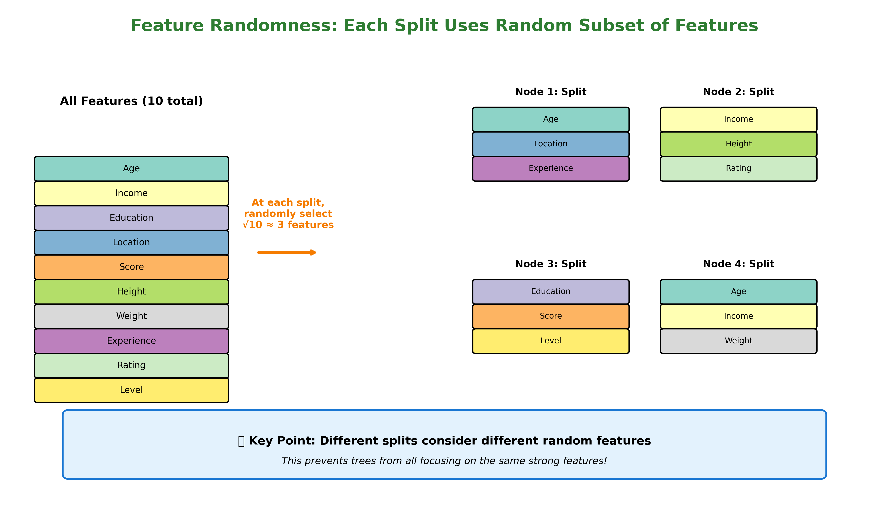

---

## 🏗️ Building a Random Forest: Step-by-Step

Let's say we want to create a Random Forest with 100 trees:

### Step 1: Create Bootstrap Samples
```
Original Dataset (1000 rows)
    ↓
Tree 1: Random sample of 1000 rows (with replacement)
Tree 2: Random sample of 1000 rows (with replacement)
Tree 3: Random sample of 1000 rows (with replacement)
...
Tree 100: Random sample of 1000 rows (with replacement)
```

### Step 2: Build Each Tree
For each tree:
- Use the bootstrap sample
- At each split, randomly select a subset of features
- Grow the tree (usually without pruning!)

### Step 3: Make Predictions

**For Classification** (predicting categories):
```
Tree 1: Predicts "Cat" 🐱
Tree 2: Predicts "Dog" 🐶
Tree 3: Predicts "Cat" 🐱
Tree 4: Predicts "Cat" 🐱
Tree 5: Predicts "Dog" 🐶
...
Tree 100: Predicts "Cat" 🐱

Final Prediction: "Cat" (Majority Vote)
```

**For Regression** (predicting numbers):
```
Tree 1: Predicts 25.3
Tree 2: Predicts 27.1
Tree 3: Predicts 26.5
Tree 4: Predicts 28.0
Tree 5: Predicts 24.8
...
Tree 100: Predicts 26.2

Final Prediction: 26.4 (Average of all predictions)
```

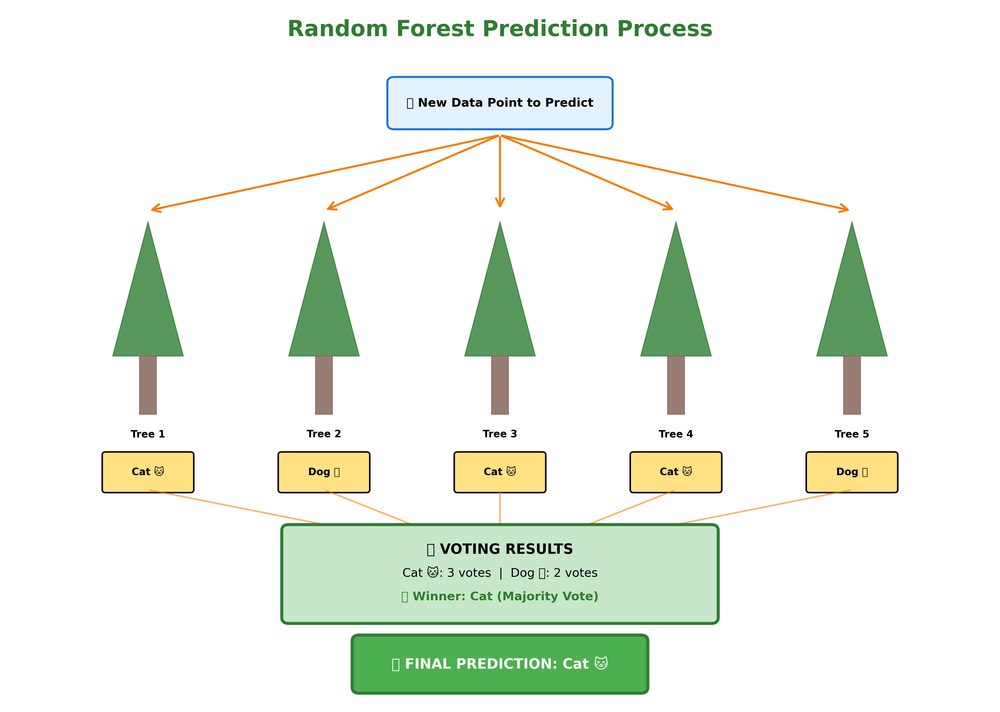

---

## 🆚 Single Tree vs Random Forest

| Aspect | Single Decision Tree 🌳 | Random Forest 🌲🌳🌲 |
|--------|------------------------|---------------------|
| **Training Data** | Uses all data | Each tree uses random sample |
| **Features per Split** | Considers all features | Considers random subset |
| **Overfitting** | ⚠️ High risk | ✅ Much lower risk |
| **Accuracy** | Good | Usually better! |
| **Interpretability** | Easy to understand | Harder (it's a "black box") |
| **Training Time** | Fast ⚡ | Slower (training many trees) |
| **Prediction Time** | Fast ⚡ | Slower (all trees must vote) |

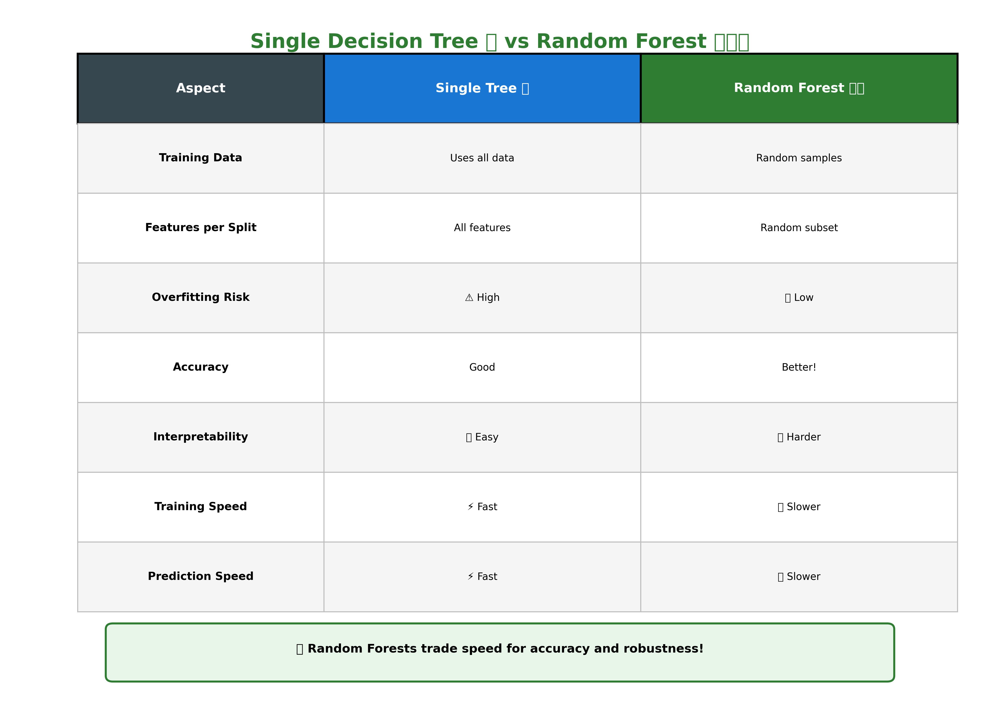

---

## 🎯 Why Random Forests Are Awesome!

### 1. **Reduces Overfitting** 🛡️
- Single trees can memorize the training data
- Random Forests average out the errors and biases
- Like asking multiple doctors instead of just one!

### 2. **Handles Missing Data** 🔧
- Can estimate missing values
- Maintains accuracy even with some missing information

### 3. **Works with Many Features** 📊
- Can handle hundreds or thousands of features
- Automatically determines which features are important

### 4. **No Need for Feature Scaling** 🎚️
- Unlike some algorithms, doesn't care if features have different scales
- Age (0-100) and Income ($0-$1,000,000) can work together just fine!

### 5. **Feature Importance** ⭐
- Tells you which features matter most
- Helps you understand your data better

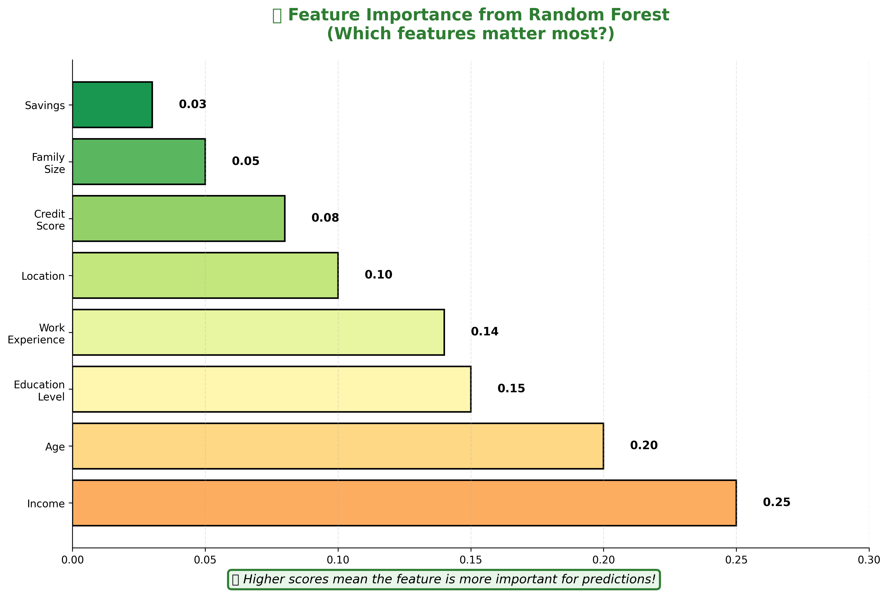

---

## ⚙️ Important Parameters (Hyperparameters)

When creating a Random Forest, you can control:

### 🔢 **n_estimators** (Number of Trees)
- How many trees to create
- More trees = better predictions (usually)
- But more trees = slower training
- **Sweet spot**: 100-500 trees

### 📏 **max_depth** (Tree Depth)
- How deep each tree can grow
- `None` = trees grow until pure (common for RF)
- Limit it to prevent very complex trees

### 🎲 **max_features** (Features per Split)
- How many features to consider at each split
- **Classification default**: √(total features)
- **Regression default**: total features / 3
- Options: "sqrt", "log2", or a specific number

### 🌱 **min_samples_split** (Minimum Samples to Split)
- Minimum samples needed to split a node
- Default: 2
- Increase to make trees simpler

### 🍃 **min_samples_leaf** (Minimum Samples in Leaf)
- Minimum samples in a leaf node
- Default: 1
- Increase to make trees smoother

### 🎒 **bootstrap** (Use Bootstrap Sampling?)
- `True` (default): Use random samples with replacement
- `False`: Use all data (then it's not really a Random Forest!)

---

## 🌍 Real-World Applications

Random Forests are used everywhere! Here are some cool examples:

### 1. **Medical Diagnosis** 🏥
- Predicting diseases based on symptoms and test results
- Determining which patients need urgent care

### 2. **Banking & Finance** 💰
- Credit card fraud detection
- Loan approval decisions
- Stock market predictions

### 3. **E-Commerce** 🛒
- Product recommendations
- Customer churn prediction (who might stop shopping with us?)
- Estimating delivery times

### 4. **Gaming** 🎮
- Predicting player behavior
- Matchmaking systems
- Detecting cheaters

### 5. **Environment** 🌱
- Predicting forest fires
- Weather forecasting
- Wildlife population estimation

### 6. **Social Media** 📱
- Friend recommendations
- Content filtering
- Ad targeting

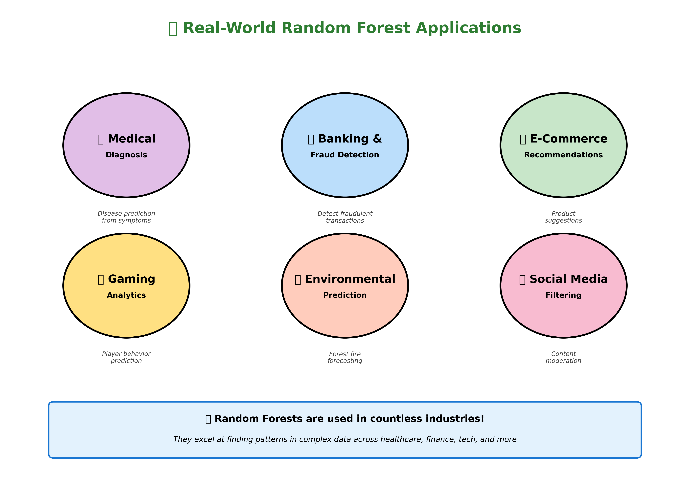

---

## ✅ Advantages of Random Forests

| Advantage | Explanation |
|-----------|-------------|
| **High Accuracy** 📈 | Usually performs better than single trees |
| **Reduces Overfitting** 🎯 | Averaging multiple trees prevents memorization |
| **Handles Big Data** 💾 | Works well with large datasets |
| **Works with Mixed Data** 🔢📝 | Handles both numerical and categorical features |
| **Parallel Training** ⚡ | Trees can be trained simultaneously (fast!) |
| **Out-of-Bag Error** 📊 | Built-in validation (we'll learn this!) |
| **Feature Importance** ⭐ | Ranks which features matter most |
| **Robust to Outliers** 🛡️ | Outliers don't affect it much |

---

## ❌ Disadvantages of Random Forests

| Disadvantage | Explanation |
|--------------|-------------|
| **Black Box** 📦 | Hard to interpret (unlike a single tree) |
| **Memory Intensive** 💾 | Storing 100+ trees takes memory |
| **Slower Predictions** 🐌 | All trees must vote (slower than one tree) |
| **Not Great for Linear Data** 📉 | If data is linear, simpler methods work better |
| **Overfits on Noisy Data** ⚠️ | Can still overfit if data is very noisy |

---

## 🧮 Mathematical Intuition (Optional Deep Dive)

### For Classification:
If we have `N` trees, and each tree `i` predicts class `c_i`:

**Final Prediction = Mode({c₁, c₂, c₃, ..., cₙ})**

(The class that appears most often)

### For Regression:
If we have `N` trees, and each tree `i` predicts value `y_i`:

**Final Prediction = (y₁ + y₂ + y₃ + ... + yₙ) / N**

(The average of all predictions)

### Why Does This Work?

**Wisdom of Crowds**: When you average multiple independent predictions, the errors tend to cancel out!

Think of it like this:
- Tree 1 might overestimate: +5 error
- Tree 2 might underestimate: -3 error
- Tree 3 might overestimate: +2 error
- Tree 4 might underestimate: -4 error

Average error: (+5 - 3 + 2 - 4) / 4 = 0 ✨

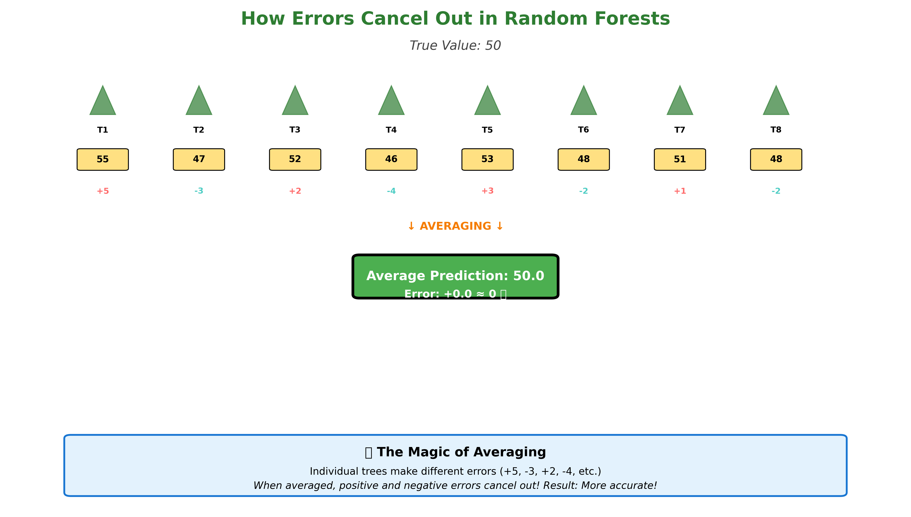

---

## 🎓 Key Vocabulary

| Term | Definition |
|------|------------|
| **Ensemble** | A group of models working together |
| **Bagging** | Bootstrap Aggregating - training on random samples |
| **Bootstrap Sample** | Random sample WITH replacement |
| **Out-of-Bag (OOB)** | Data NOT used in a tree's bootstrap sample |
| **Feature Importance** | Measure of how useful each feature is |
| **Majority Vote** | Choosing the most common prediction (classification) |
| **Averaging** | Taking the mean of predictions (regression) |
| **Hyperparameter** | Settings we choose before training |

---

## 🤓 Fun Facts!

1. **Random Forests were invented in 2001** by Leo Breiman, a statistics professor at UC Berkeley

2. **The name "Random Forest"** comes from random decision trees + forest of trees

3. **Kaggle competitions** (data science competitions) are often won using Random Forests or similar ensemble methods

4. **Random Forests can run in parallel** - each tree can be trained on a different computer core simultaneously!

5. **They work for both classification AND regression** - one algorithm, two purposes!

6. **Random Forests are robust** - they work well "out of the box" without much tuning

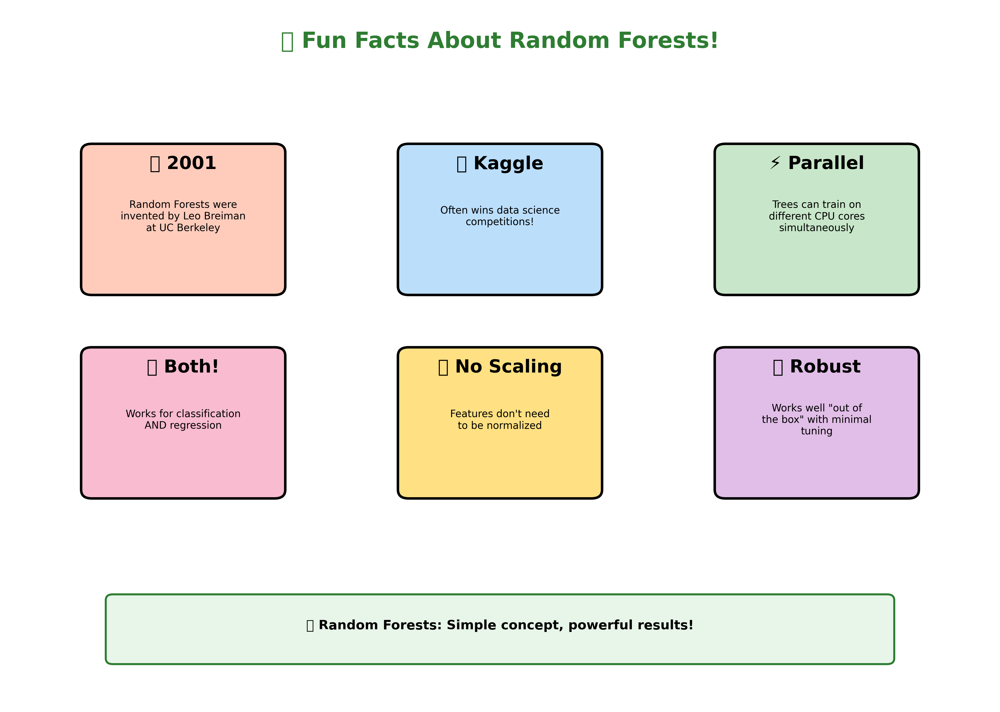

---

## 🔍 What's Next?

Now that you understand Random Forests, you're ready to:

1. **Code Random Forests in Python** using scikit-learn
2. **Compare** different numbers of trees
3. **Analyze** feature importance
4. **Tune** hyperparameters for better performance
5. **Learn** other ensemble methods (Gradient Boosting, AdaBoost)

---

## 💡 Key Takeaways

✅ Random Forests combine many decision trees for better predictions

✅ Each tree is trained on random data samples and random features

✅ Classification uses majority voting; regression uses averaging

✅ Random Forests reduce overfitting compared to single trees

✅ They're powerful but less interpretable than single trees

✅ Used in many real-world applications from medicine to gaming

✅ Generally work well without much tuning (beginner-friendly!)

---

## 🎯 Practice Questions

1. **Why is a Random Forest better than a single decision tree?**

2. **What are the two types of "randomness" in Random Forests?**

3. **If you have a Random Forest with 50 trees for classification, and 35 trees predict "Yes" while 15 predict "No", what is the final prediction?**

4. **True or False: Random Forests always perform better than single decision trees.**

5. **What would happen if we trained all trees on the same data with the same features? Would it still be a Random Forest?**

---

## 🌟 Remember

> "A single tree is good, but a forest is great! Just like in real life, teamwork makes the dream work!" 🌲🌳🌲

---

**Happy Learning! Now let's code some Random Forests! 🚀**

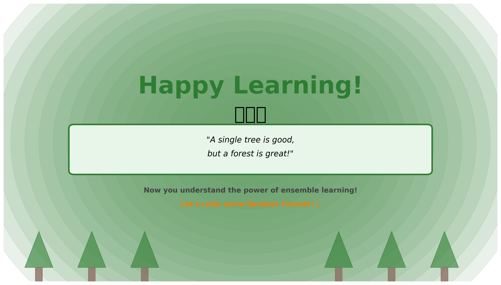
