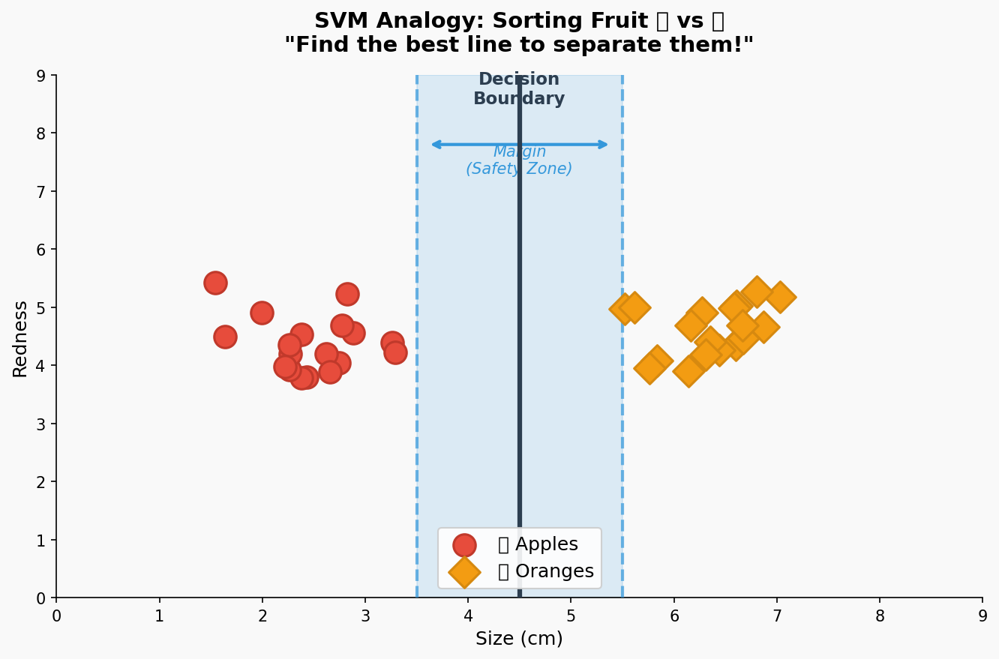
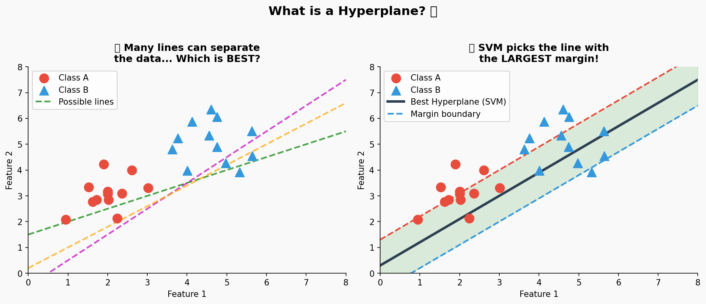
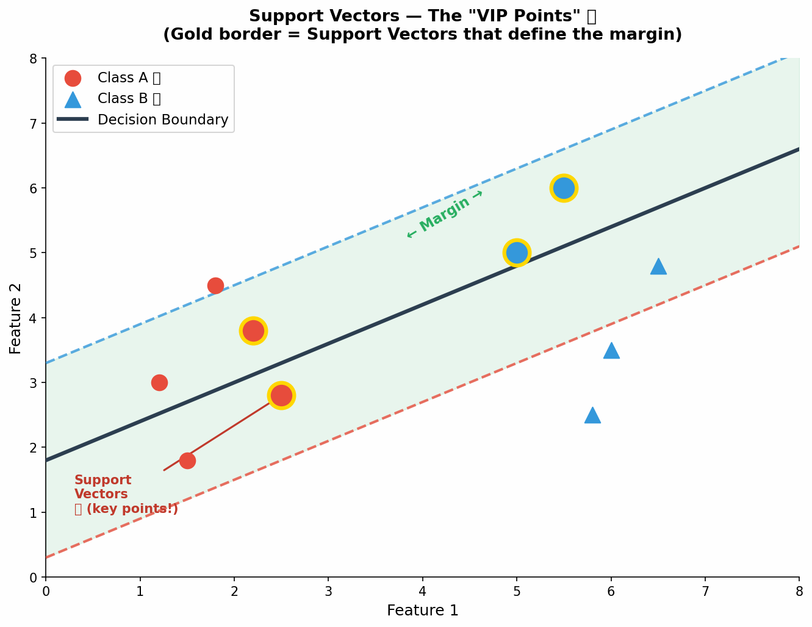
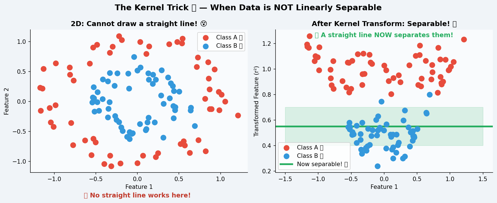
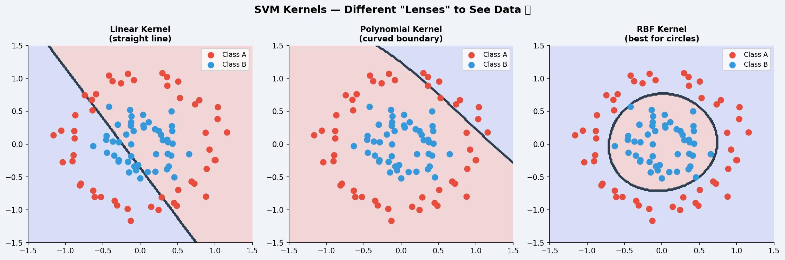
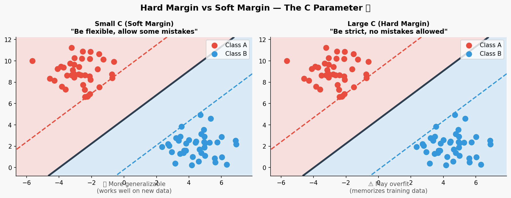
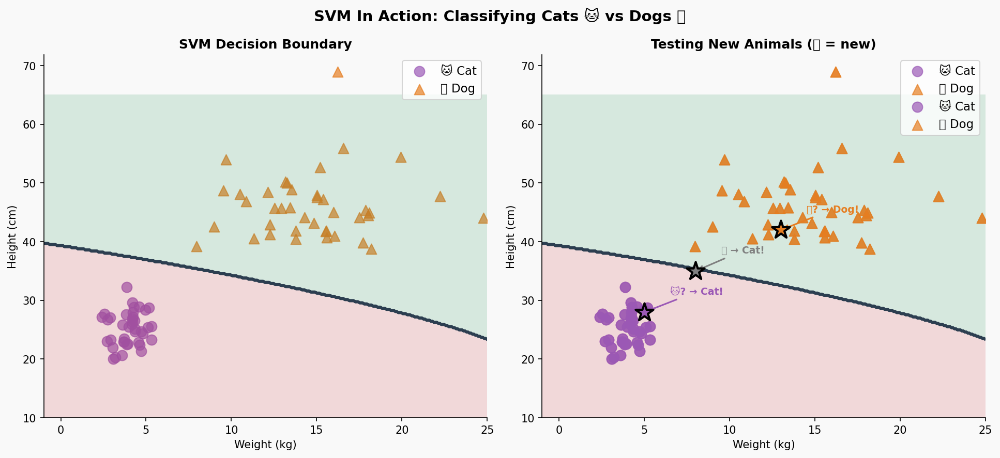
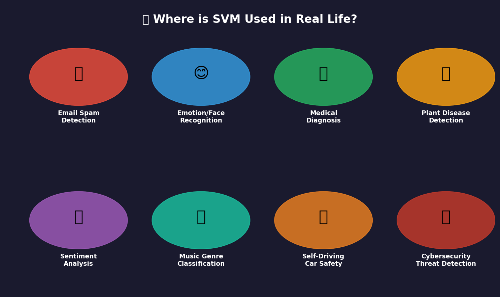
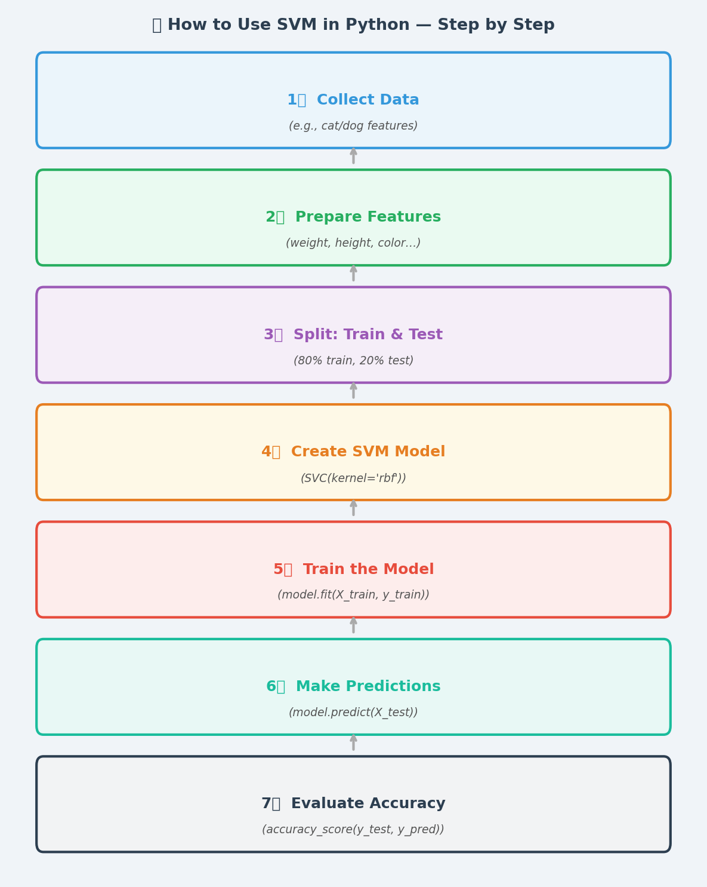

# 🤖 Support Vector Machines (SVM)
### Python ML (Python for Machine Learning)

---

> **What we'll learn today:**  
> How computers can draw an invisible line to sort things into groups — and why that's super powerful!

---

## 📋 Table of Contents

1. [What is SVM? — The Big Idea](#1-what-is-svm--the-big-idea)
2. [A Fun Analogy: Sorting Fruit](#2-a-fun-analogy-sorting-fruit)
3. [Key Vocabulary](#3-key-vocabulary)
4. [Hyperplanes — Finding the Best Line](#4-hyperplanes--finding-the-best-line)
5. [Support Vectors — The VIP Points](#5-support-vectors--the-vip-points)
6. [The Margin — Why Bigger is Better](#6-the-margin--why-bigger-is-better)
7. [The Kernel Trick — Seeing in 3D](#7-the-kernel-trick--seeing-in-3d)
8. [Types of Kernels](#8-types-of-kernels)
9. [Hard Margin vs Soft Margin (The C Parameter)](#9-hard-margin-vs-soft-margin-the-c-parameter)
10. [SVM In Action: Cats vs Dogs](#10-svm-in-action-cats-vs-dogs)
11. [Real-World Uses of SVM](#11-real-world-uses-of-svm)
12. [Full Python Code Example](#12-full-python-code-example)
13. [How to Use SVM — Step by Step](#13-how-to-use-svm--step-by-step)
14. [Practice Challenges](#14-practice-challenges)
15. [Quick Summary](#15-quick-summary)

---

## 1. What is SVM? — The Big Idea

**Support Vector Machine (SVM)** is a machine learning algorithm that helps a computer **classify** (sort) things into groups.

Think of it like this: Imagine you have a big table covered with red and blue marbles all mixed together. Your job is to draw a line on the table so that all the red marbles are on one side and all the blue marbles are on the other side. **SVM finds the best possible line to do exactly that!**

But SVM doesn't just find *any* line — it finds the **smartest line**: the one that keeps as much space as possible between the marbles and the line. This makes it much better at sorting marbles it has never seen before.

> **In real life, SVM can classify:**
> - Spam emails vs. real emails
> - Cat photos vs. dog photos
> - Healthy cells vs. cancer cells
> - Happy reviews vs. angry reviews

---

## 2. A Fun Analogy: Sorting Fruit

Imagine a school cafeteria where apples and oranges keep getting mixed together on the conveyor belt. The lunch staff draws a line on the belt — everything to the left goes in the apple bin, everything to the right goes in the orange bin.

SVM is the computer version of that cafeteria worker — except it finds the **perfect** dividing line automatically!



**What you see in the picture above:**
- 🔴 Red circles = Apples
- 🟠 Orange diamonds = Oranges
- The solid black line = The **decision boundary** (the dividing line)
- The shaded blue zone = The **margin** (the safety space on either side of the line)

Notice how the line doesn't just *barely* squeeze between them — it stays as far away as possible from both the apples and the oranges. That's what makes SVM special!

---

## 3. Key Vocabulary

Before we go further, let's learn the important words we'll use today:

| Term | What it Means | Everyday Analogy |
|------|---------------|------------------|
| **Classification** | Sorting things into groups | Sorting your Lego blocks by color |
| **Decision Boundary** | The line that separates the two groups | The fence between two yards |
| **Hyperplane** | The "line" that separates data (can be in many dimensions) | A fence in 2D, a wall in 3D |
| **Margin** | The gap between the boundary and the closest data points | The safety lane on a highway |
| **Support Vectors** | The data points closest to the decision boundary | The players right next to the half-court line |
| **Kernel** | A math trick to handle tricky curved data | Putting on 3D glasses to see more clearly |

---

## 4. Hyperplanes — Finding the Best Line

When we have data in 2D (like a regular graph with x and y), the decision boundary is a **line**.

But when we have 3D data (x, y, and z), the boundary becomes a **flat plane** (like a sheet of paper floating in space).

In general, for any number of dimensions, this boundary is called a **hyperplane**.

Here's the tricky part: **Many different lines could separate the data.** So which one should SVM pick?



**Left side:** Many possible lines can separate the red dots from the blue triangles. But which is best?

**Right side:** SVM picks the line that creates the **widest margin** — the biggest gap between the two groups. This line is the most confident separator!

### Why does the widest margin matter?

Think of it like a tight-rope walker. If the rope is right in the middle of two buildings with lots of space on either side, a small gust of wind won't make them fall. But if the rope is right at the edge, even a tiny wobble is dangerous.

The wide margin = stability = better predictions on new data!

---

## 5. Support Vectors — The VIP Points

Not all data points are equally important to SVM. The ones that matter most are the ones **closest to the decision boundary**. These special points are called **Support Vectors**.



**Gold-bordered points = Support Vectors** — these are the "VIP" data points that actually determine where the decision boundary goes!

### Key facts about Support Vectors:
- They are the points that are hardest to classify (they're right on the edge)
- If you remove any other point, the boundary stays the same
- If you move a support vector, the boundary moves too!
- SVM literally *rests* on these points — that's why they're called "support" vectors

> **Sports Analogy:** In basketball, the players standing closest to the half-court line define where "your side" vs "their side" begins. The players way in the back don't affect that boundary. Support vectors are like those players closest to the line!

---

## 6. The Margin — Why Bigger is Better

The **margin** is the total distance between the two margin boundary lines (the dashed lines in the diagrams). SVM's entire goal is to **maximize** this margin.

```
    Class A         |              |         Class B
    ● ●    ●        |              |       ▲     ▲ ▲
       ●  ●  [●]   |← ← margin → |→ [▲]  ▲    ▲
    ●                |              |
                  Support         Support
                  Vector          Vector
                  (closest A)     (closest B)
```

The margin = distance from the decision boundary to the nearest support vector on **each** side.

### Bigger margin = Better generalization

If the margin is wide, new data points have more room to land in the correct zone even if they're slightly different from the training data. A tight margin leaves no room for error!

---

## 7. The Kernel Trick — Seeing in 3D

Sometimes data can't be separated by any straight line. Imagine mixing red and blue sprinkles on a plate — the red ones are in the middle and the blue ones surround them in a circle. No straight line separates them!

This is where the **Kernel Trick** comes in — it's the most magical part of SVM!



**The kernel trick "lifts" the data into a higher dimension** where it suddenly *can* be separated by a flat surface.

### Simple Analogy:

Imagine you have red and blue coins mixed together on a table. From above (2D view), you can't draw a line to separate them. But if you **slam the table** (add energy/a new dimension), the red coins fly up higher than the blue coins. Now from the side, you can easily see a horizontal line separating them!

The kernel function is like that table slam — it transforms the data so separation becomes possible.

**Common types of kernel transformations:**
- Takes 2D data → computes new 3D coordinates
- A point at (x, y) might become (x², y², √2·x·y)
- In that new space, a flat plane separates what curved lines couldn't!

---

## 8. Types of Kernels

SVM comes with different "lenses" you can put on to see the data differently:



### Linear Kernel
- **What it does:** Draws a straight line
- **Best for:** Data that can already be separated by a line
- **Code:** `SVC(kernel='linear')`
- **Like:** Sorting people into "left side" and "right side" of a room

### Polynomial Kernel
- **What it does:** Draws a curved boundary (like a U-shape or S-curve)
- **Best for:** Data with curved relationships
- **Code:** `SVC(kernel='poly', degree=3)`
- **Like:** Drawing a curved fence around a playground

### RBF Kernel (Radial Basis Function)
- **What it does:** Can draw circular or blob-shaped boundaries
- **Best for:** Most real-world problems — it's the default!
- **Code:** `SVC(kernel='rbf')`
- **Like:** Drawing a spotlight circle around a group of people

> **Tip for beginners:** When in doubt, start with `kernel='rbf'` — it works well for most problems!

---

## 9. Hard Margin vs Soft Margin (The C Parameter)

What if your data has a few weird points that are in the wrong zone? Should SVM be super strict and try to separate *everything* perfectly, or should it be a bit flexible?

This is controlled by the **C parameter**:



| Setting | What It Means | Risk |
|---------|---------------|------|
| **Small C** (like `C=0.1`) | "Be flexible — allow some mistakes" | Might be too simple |
| **Large C** (like `C=100`) | "Be strict — no mistakes allowed" | Might memorize the data (overfitting) |

### The Goldilocks Problem

- Too strict (large C) → SVM memorizes every single training point → fails on new data
- Too flexible (small C) → SVM ignores important patterns → also fails on new data
- Just right → SVM learns the general pattern → works great on new data!

> **Analogy:** Imagine studying for a test. If you memorize only the exact practice problems (large C), you'll fail when the test has different questions. If you study too loosely (small C), you won't know anything. The best approach is to learn the *concepts* — that's what a good C value does!

### How to find the right C:

```python
# Try different C values and see which gives the best accuracy
from sklearn.model_selection import GridSearchCV

param_grid = {'C': [0.01, 0.1, 1, 10, 100]}
grid = GridSearchCV(SVC(kernel='rbf'), param_grid, cv=5)
grid.fit(X_train, y_train)
print("Best C:", grid.best_params_)
```

---

## 10. SVM In Action: Cats vs Dogs

Let's see SVM solving a real classification problem: figuring out if an animal is a cat or a dog based on its **weight** and **height**!



**Left plot:** The SVM model learns from training data and draws a decision boundary between cats (purple circles) and dogs (orange triangles).

**Right plot:** When we give it new animals (the star points), it correctly predicts whether they're cats or dogs!

### What the shading means:
- 🟢 Green zone → SVM predicts "Dog"
- 🔴 Red zone → SVM predicts "Cat"
- The boundary between them is where SVM is "50-50" unsure

---

## 11. Real-World Uses of SVM

SVM is used in many amazing applications all around you:



### Email Spam Detection
Every time your email app moves junk mail to the spam folder, something like SVM might be running behind the scenes! It looks at words in the email to decide: *Spam or Not Spam?*

### Face Recognition
Unlocking your phone with your face? SVM can learn what your face features look like and separate "your face" from "not your face."

### Medical Diagnosis
Doctors use SVM to help detect diseases. For example, looking at a cell sample and predicting: *Healthy or Cancerous?* SVM has helped save lives!

### Plant Disease Detection
Farmers use image-based SVM tools to look at a leaf photo and determine: *Healthy plant or Diseased plant?* This helps catch problems early!

### Sentiment Analysis
When a company reads thousands of online reviews, SVM can sort them: *Happy customer or Unhappy customer?*

### Self-Driving Cars
Sensors detect objects, and SVM helps classify them: *Person? Car? Stop sign? Animal?* making real-time safety decisions.

---

## 12. Full Python Code Example

Here's a complete example you can run in your Jupyter notebook! We'll classify whether a student is "likely to pass" or "needs more practice" based on their homework score and quiz score.

```python
# ============================================================
# SVM Example: Will a Student Pass or Need More Practice?
# ============================================================

# Step 1: Import the libraries we need
import numpy as np
import matplotlib.pyplot as plt
from sklearn.svm import SVC
from sklearn.model_selection import train_test_split
from sklearn.metrics import accuracy_score, classification_report
from sklearn.preprocessing import StandardScaler

# Step 2: Create our sample data
# Features: [homework_score (0-100), quiz_score (0-100)]
# Label: 0 = Needs Practice, 1 = Likely to Pass

np.random.seed(42)

# Students who passed (high scores)
pass_hw    = np.random.normal(78, 8, 50)   # homework scores
pass_quiz  = np.random.normal(75, 8, 50)   # quiz scores

# Students needing practice (lower scores)
needs_hw   = np.random.normal(48, 8, 50)
needs_quiz = np.random.normal(45, 8, 50)

# Combine into one dataset
X = np.vstack([
    np.column_stack([pass_hw, pass_quiz]),
    np.column_stack([needs_hw, needs_quiz])
])
y = np.array([1]*50 + [0]*50)   # 1 = pass, 0 = needs practice

# Step 3: Split into training and testing sets
X_train, X_test, y_train, y_test = train_test_split(
    X, y, test_size=0.2, random_state=42
)
print(f"Training samples: {len(X_train)}")
print(f"Testing samples:  {len(X_test)}")

# Step 4: Scale the features (very important for SVM!)
scaler = StandardScaler()
X_train_scaled = scaler.fit_transform(X_train)
X_test_scaled  = scaler.transform(X_test)

# Step 5: Create and train the SVM model
model = SVC(kernel='rbf', C=1.0, random_state=42)
model.fit(X_train_scaled, y_train)
print("\nModel trained successfully!")

# Step 6: Make predictions
y_pred = model.predict(X_test_scaled)

# Step 7: Evaluate accuracy
accuracy = accuracy_score(y_test, y_pred)
print(f"\nModel Accuracy: {accuracy * 100:.1f}%")
print("\nDetailed Report:")
print(classification_report(y_test, y_pred,
      target_names=['Needs Practice', 'Likely to Pass']))

# Step 8: Test with a new student!
new_student = np.array([[65, 70]])   # homework=65, quiz=70
new_scaled  = scaler.transform(new_student)
prediction  = model.predict(new_scaled)

label = "Likely to Pass! 🎉" if prediction[0] == 1 else "Needs More Practice 📚"
print(f"\nNew student (HW=65, Quiz=70): {label}")

# Step 9: Visualize the decision boundary
plt.figure(figsize=(10, 7))

# Create a mesh to plot the decision boundary
h = 0.5
x_min, x_max = X[:, 0].min() - 5, X[:, 0].max() + 5
y_min, y_max = X[:, 1].min() - 5, X[:, 1].max() + 5
xx, yy = np.meshgrid(np.arange(x_min, x_max, h),
                     np.arange(y_min, y_max, h))

mesh_scaled = scaler.transform(np.c_[xx.ravel(), yy.ravel()])
Z = model.predict(mesh_scaled).reshape(xx.shape)

plt.contourf(xx, yy, Z, alpha=0.3, cmap='RdYlGn')
plt.contour(xx, yy, Z, colors='black', linewidths=2)

# Plot the data points
plt.scatter(X[y==0, 0], X[y==0, 1], color='red',   label='Needs Practice', s=80, alpha=0.7)
plt.scatter(X[y==1, 0], X[y==1, 1], color='green', label='Likely to Pass',  s=80, alpha=0.7)
plt.scatter(65, 70, color='blue', s=300, marker='*', zorder=5, label='New Student')

plt.xlabel('Homework Score', fontsize=12)
plt.ylabel('Quiz Score', fontsize=12)
plt.title('SVM: Will the Student Pass? 🎓', fontsize=14, fontweight='bold')
plt.legend(fontsize=11)
plt.tight_layout()
plt.show()
```

### Expected Output:
```
Training samples: 80
Testing samples:  20
Model trained successfully!

Model Accuracy: 97.5%

New student (HW=65, Quiz=70): Likely to Pass! 🎉
```

---

## 13. How to Use SVM — Step by Step



Here's the recipe to build any SVM model:

**Step 1 — Collect Data:** Gather examples with labels (e.g., "spam" or "not spam" emails)

**Step 2 — Prepare Features:** Choose which measurements/attributes to use (word count, sender, subject line...)

**Step 3 — Split: Train & Test:** Keep 80% of data to teach the model, 20% to test it

**Step 4 — Scale the Features:** SVM works best when all features are on the same scale (0 to 1 or -1 to 1)

**Step 5 — Create the Model:** `model = SVC(kernel='rbf', C=1.0)`

**Step 6 — Train the Model:** `model.fit(X_train_scaled, y_train)`

**Step 7 — Make Predictions:** `y_pred = model.predict(X_test_scaled)`

**Step 8 — Check Accuracy:** `accuracy_score(y_test, y_pred)`

### The Minimal SVM Template:

```python
from sklearn.svm import SVC
from sklearn.preprocessing import StandardScaler
from sklearn.model_selection import train_test_split
from sklearn.metrics import accuracy_score

# 1. Split
X_train, X_test, y_train, y_test = train_test_split(X, y, test_size=0.2)

# 2. Scale (very important!)
scaler = StandardScaler()
X_train = scaler.fit_transform(X_train)
X_test  = scaler.transform(X_test)

# 3. Create, Train, Predict
model = SVC(kernel='rbf', C=1.0)
model.fit(X_train, y_train)
y_pred = model.predict(X_test)

# 4. Score
print(f"Accuracy: {accuracy_score(y_test, y_pred) * 100:.1f}%")
```

> **Important reminder:** Always scale your features before using SVM! SVM is very sensitive to features with very different sizes. For example, if one feature goes from 0–100 and another from 0–1,000,000, the big one will dominate. `StandardScaler` fixes this!

---

## 14. Practice Challenges

### Challenge 1 — Beginner: Classify Shapes 🔵🔺
```python
# Data: circles vs triangles based on radius and angle
import numpy as np
from sklearn.svm import SVC
from sklearn.metrics import accuracy_score

np.random.seed(0)
circles   = np.column_stack([np.random.uniform(1, 5, 30),   np.random.uniform(0, 360, 30)])
triangles = np.column_stack([np.random.uniform(6, 10, 30),  np.random.uniform(0, 360, 30)])

X = np.vstack([circles, triangles])
y = [0]*30 + [1]*30

# TODO: Build and train an SVM model to classify circles vs triangles!
# Hint: Use SVC(kernel='rbf')
```

### Challenge 2 — Intermediate: Tune the C Parameter 🎛️
Train the student score example from earlier with different C values (`0.01, 0.1, 1, 10, 100`) and record the accuracy for each. Which C value works best? Make a bar chart!

### Challenge 3 — Advanced: Multi-class SVM 🌸
SVM can classify more than 2 groups! Use the built-in Iris flower dataset to classify 3 types of flowers:

```python
from sklearn.datasets import load_iris
from sklearn.svm import SVC
from sklearn.model_selection import train_test_split
from sklearn.metrics import accuracy_score

# Load data
iris = load_iris()
X, y = iris.data, iris.target

# TODO:
# 1. Split into train/test
# 2. Scale the features
# 3. Train SVC with kernel='rbf'
# 4. Print accuracy
# 5. Try to visualize using just 2 of the 4 features
```

### Challenge 4 — Explorer: Real Dataset 📊
Download the SMS Spam dataset from the internet and use `CountVectorizer` to turn text into numbers, then train SVM to detect spam!

---

## 15. Quick Summary

| Concept | Key Point |
|---------|-----------|
| **SVM Goal** | Find the decision boundary with the **widest margin** |
| **Hyperplane** | The dividing line/plane/surface between classes |
| **Support Vectors** | The most important points — closest to the boundary |
| **Margin** | The gap between the boundary and support vectors — maximize it! |
| **Kernel** | Math trick to handle non-linearly separable data |
| **C Parameter** | Controls strictness: small C = flexible, large C = strict |
| **Scaling** | Always scale features before SVM! |
| **Default Kernel** | Use `rbf` when you're not sure |

### SVM Cheat Sheet:
```python
from sklearn.svm import SVC
from sklearn.preprocessing import StandardScaler

# Scale first!
scaler = StandardScaler()
X_scaled = scaler.fit_transform(X)

# Basic SVM
model = SVC(kernel='rbf', C=1.0)     # Best for most problems
model = SVC(kernel='linear')          # For linearly separable data
model = SVC(kernel='poly', degree=3)  # For polynomial boundaries

# Train and predict
model.fit(X_train, y_train)
predictions = model.predict(X_new)
```

---

## 🧠 Reflect and Review

Before you leave today, think about these questions:

1. **In your own words**, what does SVM do? Explain it to someone who has never heard of it.
2. Why do we want the **widest** margin and not just any margin?
3. What are **support vectors** and why are they called "support" vectors?
4. When would you use an **RBF kernel** instead of a linear kernel?
5. If your SVM model has 99% accuracy on training data but only 60% on test data, which C value might you try — larger or smaller? Why?

---

## 📚 Further Reading

- [Scikit-learn SVM Documentation](https://scikit-learn.org/stable/modules/svm.html)
- [Visual SVM Playground (Weka)](https://www.cs.waikato.ac.nz/ml/weka/)
- Try searching: *"SVM interactive demo"* to find websites where you can drag points and watch the boundary update live!

---

*Happy Coding! Remember: Every expert was once a beginner. Keep experimenting!* 🚀

---

**Course:** Python for Machine Learning | **Level:** Middle School  
**Topic:** Support Vector Machines (SVM) | **Images folder:** `images_svm/`
