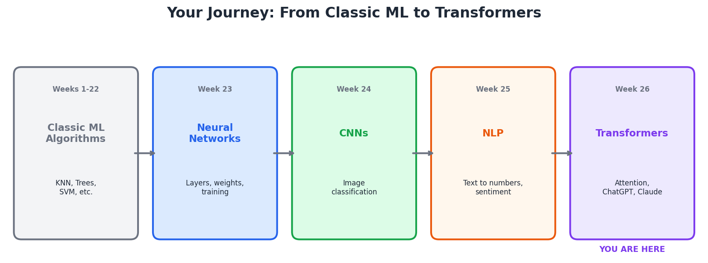
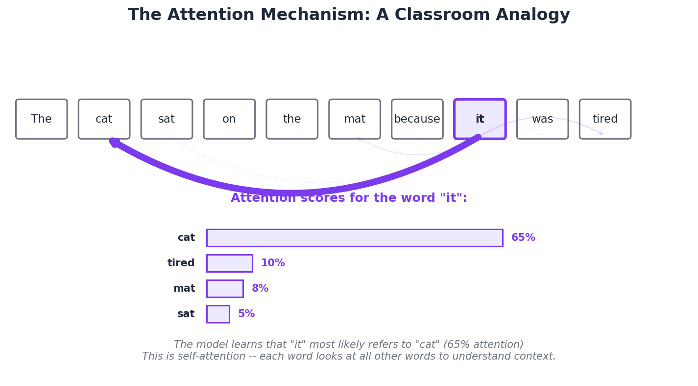
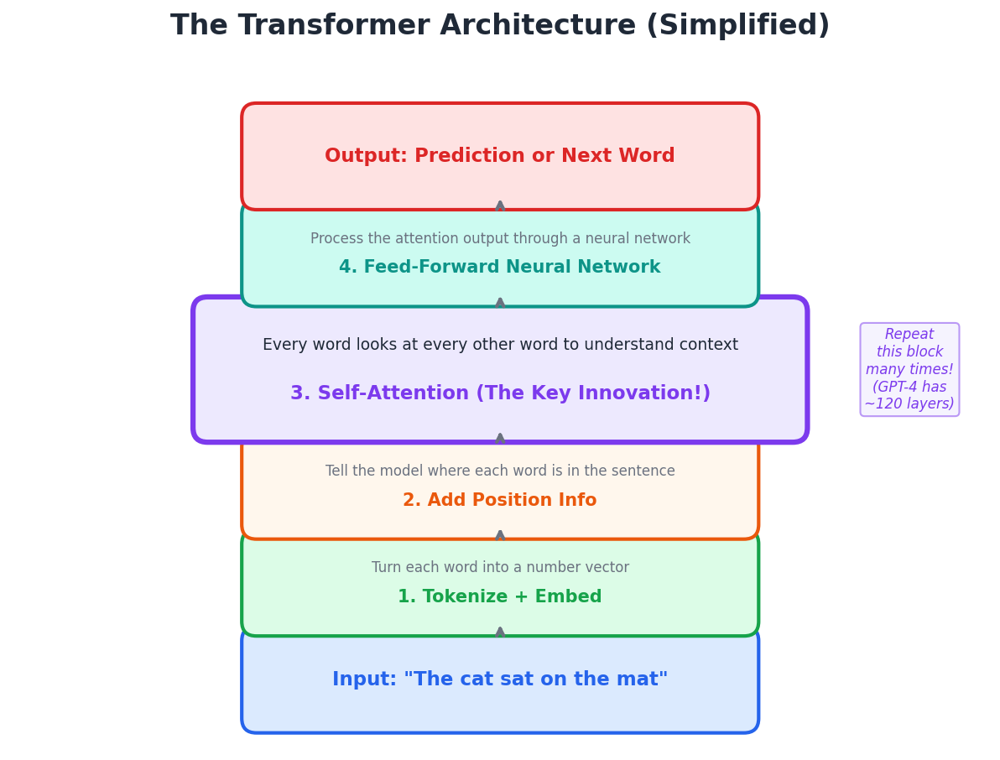
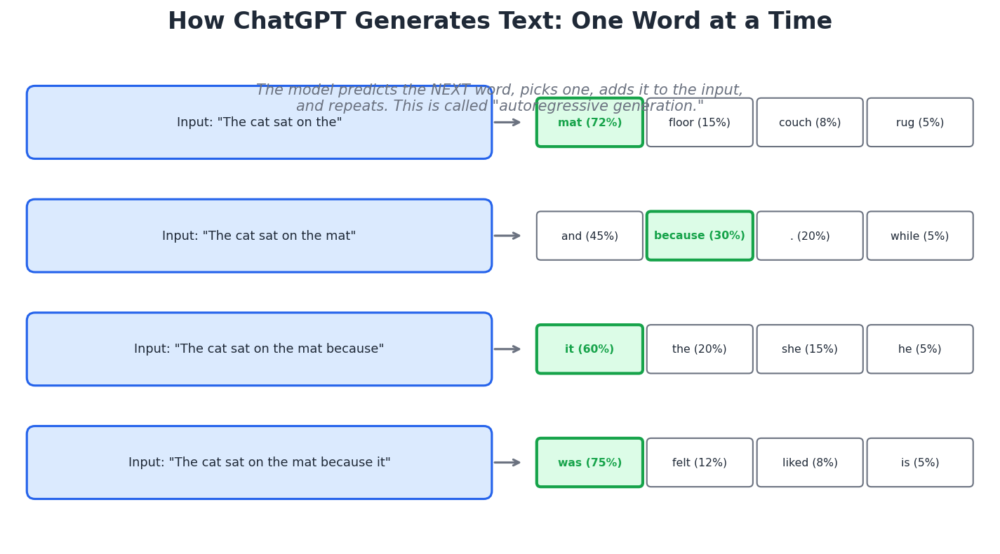
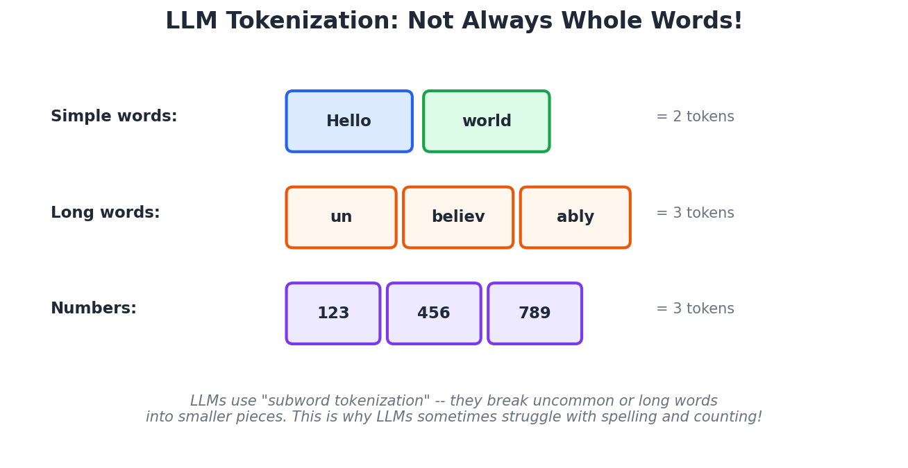
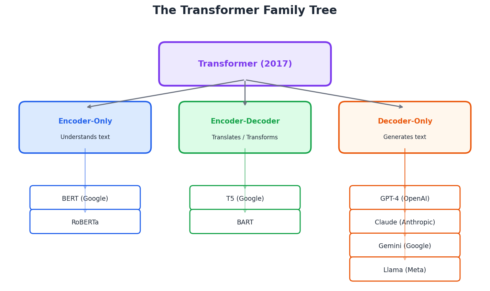
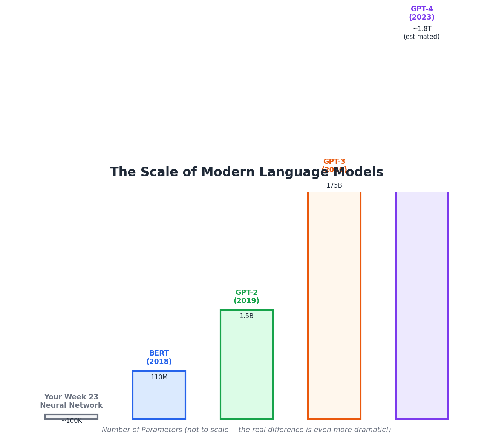

# Transformers and Large Language Models

**Python Machine Learning Course — Week 26**  
**Learn and Help | Academic Year 2025–2026**

---

## Learning Goals

By the end of this lesson, you will be able to:

1. Explain what a Transformer is and why it changed AI
2. Understand the attention mechanism using a simple analogy
3. Describe how ChatGPT and Claude generate text one word at a time
4. Know the difference between encoder, decoder, and encoder-decoder models
5. Use a pretrained Transformer model in Python with just a few lines of code
6. Appreciate the scale of modern LLMs and how they connect to everything you've learned this year

---

## Part 1: The Road to Transformers

### Where We've Been

Look how far you've come this year:



- **Weeks 1–22:** You learned classic ML algorithms — KNN, Decision Trees, Random Forests, SVM, and more. These algorithms work great on structured data (spreadsheets, tables, numbers).
- **Week 23:** You learned neural networks — layers of neurons that can learn complex patterns by adjusting weights during training.
- **Week 24:** You learned CNNs — neural networks designed to "see" images using filters that detect edges, shapes, and patterns.
- **Week 25:** You learned NLP — how to turn text into numbers (tokenization, TF-IDF) so machine learning models can work with language.

Now we reach the final piece of the puzzle: **Transformers** — the architecture that powers ChatGPT, Claude, Google Translate, and nearly every modern AI system you've heard of.

### Why Transformers Matter

Before Transformers (invented in 2017), AI models processed words **one at a time**, in order, like reading a book one word at a time with no ability to skip ahead or look back efficiently. This was slow and made it hard to understand long sentences.

Transformers changed everything by introducing a simple but powerful idea: **let every word look at every other word at the same time.** This is called **attention**, and it's the key innovation that made modern AI possible.

---

## Part 2: The Attention Mechanism

### The Core Idea

Imagine you're reading this sentence:

> "The cat sat on the mat because **it** was tired."

What does "it" refer to? You instantly know it means "the cat" — not "the mat." But how did you figure that out? Your brain automatically **paid attention** to the word "cat" more than any other word when processing "it."

That's exactly what the attention mechanism does. For each word in a sentence, the model calculates **how much attention to pay to every other word**.



### The Classroom Analogy

Think of a classroom where every student (word) can pass notes to every other student:

1. **Each student writes a question:** "What am I related to?" (this is called the **Query**)
2. **Each student also has a name tag:** describing what they are (this is called the **Key**)
3. **And each student holds a piece of information:** their meaning (this is called the **Value**)

When the word "it" wants to figure out what it means, it:
- Sends its Question to every other word
- Compares it against each word's Key to get a match score
- Uses those scores to decide how much of each word's Value to take

The word "cat" has a high match score, so "it" pays the most attention to "cat" and absorbs its meaning.

> Key Insight: You don't need to memorize Query/Key/Value. The important thing to understand is that **attention lets every word look at every other word** to figure out context. This is what makes Transformers so powerful.

### Why This Is Better Than What Came Before

Before Transformers, models called RNNs (Recurrent Neural Networks) processed words one at a time, left to right. By the time the model reached "it" in a long sentence, it might have "forgotten" what "the cat" was. Attention solves this by letting the model look at the **entire sentence at once**, no matter how long it is.

---

## Part 3: The Transformer Architecture

### How It All Fits Together

A Transformer has a clear structure. Here's the simplified version:



### The Steps, Explained

**Step 1: Tokenize and Embed**

You already learned this in Week 25! Break the text into tokens and convert each token into a number vector (embedding). This is the same idea as the Keras embedding layer you used for sentiment analysis.

**Step 2: Add Position Information**

Here's a problem: unlike RNNs that process words in order, Transformers see all words at once. So how does the model know that "cat" comes before "sat"? The answer is **positional encoding** — we add special numbers to each embedding that tell the model the position of each word. Think of it like numbering seats in a classroom.

**Step 3: Self-Attention (The Key Innovation)**

This is where the magic happens. Every word calculates attention scores with every other word, as we described in Part 2. The model learns which words are important for understanding each other word.

In practice, Transformers use **multi-head attention** — they run the attention process multiple times in parallel, each time looking for different types of relationships (grammatical, semantic, positional, etc.). It's like having multiple study groups, each focusing on a different aspect of the text.

**Step 4: Feed-Forward Neural Network**

After attention, each word's updated representation goes through a regular neural network (like the ones you built in Week 23) for additional processing.

**Repeat!** These steps (attention + feed-forward) are stacked many times. GPT-2 has 12 layers. GPT-3 has 96 layers. GPT-4 is estimated to have around 120 layers. More layers = more capacity to learn complex patterns.

---

## Part 4: How ChatGPT Generates Text

### Next Token Prediction

Here's a surprising fact: ChatGPT, Claude, and all modern language models work by doing one incredibly simple thing over and over:

**Predict the next word.**

That's it. When ChatGPT writes a paragraph, it's not planning the whole thing in advance. It predicts one word, adds it to the input, and repeats.



### The Process

1. You type: "The cat sat on the"
2. The model considers all possible next words and assigns probabilities
3. "mat" has the highest probability (72%), so it picks "mat"
4. Now the input becomes: "The cat sat on the mat"
5. The model predicts the next word: "because" (30%)
6. Repeat, repeat, repeat — hundreds of times to generate a full response

### Why It Sometimes Makes Mistakes

Since the model picks one word at a time based on probabilities, it can sometimes:
- **Choose a less likely word** — there's randomness built in (called "temperature") to make responses more creative and less repetitive
- **Lose track of earlier context** — even with attention, very long conversations can be challenging
- **"Hallucinate"** — confidently say something false, because the next word that "sounds right" isn't always factually correct

> Fun Fact: When Claude writes you a 500-word response, it has made roughly 500+ individual predictions, one after another. Each prediction uses the entire previous context (your question + everything it's written so far).

---

## Part 5: Tokens in LLMs — Not Always Whole Words

### Subword Tokenization

In Week 25, you learned about tokenization — splitting text into words. LLMs use a more advanced version called **subword tokenization**, where uncommon or long words get split into smaller pieces.



### Why This Matters

- **Vocabulary size:** Instead of needing a separate entry for every word in every language, the model can represent any word by combining smaller pieces. A typical LLM vocabulary has about 50,000–100,000 tokens.
- **Why LLMs struggle with spelling:** The model doesn't see individual letters — it sees chunks. When you ask "How many R's in strawberry?", the model might see ["straw", "berry"] and never separately process the letters.
- **Why LLMs struggle with math:** Numbers get split into chunks too. "123456789" might become ["123", "456", "789"], making arithmetic difficult.
- **Token limits:** When people say "GPT-4 has a 128K context window," they mean 128,000 tokens — roughly 96,000 words.

### Try It Yourself

You can see exactly how text gets tokenized at [platform.openai.com/tokenizer](https://platform.openai.com/tokenizer) — paste in any text and see how it splits into tokens.

---

## Part 6: The Transformer Family Tree

Not all Transformer models are the same. There are three main types:



### Encoder-Only Models (Understanding Text)

- **What they do:** Read text and produce a deep understanding of it
- **Example:** BERT (by Google)
- **Used for:** Sentiment analysis, text classification, search ranking, question answering
- **Analogy:** Like a reader who's great at understanding and analyzing text, but can't write new text from scratch

### Encoder-Decoder Models (Transforming Text)

- **What they do:** Read text AND generate new text — input goes in, different output comes out
- **Example:** T5 (by Google), the original Transformer
- **Used for:** Translation (English to French), summarization, question answering
- **Analogy:** Like a translator who reads in one language and writes in another

### Decoder-Only Models (Generating Text)

- **What they do:** Generate text one token at a time (next-token prediction)
- **Examples:** GPT-4 (OpenAI), Claude (Anthropic), Gemini (Google), Llama (Meta)
- **Used for:** Chatbots, code generation, creative writing, reasoning — the most versatile type
- **Analogy:** Like a writer who's great at continuing any story or answering any question

> Key Insight: ChatGPT and Claude are **decoder-only** Transformers. They're trained on massive amounts of text to become incredibly good at predicting the next word — and it turns out that being really good at predicting the next word requires a deep understanding of language, logic, and even reasoning.

---

## Part 7: The Scale of Modern LLMs

### How Big Are These Models?

Remember your Week 23 neural network? It had about 100,000 parameters (weights). Modern LLMs are astronomically larger:



### By the Numbers

| Model | Year | Parameters | Training Data |
|-------|------|-----------|---------------|
| Your Week 23 NN | 2026 | ~100,000 | 70,000 images |
| BERT | 2018 | 110 million | ~3 billion words |
| GPT-2 | 2019 | 1.5 billion | ~40 GB of text |
| GPT-3 | 2020 | 175 billion | ~570 GB of text |
| GPT-4 | 2023 | ~1.8 trillion (estimated) | Trillions of words |

### What Does This Mean?

- **Parameters** are the learnable weights — just like the weights in your Week 23 network, but billions of them
- **Training data** is the text the model learned from — books, websites, articles, code, and more
- **Training cost** for GPT-4 is estimated at over $100 million in computing costs
- **Training time** used thousands of specialized GPUs running for months

> Perspective: If each parameter were a grain of sand, your Week 23 network would fill a small cup. GPT-4 would fill several Olympic swimming pools.

---

## Part 8: Hands-On Activities

### Activity 1: Use a Pretrained Transformer in 3 Lines of Code

The Hugging Face library makes it incredibly easy to use powerful pretrained models. No training required — the models come ready to use!

```python
# =============================================
# USE A PRETRAINED TRANSFORMER — 3 LINES!
# =============================================

from transformers import pipeline

# Load a pretrained sentiment analysis model
classifier = pipeline("sentiment-analysis")

# Classify some text!
results = classifier([
    "I absolutely loved this movie! Best film of the year.",
    "This was the worst experience of my life. Terrible.",
    "The food was okay, nothing special but not bad either.",
])

for r in results:
    print(f"  {r['label']}: {r['score']:.2%}")
```

**Compare this to Week 25:** Last week you had to tokenize text, extract TF-IDF features, train a model, and then predict. With a pretrained Transformer, all of that is done for you — and the accuracy is usually much higher!

---

### Activity 2: Text Generation with a Transformer

```python
# =============================================
# TEXT GENERATION — Watch a Transformer write!
# =============================================

from transformers import pipeline

generator = pipeline("text-generation", model="gpt2")

prompt = "The future of artificial intelligence is"
outputs = generator(prompt, max_length=50, num_return_sequences=3)

print(f'Prompt: "{prompt}"\n')
for i, output in enumerate(outputs):
    print(f"Generation {i+1}:")
    print(f"  {output['generated_text']}")
    print()
```

Notice how each generation is different — the model samples from probabilities, so it produces varied outputs.

---

### Activity 3: Compare All Approaches — From Classic ML to Transformers

```python
# =============================================
# THE ULTIMATE COMPARISON: Classic ML vs Keras vs Transformer
# =============================================
# Same task (sentiment analysis). Three eras of AI.

from sklearn.feature_extraction.text import TfidfVectorizer
from sklearn.linear_model import LogisticRegression
from transformers import pipeline
import time

# Test reviews
test_reviews = [
    "This movie was absolutely fantastic! A masterpiece of storytelling.",
    "Terrible waste of time. The acting was awful and the plot was boring.",
    "It was okay. Some good parts but overall pretty average.",
    "One of the greatest films I have ever had the pleasure of watching.",
    "I want my money back. This was painfully bad from start to finish.",
]

# --- Approach 1: Classic ML (TF-IDF + Logistic Regression) ---
print("=" * 60)
print("APPROACH 1: Classic ML (TF-IDF + Logistic Regression)")
print("=" * 60)

# Quick training on sample data
train_texts = [
    "great movie loved it fantastic wonderful amazing",
    "terrible awful bad horrible waste boring worst",
    "good film nice enjoyable great fun entertaining",
    "bad movie terrible acting poor writing dull",
] * 25  # Repeat for minimal training
train_labels = [1, 0, 1, 0] * 25

tfidf = TfidfVectorizer(stop_words='english')
X_train = tfidf.fit_transform(train_texts)
lr_model = LogisticRegression(max_iter=1000)
lr_model.fit(X_train, train_labels)

X_test = tfidf.transform(test_reviews)
start = time.time()
lr_preds = lr_model.predict(X_test)
lr_time = time.time() - start

for review, pred in zip(test_reviews, lr_preds):
    label = "POSITIVE" if pred == 1 else "NEGATIVE"
    print(f'  {label}: "{review[:60]}..."')
print(f"  Prediction time: {lr_time*1000:.1f}ms")

# --- Approach 2: Pretrained Transformer ---
print(f"\n{'=' * 60}")
print("APPROACH 2: Pretrained Transformer")
print("=" * 60)

classifier = pipeline("sentiment-analysis")
start = time.time()
tf_preds = classifier(test_reviews)
tf_time = time.time() - start

for review, pred in zip(test_reviews, tf_preds):
    print(f'  {pred["label"]} ({pred["score"]:.1%}): "{review[:60]}..."')
print(f"  Prediction time: {tf_time*1000:.1f}ms")

# --- Summary ---
print(f"\n{'=' * 60}")
print("COMPARISON")
print("=" * 60)
print(f"{'Approach':<35} {'Setup Required':<20} {'Accuracy'}")
print("-" * 60)
print(f"{'TF-IDF + Logistic Regression':<35} {'Manual pipeline':<20} Good")
print(f"{'Pretrained Transformer':<35} {'One line of code':<20} Excellent")
print("-" * 60)
print("\nThe Transformer was trained on millions of examples by a large")
print("company — we just downloaded and used their work! This is the")
print("power of pretrained models and transfer learning.")
```

---

### Activity 4: Explore What Transformers Can Do

Transformers aren't just for sentiment analysis. The Hugging Face `pipeline` supports many tasks:

```python
from transformers import pipeline

# --- Summarization ---
summarizer = pipeline("summarization")
long_text = """
    Artificial intelligence has made remarkable progress in recent years,
    particularly in the field of natural language processing. Large language
    models like GPT-4 and Claude can now write essays, answer questions,
    write code, and even engage in complex reasoning tasks. These models
    are based on the Transformer architecture, which was introduced in 2017.
    The key innovation of the Transformer is the self-attention mechanism,
    which allows the model to consider all parts of the input simultaneously.
"""
summary = summarizer(long_text, max_length=50, min_length=20)
print("SUMMARIZATION:")
print(f"  Original: {len(long_text.split())} words")
print(f"  Summary: {summary[0]['summary_text']}")

# --- Named Entity Recognition ---
print("\nNAMED ENTITY RECOGNITION:")
ner = pipeline("ner", grouped_entities=True)
results = ner("Elon Musk founded SpaceX in Hawthorne, California in 2002.")
for entity in results:
    print(f'  "{entity["word"]}" -> {entity["entity_group"]} ({entity["score"]:.1%})')

# --- Question Answering ---
print("\nQUESTION ANSWERING:")
qa = pipeline("question-answering")
result = qa(
    question="What architecture powers modern AI?",
    context="Modern AI systems like ChatGPT and Claude are powered by the Transformer architecture, which was introduced in 2017 by researchers at Google."
)
print(f'  Question: "What architecture powers modern AI?"')
print(f'  Answer: "{result["answer"]}" (confidence: {result["score"]:.1%})')
```

---

## Part 9: Recommended Videos and Resources

### Must-Watch Videos

| Video | Length | Why Watch It |
|-------|--------|-------------|
| [3Blue1Brown: But What Is a GPT?](https://www.youtube.com/watch?v=wjZofJX0v4M) | 27 min | The absolute best visual explanation of how Transformers and GPT work. Beautiful animations. Start here! |
| [3Blue1Brown: Attention in Transformers, Visually Explained](https://www.youtube.com/watch?v=eMlx5fFNoYc) | 26 min | Deep dive into the attention mechanism with incredible visualizations. Watch after the first video. |
| [Fireship: Transformers Explained in 100 Seconds](https://www.youtube.com/watch?v=SZorAJ4I-sA) | 2 min | Ultra-fast overview if you want the key ideas in under 2 minutes |

### Interactive Tools

| Tool | Link | What You Can Do |
|------|------|----------------|
| **OpenAI Tokenizer** | [platform.openai.com/tokenizer](https://platform.openai.com/tokenizer) | See exactly how text gets split into tokens for GPT models |
| **Hugging Face Models** | [huggingface.co/models](https://huggingface.co/models) | Browse thousands of pretrained Transformer models you can use for free |
| **BertViz** | [github.com/jessevig/bertviz](https://github.com/jessevig/bertviz) | Visualize the attention patterns in a real Transformer model |

---

## Part 10: Quick Review — Key Takeaways

1. **Transformers** are the architecture behind ChatGPT, Claude, GPT-4, Gemini, and nearly every modern AI system. They were invented in 2017 and changed AI forever.

2. **Self-attention** is the key innovation — it lets every word look at every other word simultaneously to understand context. This is why "it" in "The cat sat because it was tired" correctly refers to "the cat."

3. **ChatGPT and Claude generate text one word at a time** by predicting the most likely next token, adding it to the input, and repeating. This is called autoregressive generation.

4. **LLMs use subword tokenization** — words get split into smaller pieces. This is why they can struggle with spelling, counting letters, and math.

5. **Three types of Transformers:** Encoder-only (BERT, for understanding), Encoder-Decoder (T5, for translating), Decoder-only (GPT-4, Claude, for generating). The chatbots you use are decoder-only.

6. **Scale matters.** Modern LLMs have billions to trillions of parameters, trained on trillions of words. Your Week 23 neural network had ~100,000 parameters — GPT-4 has roughly 18 million times more.

7. **Pretrained models are incredibly powerful.** With Hugging Face, you can use a state-of-the-art Transformer in 3 lines of Python — no training required. This is called **transfer learning**.

8. **Everything connects.** Tokenization (Week 25), embeddings (Week 25), neural networks (Week 23), training with loss functions (Week 23) — all of these concepts come together in Transformers.

---

## The Big Picture: Your ML Journey

Take a step back and appreciate what you've accomplished this year:

| What You Learned | Why It Matters |
|-----------------|---------------|
| Classic ML (KNN, Trees, SVM) | The foundation — how machines learn from data |
| Neural Networks | How layers of simple computations can learn complex patterns |
| CNNs | How machines can "see" and classify images |
| NLP | How to turn human language into numbers machines can process |
| Transformers | How all of this comes together to create the AI systems changing the world |

You now understand, at a conceptual level, how ChatGPT, Claude, Google Translate, image classifiers, spam filters, and recommendation systems work. That's an incredible achievement for any student, let alone a middle schooler.

---

*Last Updated: April 2026*  
*Python ML Course — Learn and Help*
