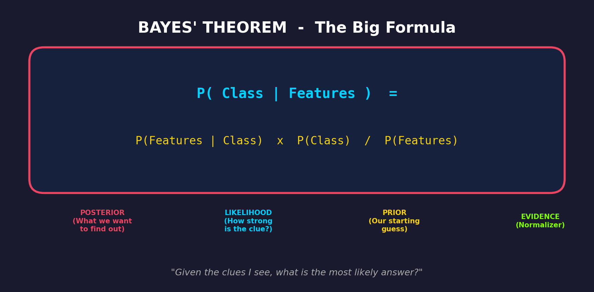
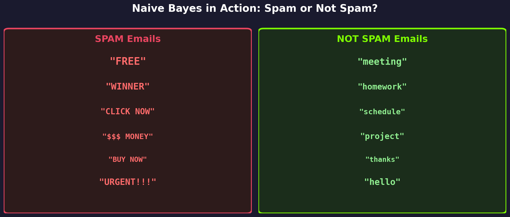
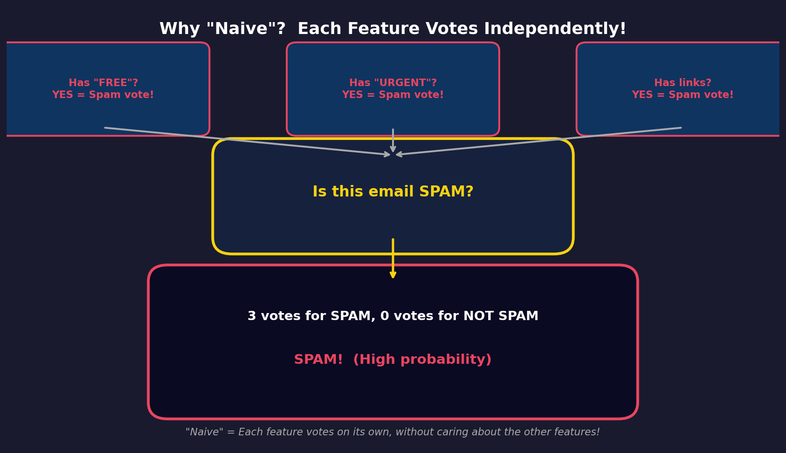
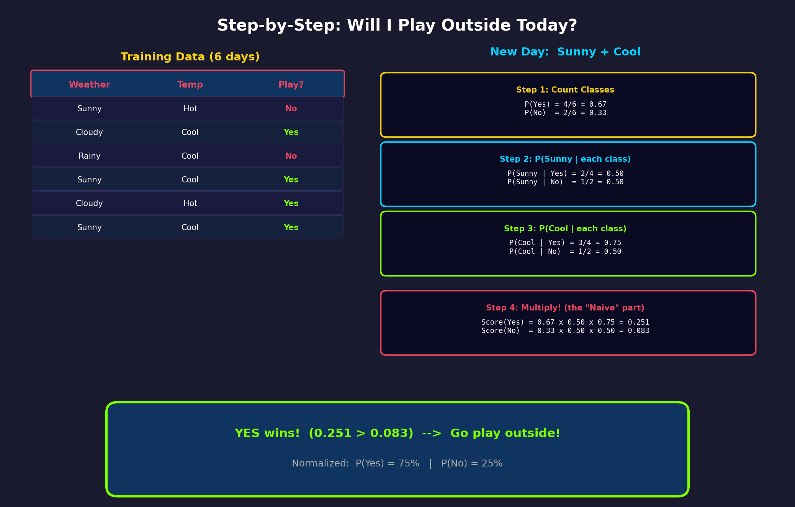
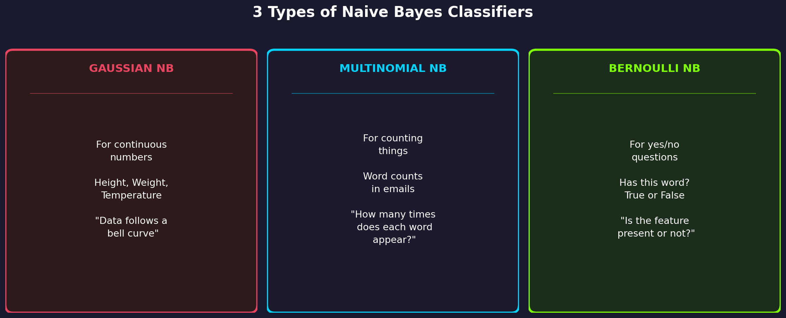
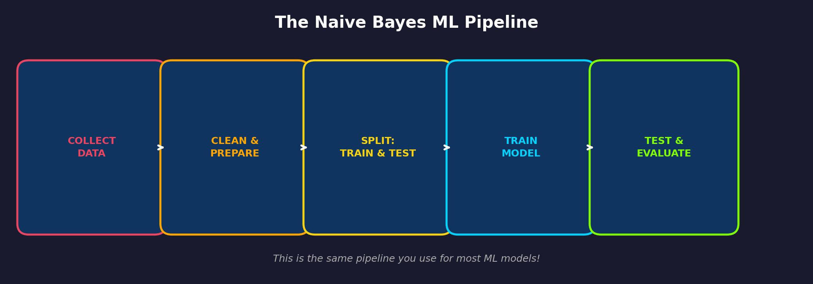
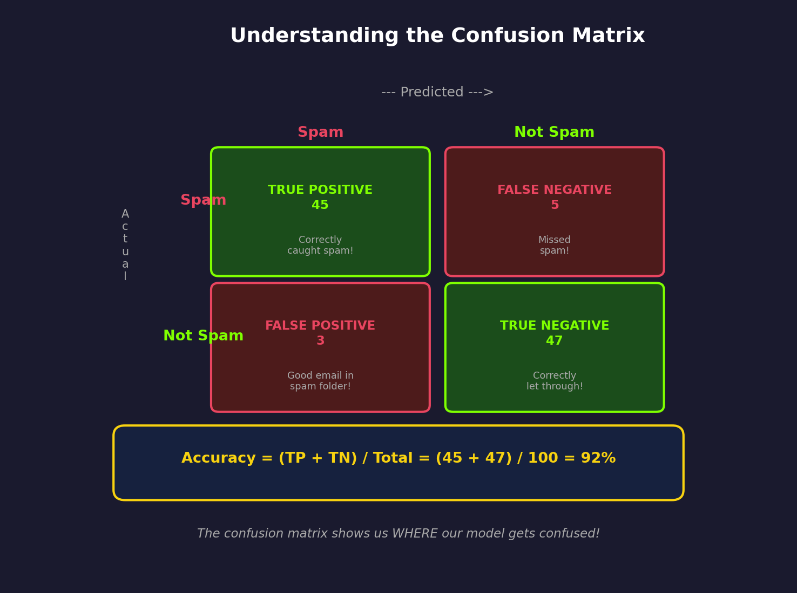
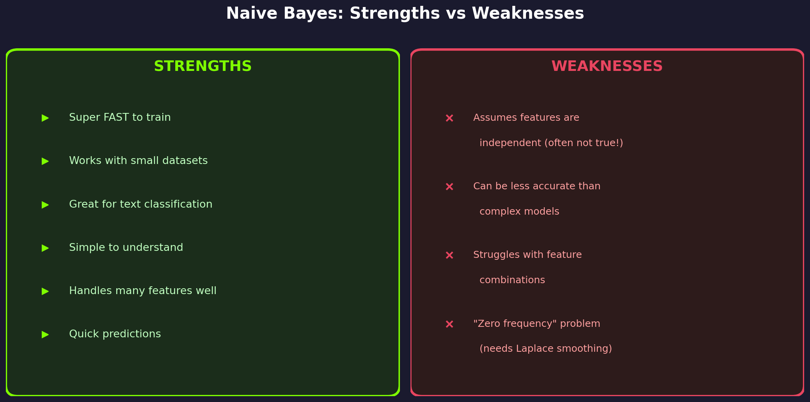
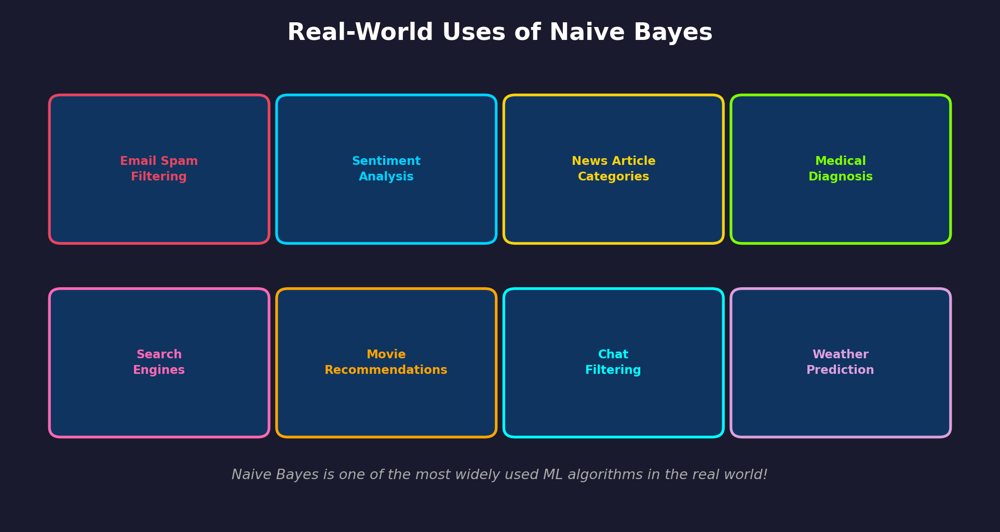

# 🧠 Naive Bayes Classifier

### Python for Machine Learning — Learn and Help Program
**Metropolitan State University | www.learnandhelp.com**

---

## 📌 What You'll Learn Today

By the end of this lesson, you will be able to:
- Explain what a Naive Bayes Classifier is and how it works
- Understand Bayes' Theorem in simple terms
- Know why it's called "Naive"
- Build a Naive Bayes model in Python using scikit-learn
- Evaluate your model using a confusion matrix and accuracy score

---

## 🤔 What is Naive Bayes?

Imagine you're a detective trying to figure out if an email is **spam** or **not spam**. You look at clues — words in the email — and based on what you've seen before, you make your best guess.

That's exactly what **Naive Bayes** does! It's a **classification algorithm** that uses **probability** (the chance of something happening) to predict which category something belongs to.

**Real-life analogy:** Think of it like a doctor diagnosing a patient. The doctor looks at **symptoms** (features) and based on past experience with other patients (training data), makes a **diagnosis** (prediction).

---

## 📐 Bayes' Theorem — The Math Behind It

Don't worry — the math is simpler than it looks!



Let's break down each part:

| Term | What it Means | Example |
|------|--------------|---------|
| **P(Class \| Features)** | What's the probability of this class, given the features we see? | What's the chance this email is spam, given it contains "FREE"? |
| **P(Features \| Class)** | How likely are these features if we already know the class? | How often do spam emails contain the word "FREE"? |
| **P(Class)** | What's our starting guess before looking at any features? | What percentage of all emails are spam? |
| **P(Features)** | How common are these features overall? | How often does "FREE" appear in any email? |

### 🍕 Pizza Analogy

Imagine you smell pizza. You want to know: **"Is the pizza place open?"**

- **Prior** P(Open): The pizza place is open 80% of the time → `0.80`
- **Likelihood** P(Smell Pizza | Open): If it's open, there's a 90% chance you smell pizza → `0.90`
- **Evidence** P(Smell Pizza): Overall, you smell pizza 75% of the time → `0.75`

**P(Open | Smell Pizza) = (0.90 × 0.80) / 0.75 = 0.96**

There's a **96% chance** the pizza place is open! 🎉

---

## 📧 Classic Example: Spam Detection

This is the most famous use of Naive Bayes — filtering spam emails!



The algorithm learns patterns:
- **Spam emails** tend to have words like: "FREE", "WINNER", "CLICK NOW", "BUY", "URGENT"
- **Normal emails** tend to have words like: "meeting", "homework", "project", "thanks", "schedule"

When a new email arrives, Naive Bayes checks the words and calculates: **"Based on these words, is this more likely spam or not spam?"**

---

## 🤷 Why is it Called "Naive"?

Here's the interesting part — Naive Bayes assumes that **every feature (clue) is independent** of every other feature. Each feature "votes" on its own!



**What does "independent" mean here?**

In real life, the words "FREE" and "CLICK" often appear **together** in spam. But Naive Bayes pretends they don't influence each other — it treats each word separately.

**Is this realistic?** Not always! That's why it's called **"naive"** — it makes a simplifying assumption. But here's the surprise: **it still works really well in practice!** Even though the assumption isn't perfect, the results are often excellent.

**Think of it like voting:**
- Each feature casts its own vote
- Features don't discuss with each other
- The class with the most "probability votes" wins!

---

## 📝 Step-by-Step Example: Will I Play Outside?

Let's walk through a complete example by hand so you can see exactly how Naive Bayes works.



### The Problem
We have 6 days of data about weather, temperature, and whether we played outside. Now it's a **new day: Sunny and Cool**. Should we play?

### Walking Through the Steps

**Step 1: Count how often each class appears (Prior Probability)**
- Out of 6 days, we played **4 times** (Yes) and **didn't play 2 times** (No)
- P(Yes) = 4/6 = **0.67** (67%)
- P(No) = 2/6 = **0.33** (33%)

**Step 2: For each feature, find P(Feature | Class)**
- P(Sunny | Yes) = 2 out of 4 "Yes" days were Sunny = **0.50**
- P(Sunny | No) = 1 out of 2 "No" days was Sunny = **0.50**

**Step 3: Same for Temperature**
- P(Cool | Yes) = 3 out of 4 "Yes" days were Cool = **0.75**
- P(Cool | No) = 1 out of 2 "No" days was Cool = **0.50**

**Step 4: Multiply everything together (this is the "Naive" part!)**
- Score(Yes) = P(Yes) × P(Sunny|Yes) × P(Cool|Yes) = 0.67 × 0.50 × 0.75 = **0.251**
- Score(No) = P(No) × P(Sunny|No) × P(Cool|No) = 0.33 × 0.50 × 0.50 = **0.083**

**Step 5: Normalize to get probabilities**
- P(Yes) = 0.251 / (0.251 + 0.083) = **75%**
- P(No) = 0.083 / (0.251 + 0.083) = **25%**

**Answer: YES! Go play outside!** (75% confident)

---

## 🎯 Three Types of Naive Bayes

Not all data is the same, so there are different versions of Naive Bayes for different types of data:



| Type | Best For | Example |
|------|----------|---------|
| **Gaussian NB** | Continuous numbers (decimals) | Height, weight, temperature |
| **Multinomial NB** | Counts and frequencies | Word counts in documents |
| **Bernoulli NB** | Yes/No (binary) data | Does the email contain "FREE"? (True/False) |

**How to choose?**
- If your features are **measurements** (like height or temperature) → **Gaussian NB**
- If your features are **word counts** → **Multinomial NB**
- If your features are **yes/no** → **Bernoulli NB**

---

## 🔄 The ML Pipeline for Naive Bayes

Building a Naive Bayes model follows the same steps as any ML project:



---

## 💻 Let's Code It in Python!

### Example 1: Iris Flower Classification (Gaussian NB)

This classic example classifies iris flowers into 3 species based on petal and sepal measurements.

```python
# Step 1: Import the tools we need
from sklearn.datasets import load_iris
from sklearn.model_selection import train_test_split
from sklearn.naive_bayes import GaussianNB
from sklearn.metrics import accuracy_score, classification_report

# Step 2: Load the Iris dataset
iris = load_iris()
X = iris.data        # Features: petal length, width, etc.
y = iris.target      # Labels: 0, 1, or 2 (3 flower species)

print(f"Number of samples: {len(X)}")
print(f"Number of features: {X.shape[1]}")
print(f"Feature names: {iris.feature_names}")
print(f"Class names: {list(iris.target_names)}")

# Step 3: Split into training (80%) and testing (20%)
X_train, X_test, y_train, y_test = train_test_split(
    X, y, test_size=0.2, random_state=42
)
print(f"\nTraining samples: {len(X_train)}")
print(f"Testing samples: {len(X_test)}")

# Step 4: Create and train the model
model = GaussianNB()
model.fit(X_train, y_train)
print("\n✅ Model trained!")

# Step 5: Make predictions
y_pred = model.predict(X_test)

# Step 6: Check accuracy
accuracy = accuracy_score(y_test, y_pred)
print(f"\n🎯 Accuracy: {accuracy * 100:.1f}%")

# Step 7: Detailed report
print("\n📊 Classification Report:")
print(classification_report(y_test, y_pred, target_names=iris.target_names))
```

**Expected Output:**
```
🎯 Accuracy: 96.7%
```

---

### Example 2: Email Spam Detection (Multinomial NB)

Now let's build a real spam detector!

```python
# Step 1: Import tools
from sklearn.feature_extraction.text import CountVectorizer
from sklearn.naive_bayes import MultinomialNB
from sklearn.model_selection import train_test_split
from sklearn.metrics import accuracy_score, confusion_matrix
import numpy as np

# Step 2: Sample email data
emails = [
    "Win a FREE iPhone now click here",
    "URGENT: You've won $1000 cash prize",
    "Buy cheap medications online now",
    "FREE entry to win a vacation",
    "Click here for amazing deals today",
    "Congratulations you are a WINNER",
    "Make money fast work from home",
    "Limited time offer buy now save big",
    "Hey, are we still meeting tomorrow?",
    "Please review the attached homework",
    "The project deadline is next Friday",
    "Thanks for sending the class notes",
    "Can you help me with the assignment?",
    "Great presentation in class today",
    "Let's schedule a study group session",
    "Don't forget about the exam next week",
    "Here are the meeting notes from today",
    "Your class registration is confirmed",
]

# Labels: 1 = Spam, 0 = Not Spam
labels = [1, 1, 1, 1, 1, 1, 1, 1,    # First 8 are spam
          0, 0, 0, 0, 0, 0, 0, 0, 0, 0]  # Last 10 are not spam

# Step 3: Convert text to numbers (Count the words!)
vectorizer = CountVectorizer()
X = vectorizer.fit_transform(emails)

print(f"Vocabulary size: {len(vectorizer.get_feature_names_out())} words")
print(f"Some words: {list(vectorizer.get_feature_names_out()[:10])}")

# Step 4: Split data
X_train, X_test, y_train, y_test = train_test_split(
    X, labels, test_size=0.3, random_state=42
)

# Step 5: Train Multinomial Naive Bayes
model = MultinomialNB()
model.fit(X_train, y_train)
print("\n✅ Spam detector trained!")

# Step 6: Test it
y_pred = model.predict(X_test)
accuracy = accuracy_score(y_test, y_pred)
print(f"🎯 Accuracy: {accuracy * 100:.1f}%")

# Step 7: Try with new emails!
new_emails = [
    "Congratulations! Click to claim your FREE prize",
    "Hey, want to study together for the exam?",
    "URGENT: Send money now to win big cash",
    "The homework is due next Tuesday",
]

new_X = vectorizer.transform(new_emails)
predictions = model.predict(new_X)

print("\n📧 Predictions for new emails:")
for email, pred in zip(new_emails, predictions):
    status = "🚫 SPAM" if pred == 1 else "✅ Not Spam"
    print(f"  {status}: \"{email[:50]}...\"")
```

---

### Example 3: Visualizing Results with a Confusion Matrix

```python
import matplotlib.pyplot as plt
from sklearn.metrics import confusion_matrix, ConfusionMatrixDisplay

# Using the iris example from above
from sklearn.datasets import load_iris
from sklearn.model_selection import train_test_split
from sklearn.naive_bayes import GaussianNB

# Load and train
iris = load_iris()
X_train, X_test, y_train, y_test = train_test_split(
    iris.data, iris.target, test_size=0.2, random_state=42
)
model = GaussianNB()
model.fit(X_train, y_train)
y_pred = model.predict(X_test)

# Create confusion matrix
cm = confusion_matrix(y_test, y_pred)

# Display it with a nice plot
fig, ax = plt.subplots(figsize=(8, 6))
disp = ConfusionMatrixDisplay(
    confusion_matrix=cm,
    display_labels=iris.target_names
)
disp.plot(ax=ax, cmap='Blues', values_format='d')
plt.title('Naive Bayes - Confusion Matrix\n(Iris Dataset)', fontsize=14)
plt.tight_layout()
plt.savefig('confusion_matrix_result.png', dpi=150)
plt.show()

print("✅ Confusion matrix saved!")
```

---

## 📊 Understanding the Confusion Matrix

The confusion matrix is a table that shows us **where our model gets it right and where it gets confused**.



**Key terms to remember:**
- **True Positive (TP):** Model said "Spam" and it WAS spam ✅
- **True Negative (TN):** Model said "Not Spam" and it WAS NOT spam ✅
- **False Positive (FP):** Model said "Spam" but it was NOT spam ❌ (Oops! Good email in spam folder)
- **False Negative (FN):** Model said "Not Spam" but it WAS spam ❌ (Oops! Spam got through)

**Important Formulas:**
```
Accuracy  = (TP + TN) / Total        → How often is the model correct overall?
Precision = TP / (TP + FP)           → When it says "Spam", how often is it right?
Recall    = TP / (TP + FN)           → Out of all actual spam, how much did it catch?
F1-Score  = 2 × (Precision × Recall) / (Precision + Recall)  → Balance of both
```

---

## ⚖️ Pros and Cons



### The "Zero Frequency" Problem

What happens if a word **never appeared** in the training data for a certain class? The probability becomes **zero**, and since we multiply, the entire score becomes zero!

**Solution: Laplace Smoothing** — We add a small number (usually 1) to every count so nothing is ever zero.

```python
# In scikit-learn, Laplace smoothing is ON by default!
model = MultinomialNB(alpha=1.0)  # alpha=1.0 is Laplace smoothing

# You can adjust it:
model = MultinomialNB(alpha=0.5)  # Less smoothing
model = MultinomialNB(alpha=2.0)  # More smoothing
```

---

## 🌍 Real-World Applications



Naive Bayes is used everywhere:
- **Gmail** uses it to filter spam
- **Twitter/X** uses it for sentiment analysis (is this tweet positive or negative?)
- **News apps** use it to categorize articles (sports, politics, technology)
- **Medical systems** use it to help diagnose diseases based on symptoms
- **Recommendation engines** use it to suggest content you might like

---

## 🧪 Try It Yourself: Practice Challenges

### Challenge 1: Fruit Classifier (Beginner)
Build a Naive Bayes model that classifies fruits based on their color, size, and texture.

```python
# Starter code - fill in the blanks!
import pandas as pd
from sklearn.naive_bayes import GaussianNB
from sklearn.preprocessing import LabelEncoder

# Sample fruit data
data = {
    'color':   ['red', 'yellow', 'red', 'orange', 'yellow', 'red', 'orange', 'yellow'],
    'size':    ['small', 'large', 'small', 'medium', 'large', 'small', 'medium', 'medium'],
    'texture': ['smooth', 'smooth', 'smooth', 'rough', 'smooth', 'smooth', 'rough', 'smooth'],
    'fruit':   ['apple', 'banana', 'apple', 'orange', 'banana', 'apple', 'orange', 'banana']
}
df = pd.DataFrame(data)

# TODO: Encode categorical features using LabelEncoder
# TODO: Split into X (features) and y (labels)
# TODO: Train a GaussianNB model
# TODO: Predict what fruit is: red, small, smooth?

print("What fruit is red, small, and smooth?")
# Your prediction here!
```

### Challenge 2: Movie Review Sentiment (Intermediate)
```python
# Can you build a sentiment analyzer that determines
# if a movie review is positive or negative?

reviews = [
    "This movie was amazing and wonderful",
    "Terrible film, worst I've ever seen",
    "I loved every minute of this movie",
    "Boring and predictable, do not watch",
    "Absolutely fantastic performances",
    "What a waste of time and money",
    # Add more reviews!
]

# Labels: 1 = positive, 0 = negative
sentiments = [1, 0, 1, 0, 1, 0]

# TODO: Use CountVectorizer and MultinomialNB
# TODO: Test with your own movie reviews!
```

### Challenge 3: Compare Naive Bayes Types (Advanced)
```python
# Load the wine dataset and compare all 3 types of Naive Bayes
from sklearn.datasets import load_wine
from sklearn.naive_bayes import GaussianNB, MultinomialNB, BernoulliNB

# TODO: Load wine data
# TODO: Train all 3 types
# TODO: Compare their accuracies
# TODO: Which one works best? Why?
```

---

## 📝 Key Takeaways

1. **Naive Bayes** uses Bayes' Theorem to calculate the probability of each class
2. It's called **"Naive"** because it assumes all features are independent
3. Despite this simplifying assumption, it works **surprisingly well** in practice
4. There are **3 types**: Gaussian (numbers), Multinomial (counts), and Bernoulli (yes/no)
5. It's **fast**, **simple**, and especially great for **text classification**
6. Use the **confusion matrix** to understand where your model makes mistakes
7. **Laplace smoothing** fixes the zero-frequency problem

---

## 🔗 Helpful Resources

- [scikit-learn Naive Bayes Documentation](https://scikit-learn.org/stable/modules/naive_bayes.html)
- [Visual Guide to Bayes' Theorem](https://betterexplained.com/articles/an-intuitive-and-short-explanation-of-bayes-theorem/)
- [Google's ML Crash Course - Classification](https://developers.google.com/machine-learning/crash-course/classification)

---

## 📚 Vocabulary Quick Reference

| Term | Definition |
|------|-----------|
| **Classification** | Putting things into categories (like spam or not spam) |
| **Probability** | How likely something is to happen (0% to 100%) |
| **Prior** | Our starting guess before looking at evidence |
| **Likelihood** | How likely the evidence is, given a particular class |
| **Posterior** | Our updated belief after seeing the evidence |
| **Feature** | A piece of information we use to make predictions |
| **Independent** | When one thing doesn't affect another |
| **Training Data** | Data we use to teach the model |
| **Test Data** | Data we use to check if the model learned correctly |
| **Accuracy** | How often the model gets the right answer |
| **Confusion Matrix** | A table showing correct and incorrect predictions |
| **Laplace Smoothing** | Adding a small number to avoid zero probabilities |

---

*Created for the Learn and Help Program | Python for Machine Learning*
*www.learnandhelp.com*
