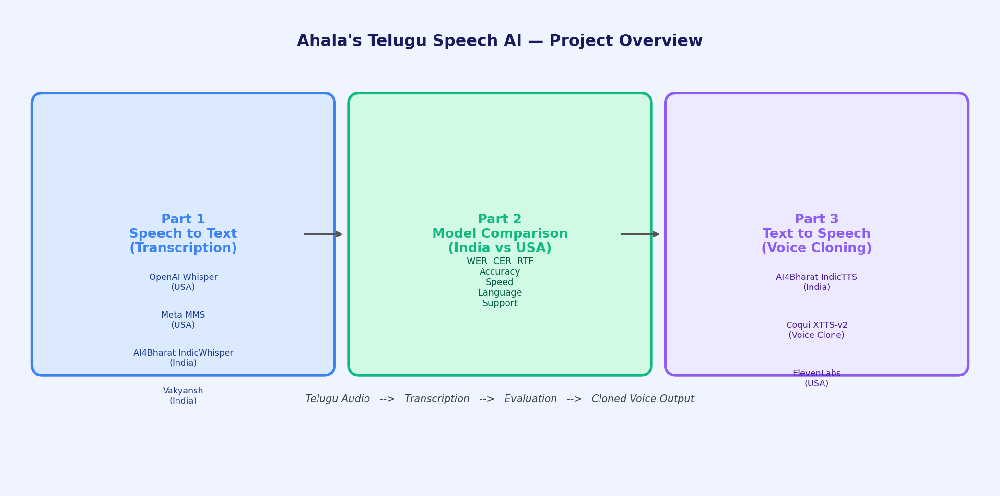
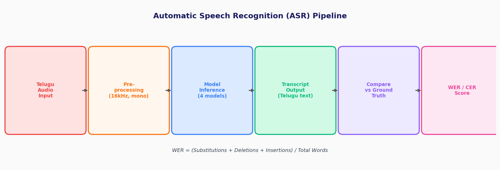
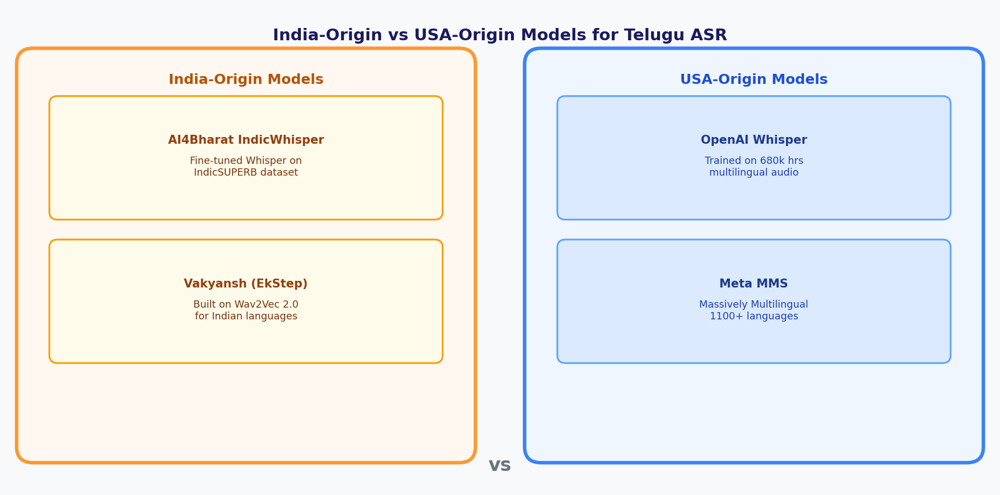
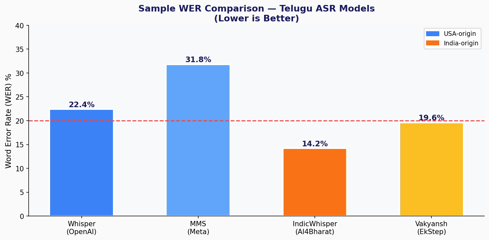
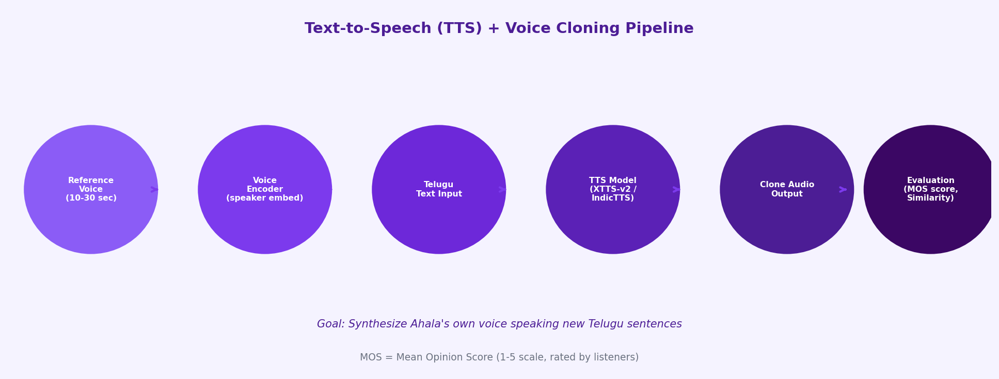
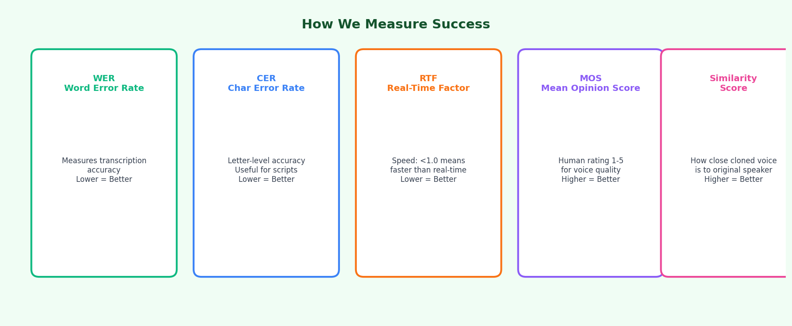
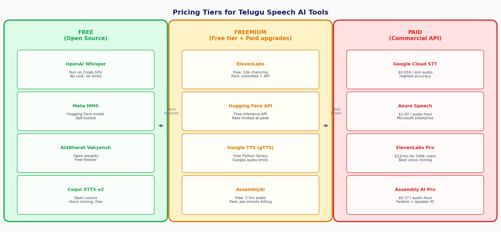
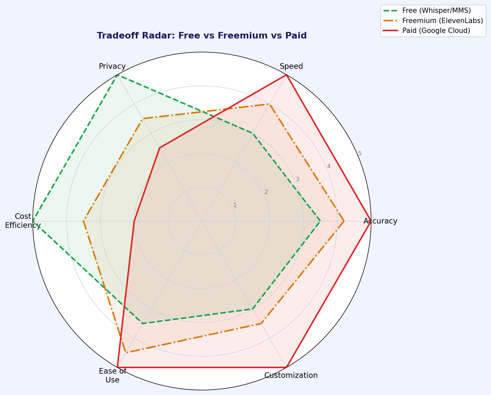
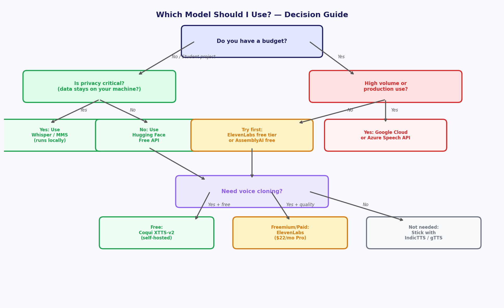

# Telugu Speech AI — Capstone Final Project
### Learn and Help | Python Machine Learning Course | Week 27

---

## Project Author: Ahala

---

## What is This Project?

You've spent this year building machine learning models that can **classify images, understand text,
and generate language**. Now it's time to combine those ideas into something personal and meaningful.

In this capstone project, you'll build a **Telugu Speech AI system** that can:
1. **Listen** to spoken Telugu and convert it to text (Speech-to-Text / ASR)
2. **Compare** how well models trained in India vs. the USA understand Telugu
3. **Speak** by synthesizing a new voice — even one that sounds like *you* (Text-to-Speech + Voice Cloning)

---

## Project Overview



Telugu is one of the oldest classical languages in the world, spoken by 90+ million people.
Yet most voice AI is built for English. This project explores the **gap** — and helps close it.

---

## Part 1: Speech-to-Text (Transcription)

### What is ASR?

**Automatic Speech Recognition (ASR)** turns audio into text.
Think of it as Google's "Hey Google" — but for Telugu.

### The Pipeline



The steps:
1. You record (or load) a Telugu audio clip
2. The audio is cleaned up (converted to 16,000 samples/second, single channel)
3. A model reads the audio and outputs Telugu text
4. We compare the output to the actual correct text
5. We measure accuracy using **WER** (Word Error Rate)

### Key Metric: WER
> **WER = (Substitutions + Deletions + Insertions) / Total Words × 100%**

Lower WER = better model. A WER of 0% means perfect transcription.

---

## Part 2: India-Origin vs. USA-Origin Models

This is the **core comparison** of the project.



### USA-Origin Models

| Model | Creator | Key Feature |
|---|---|---|
| **OpenAI Whisper** | OpenAI (San Francisco) | Trained on 680,000 hours of multilingual audio from the internet |
| **Meta MMS** | Meta AI (New York/California) | Massively Multilingual Speech — supports 1,100+ languages |

### India-Origin Models

| Model | Creator | Key Feature |
|---|---|---|
| **AI4Bharat IndicWhisper** | IIT Madras + AI4Bharat | Whisper fine-tuned specifically on Indian languages using the IndicSUPERB dataset |
| **Vakyansh** | EkStep Foundation / AI4Bharat | Built on Wav2Vec 2.0; designed ground-up for 10+ Indian languages including Telugu |

### The Big Question
> Do models built specifically for Indian languages perform better on Telugu
> than models trained on massive multilingual datasets from the USA?

### Sample Results (you'll compute your own!)



Note: The values above are illustrative examples. Your actual results will vary based on
your test audio clips and the specific model versions you use.

---

## Part 3: Text-to-Speech and Voice Cloning

### What is TTS + Voice Cloning?

**Text-to-Speech (TTS)** converts written text into spoken audio.
**Voice Cloning** goes further — it learns what *your* voice sounds like from a short recording,
and then speaks any new text in *your* voice!



### Tools We'll Use

| Tool | Origin | Type |
|---|---|---|
| **AI4Bharat IndicTTS** | India (IIT Madras) | Standard TTS for Telugu — high quality, no cloning |
| **Coqui XTTS-v2** | USA (open source) | Voice cloning with just 10-30 seconds of reference audio |
| **ElevenLabs** | USA | Commercial voice cloning via API |

### How Voice Cloning Works

1. **Record yourself** speaking a short Telugu sentence (10–30 seconds)
2. The model builds a **speaker embedding** — a mathematical fingerprint of your voice
3. You type any new Telugu text
4. The model generates audio that sounds like *you* saying that text!

---

## How We Measure Success



### For Speech-to-Text (ASR):
- **WER** (Word Error Rate): percentage of words wrong — lower is better
- **CER** (Character Error Rate): percentage of characters wrong — useful for scripts like Telugu
- **RTF** (Real-Time Factor): speed; RTF < 1.0 means faster than real-time

### For Text-to-Speech (TTS):
- **MOS** (Mean Opinion Score): human listeners rate quality from 1 (bad) to 5 (excellent)
- **Speaker Similarity Score**: how close the cloned voice sounds to the original speaker

---

## Analogy: The Sports Team Analogy

Imagine you're picking a cricket team:
- **USA-origin models** are like *all-rounders* trained on everything — they've played in 100 countries
- **India-origin models** are like *specialists* — they grew up playing on Indian pitches, in Indian conditions

Who performs better in a match played in India (in Telugu)?
That's exactly what this project tests!

---

## Code Activities

### Activity 1: Run OpenAI Whisper on Telugu Audio
```python
import whisper

model = whisper.load_model("medium")
result = model.transcribe("telugu_audio.wav", language="te")
print(result["text"])
```

### Activity 2: Run Meta MMS
```python
from transformers import pipeline

asr = pipeline("automatic-speech-recognition",
               model="facebook/mms-300m",
               generate_kwargs={"language": "tel"})
result = asr("telugu_audio.wav")
print(result["text"])
```

### Activity 3: Run AI4Bharat IndicWhisper
```python
from transformers import pipeline

asr = pipeline("automatic-speech-recognition",
               model="ai4bharat/indicwav2vec-hindi",   # swap with telugu variant
               device=0)  # GPU
result = asr("telugu_audio.wav")
print(result["text"])
```

### Activity 4: Compute WER
```python
from jiwer import wer, cer

ground_truth  = "నేను తెలుగు నేర్చుకుంటున్నాను"
hypothesis    = result["text"]

print(f"WER: {wer(ground_truth, hypothesis)*100:.1f}%")
print(f"CER: {cer(ground_truth, hypothesis)*100:.1f}%")
```

### Activity 5: Voice Cloning with Coqui XTTS-v2
```python
from TTS.api import TTS

tts = TTS("tts_models/multilingual/multi-dataset/xtts_v2")
tts.tts_to_file(
    text="నేను ఆహల. నేను తెలుగు మాట్లాడతాను.",   # "I am Ahala. I speak Telugu."
    speaker_wav="my_voice_sample.wav",             # your 10-30 sec recording
    language="te",
    file_path="cloned_output.wav"
)
```

---

## Part 4: Free vs. Freemium vs. Paid — What's the Difference?

Every tool in this project falls into one of three pricing tiers.
Understanding this helps you make smart decisions as a developer — not just for Telugu AI,
but for any real-world project.



### The Three Tiers Explained

**Free / Open Source**
The full model is publicly released — you download and run it yourself.
There are no usage limits, no monthly bill, and your audio data never leaves your computer.
The tradeoff: you need a GPU (Google Colab provides one for free), and setup takes more effort.

Examples in this project: OpenAI Whisper, Meta MMS, AI4Bharat Vakyansh, Coqui XTTS-v2.

**Freemium**
A company hosts the model for you and gives you a free quota each month.
When you exceed the quota, you either wait or pay. Great for experimenting — but watch the limits.

Examples in this project: ElevenLabs (10,000 characters/month free), Hugging Face Inference API
(free but rate-limited at peak hours), AssemblyAI (5 free hours of audio).

**Paid / Commercial API**
You send audio to the company's servers and pay per minute or per character.
In return, you get the fastest speeds, the best accuracy, and enterprise-grade support.
The tradeoff: your audio is processed on someone else's server (privacy consideration), and
costs can add up quickly for large projects.

Examples in this project: Google Cloud Speech-to-Text ($0.016/min), Azure Speech ($1.00/hr),
ElevenLabs Pro ($22/month).

---

### Tradeoff Radar: Visualizing the Differences

Not every dimension is about cost. Here is how the tiers compare across six real factors:



| Dimension | Free (Whisper/MMS) | Freemium (ElevenLabs) | Paid (Google Cloud) |
|---|---|---|---|
| Accuracy | Good | Very Good | Best |
| Speed | Depends on your GPU | Fast | Fastest |
| Privacy | Full — data stays local | Partial — sent to server | Lowest — stored by provider |
| Cost Efficiency | Best (free forever) | Good up to quota | Expensive at scale |
| Ease of Use | Moderate (setup needed) | Easy (web UI + API) | Easy (but billing setup) |
| Customization | Highest (fine-tune freely) | Limited | Some (custom models extra $) |

**Key Insight:** For a student project, free models are almost always the right choice.
For a startup building a product with millions of users, paid APIs may be worth the cost.

---

### The Analogy: Restaurant vs. Home Cooking vs. Meal Kit

Think of it this way:

- **Free/Open Source** = cooking at home from scratch. Total control, costs almost nothing,
  but you need to know what you're doing and buy the ingredients.
- **Freemium** = a meal kit service (HelloFresh, etc.). Someone preps the ingredients and
  gives you the recipe. A few meals are free; after that you pay per box.
- **Paid API** = ordering from a restaurant. Fastest and easiest — just place your order
  and it arrives ready. But you pay for every dish, and you can't see the kitchen.

---

### Which Model Should Ahala Use?



For this school project: **start with free models** (Whisper + Vakyansh + Coqui XTTS-v2)
run on Google Colab. They are more than powerful enough, and you'll learn the most by
running the models yourself rather than just calling an API.

Use a freemium tool (ElevenLabs free tier) to *compare* quality — it's a great benchmark
for how much better a commercial tool sounds, and it's free within the limit.

---

## Resources

### Playgrounds & Tools
- [AI4Bharat Demo](https://ai4bharat.iitm.ac.in/) — Test IndicASR directly in browser
- [OpenAI Whisper on Hugging Face](https://huggingface.co/openai/whisper-medium)
- [Meta MMS on Hugging Face](https://huggingface.co/facebook/mms-300m)
- [Coqui TTS GitHub](https://github.com/coqui-ai/TTS)
- [ElevenLabs](https://elevenlabs.io/) — Free tier available for voice cloning

### Telugu Audio Datasets
- [OpenSLR Telugu](https://openslr.org/66/) — Free Telugu speech corpus
- [IndicSUPERB](https://github.com/AI4Bharat/IndicSUPERB) — Benchmark dataset for Indian languages
- Record your own sentences using Audacity or your phone!

### YouTube Videos
- Search: "AI4Bharat IndicASR Telugu demo"
- Search: "Coqui XTTS voice cloning tutorial"
- Search: "OpenAI Whisper multilingual"

---

## Project Timeline

| Week | Task |
|---|---|
| Week 1 | Set up Colab, install libraries, record Telugu audio samples |
| Week 2 | Run all 4 ASR models, compute WER/CER, build comparison table |
| Week 3 | Experiment with TTS (IndicTTS + XTTS), create voice clone |
| Week 4 | Write report, create presentation, demo your results |

---

## What You'll Submit
See the [Assignment File](ML_Telugu_Speech_AI_Assignment.md) for details.

---

*Learn and Help — learnandhelp.com*
*"From Voice to Text, From Text to Voice — in Telugu!"*
